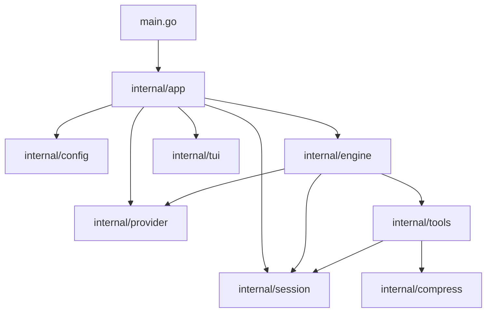

# Eitri architecture

This document maps implementation boundaries for maintainers and agents. User-facing behavior belongs in [README.md](README.md); domain terminology belongs in [CONTEXT.md](CONTEXT.md). Detailed operational contracts live under `docs/`.

## Runtime flow

Startup resolves paths, loads configuration, verifies the declared runtime toolset, materializes builtin skills, and constructs the provider, tools, engine, and session store. The app then starts batch mode or the TUI.

One run follows this path:

1. The engine assembles the stable prompt head, workspace directives, skills, repository instructions, persisted history, and user prompt.
2. The provider translates canonical messages and tools into its wire dialect and streams the response.
3. Tool calls go through the fixed tool registry. Bash uses bubblewrap by default or the direct backend with `--yolo-unsafe`.
4. Tool output is deterministically compressed before returning to the engine. Older history is compacted with an LLM when context requires it.
5. Typed engine events drive the TUI; requests and responses are appended to the session transcript.

## Package boundaries

### `internal/app`

Composition root. Resolves `EITRI_DIR`, loads config, verifies dependencies, materializes builtin skills, constructs providers/tools/engine/session, and starts batch or TUI mode. It also owns pprof setup, Copilot login, and session subcommands.

### `internal/config`

Reads and writes `<data directory>/config.json`. Defaults include provider `opencode-go`, model `deepseek-v4-flash`, low reasoning effort, thinking enabled, collapsed reasoning/tool results, context-overflow recovery, and 250 maximum turns.

### `internal/engine`

Runs the bounded agent loop. It assembles prompts, streams provider responses, dispatches tool calls, emits typed events, enforces the turn cap, exposes `ErrStopped`, and retries once after context-overflow compaction. `prompt.md` is embedded at build time; `skillspack/` embeds builtin skills and materializes them under `$EITRI_DIR/skills-builtin`.

### `internal/provider`

Defines canonical messages, tools, streams, usage, and errors. Dialects translate canonical requests and SSE responses to Chat Completions, Anthropic Messages, or OpenAI Responses formats. Adapters implement OpenCode Go, GitHub Copilot, and custom OpenAI-compatible providers. The logging decorator records wire-level data in the session transcript.

### `internal/tools`

Defines `bash` and `open_in_browser`. `sandbox.go` runs bash through bubblewrap; `direct.go` runs it directly for `--yolo-unsafe`. `skills.go` discovers and validates project, user, and builtin skills, with project > user > builtin shadowing.

### `internal/compress`

Deterministically bounds tool results by stripping ANSI and applying line and byte limits. It reports dropped output explicitly and never performs model-based compaction.

### `internal/session`

Stores GUID-named, append-only session directories under the data directory. Message transcripts are JSONL records of provider requests and responses; debug mode adds raw HTTP traces.

### `internal/tui`

Bubble Tea terminal UI. It owns the composer, rendered transcript, right rail, settings, login, help, slash commands, and turn lifecycle. `TurnRuntime` is the sole caller-facing seam for a live Run: it dispatches and cancels the Run, drains the FIFO event feed, preserves event order, and rejects stale Run IDs. `Transcript` is the sole owner of transcript projection state; it receives typed start, stream, tool, and completion outcomes. `TurnSession` supplies cancellable execution only. The engine is the only provider caller.

### Small packages

`internal/osc52` writes clipboard escape sequences; `internal/constants` holds cross-layer limits; `internal/testutil` contains shared test helpers; `internal/tools/memtmp` manages per-session temporary storage.

## Invariants

1. Boot verifies every declared runtime tool, so the prompt does not promise unavailable commands.
2. The stable system-prompt head is byte-identical across turns; variable workspace directives are separate messages for provider cacheability.
3. Compression bounds tool output deterministically; compaction summarizes older history with a model.
4. User stop is represented by `ErrStopped`, distinct from provider or tool failure.
5. Sessions and transcripts are append-only.
6. Default bash is bubblewrap-confined; `--yolo-unsafe` executes directly and is not represented as sandboxed.
7. TUI rendering uses typed engine events and rejects stale run IDs.

## Where to start

| Task | Files |
| --- | --- |
| Agent turn loop | `internal/engine/engine.go`, `events.go` |
| Prompt assembly | `internal/engine/prompt.go`, `message_partition.go`, `prompt.md` |
| Provider wire format | `internal/provider/dialect.go`, `chatdialect.go`, `anthropic.go`, `responses.go` |
| Bash execution | `internal/tools/sandbox.go`, `direct.go`, `tool_bash.go` |
| Tool output limits | `internal/compress/compress.go` |
| Sessions/transcripts | `internal/session`, `internal/provider/messagelog.go` |
| TUI turn lifecycle | `internal/tui/turn_runtime.go` (caller seam), `turn_session.go` and `fold.go` (implementation), `internal/engine/events.go` |
| Skills | `internal/tools/skills.go`, `internal/engine/skillspack` |
| Batch contract | `docs/batch-mode.md` |
| Session commands | `docs/sessions.md` |
| Render diagnostics | `docs/render-diagnostics.md` |
