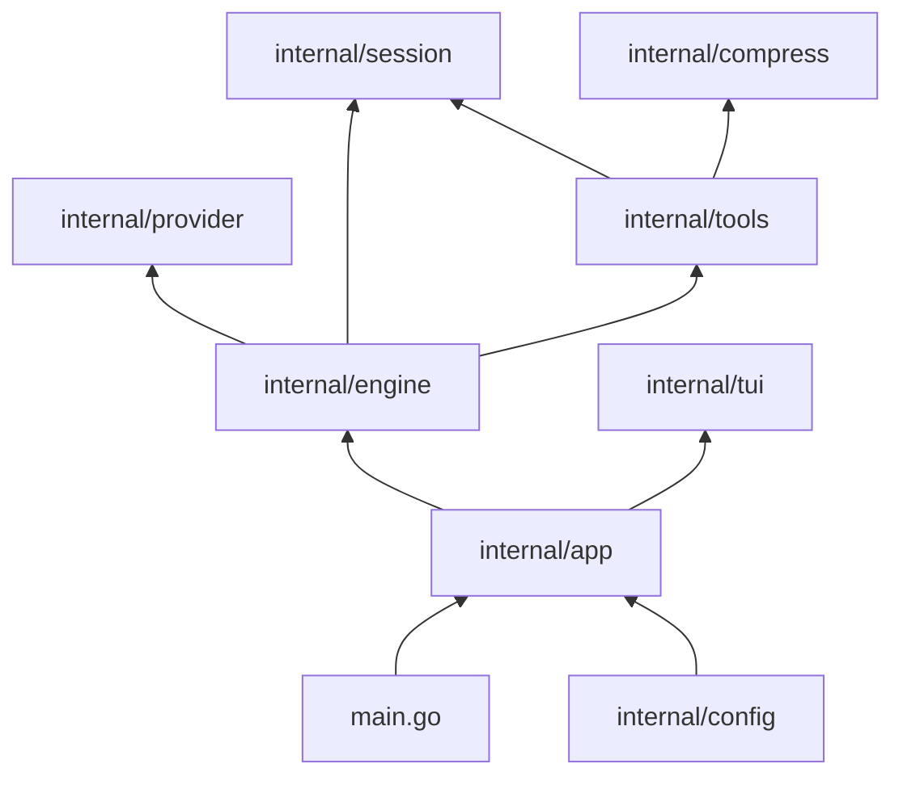

# Eitri architecture

This is the implementation map for agents and maintainers. User-facing behavior belongs in [README.md](README.md); domain terminology belongs in [CONTEXT.md](CONTEXT.md).

## Eitri philosophy

Eitri is a Linux-only assistant built in the Unix tradition: compose small, capable programs rather than reimplementing their responsibilities. The agent's primary way to interact with the system is the GNU/Linux command line, and the toolset should expose dependable existing programs whenever they provide the needed capability.

Prefer a pipeline of simple commands whose inputs and outputs are inspectable. When coordination requires state, branching, or more involved control flow, use a short-lived throwaway script—typically Bash or Python—rather than growing a permanent abstraction prematurely. Such scripts are glue for the current task, not a new product surface.

This keeps the architecture small, transparent, and replaceable: composition belongs at the edges, stable behavior belongs in focused packages, and platform-specific behavior may assume GNU/Linux. Changes should preserve this bias toward standard tools, text streams, explicit boundaries, and minimal custom machinery.

## Dependency map

`main.go` parses flags and dispatches `session` commands. `internal/app` is the composition root. Higher layers call lower layers; providers and tools do not depend on the TUI.

## Packages

### `internal/app`

Bootstraps the process: resolves `EITRI_DIR`, loads config, verifies runtime dependencies, materializes embedded builtin skills, constructs providers/tools/engine/session, and starts batch or TUI mode. It also owns pprof setup, Copilot login, and the session CLI.

### `internal/config`

Reads and writes `<data directory>/config.json`. Defaults are provider `opencode-go`, model `deepseek-v4-flash`, low reasoning effort, thinking enabled, collapsed reasoning/tool results, context-overflow recovery enabled, and 250 maximum turns.

### `internal/engine`

Runs one bounded agent run. It builds the stable embedded persona head, separate workspace/skill/`AGENTS.md` system directives, persisted history, and the user prompt. It streams provider responses, dispatches tool calls, emits typed events, enforces the turn cap, exposes the `ErrStopped` sentinel, and retries once after context-overflow compaction.

`compact.go` performs LLM-based history compaction. `message_partition.go` preserves the stable head. `prompt.md` is embedded at build time. `skillspack/` embeds builtin `subagents` and `web-access` skills and materializes them under `$EITRI_DIR/skills-builtin`.

### `internal/provider`

Defines the provider seam and canonical messages, tools, streams, usage, and errors. Dialects translate canonical requests and SSE responses to Chat Completions, Anthropic Messages, or OpenAI Responses wire formats. Adapters implement OpenCode Go, GitHub Copilot, and custom OpenAI-compatible providers. The logging decorator writes wire-level request/response records to the session transcript.

### `internal/tools`

Defines the fixed tool surface: `bash` and `open_in_browser`. `sandbox.go` runs bash through bubblewrap; `direct.go` is the `--yolo-unsafe` backend. Both use the same command environment contract. `skills.go` discovers and validates project, user, and builtin skills, with project > user > builtin shadowing.

### `internal/compress`

Deterministically bounds tool results: strips ANSI, applies line and byte limits, and reports dropped output explicitly. This is separate from engine compaction and uses no model call.

### `internal/session`

Stores GUID-named, append-only session directories under the data directory. Message transcripts are JSONL records of provider requests and responses; debug mode adds raw HTTP traces.

### `internal/tui`

Bubble Tea terminal UI. `model.go` coordinates the composer, transcript, right rail, and turn session. The engine is the only provider caller; the TUI consumes engine events and rejects stale events from prior runs. Rendering, selection, markdown, themes, settings, login, help, and slash commands live here. `livekey` owns the current session GUID; `telemetry` feeds the render diagnostics workflow.

### Small packages

`internal/osc52` writes clipboard escape sequences, `internal/constants` holds cross-layer limits, and `internal/testutil` contains shared test helpers. `internal/tools/memtmp` manages per-session temporary storage.

## Important invariants

1. The declared runtime toolset is checked at boot, so the prompt does not promise unavailable commands.
2. The stable system prompt head is byte-identical across turns; variable workspace directives are separate messages to preserve provider cacheability.
3. Compression is deterministic tool-output bounding; compaction is LLM summarization of older history.
4. User cancellation is represented by `ErrStopped`, distinct from provider or tool failure.
5. Sessions and transcripts are append-only.
6. Sandboxing claims are mode-dependent: default bash is bubblewrap-confined; `--yolo-unsafe` runs directly and is not represented as contained to the agent.
7. Live rendering flows through typed engine events, with run-ID stale-event rejection.

## Where to start

| Task | Files |
| --- | --- |
| Agent turn loop | `internal/engine/engine.go`, `events.go` |
| Prompt assembly | `internal/engine/prompt.go`, `message_partition.go`, `prompt.md` |
| Provider wire format | `internal/provider/dialect.go`, `chatdialect.go`, `anthropic.go`, `responses.go` |
| Bash execution | `internal/tools/sandbox.go`, `direct.go`, `tool_bash.go` |
| Tool output limits | `internal/compress/compress.go` |
| Sessions/transcripts | `internal/session`, `internal/provider/messagelog.go` |
| TUI turn lifecycle | `internal/tui/turn_session.go`, `turn_runtime.go`, `internal/engine/events.go` |
| Skills | `internal/tools/skills.go`, `internal/engine/skillspack` |
| Batch contract | `docs/batch-mode.md` |
| Session commands | `docs/sessions.md` |
| Render diagnostics | `docs/render-diagnostics.md` |
