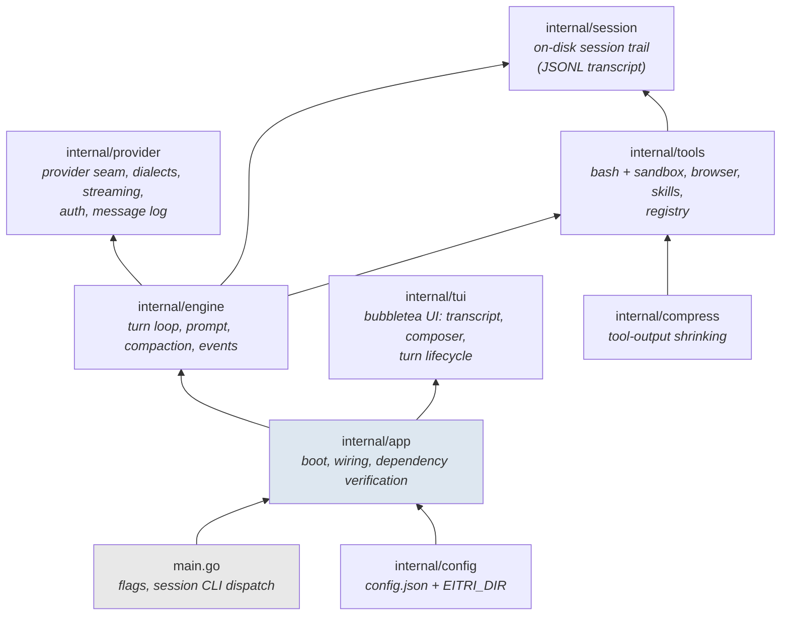

# Eitri Architecture

Eitri is a single static Go binary: a self-hosted AI coding agent that reads, writes, and runs code in a user's workspace through natural-language conversation with any OpenAI-compatible model provider. Two goals shape every design decision here. First, Eitri keeps a **lean system prompt**: the embedded persona says as little as possible, and workspace-specific knowledge is delivered as additive system-layer directives (`AGENTS.md`, skills) or read from disk on demand rather than baked in. Second, Eitri leans on the **Unix philosophy**: the agent's tools are the shell's tools (`bash`, `rg`, `curl`, `jq`, `python3`, ...) composed into pipelines, and the binary itself is a small static Go program that does one thing — the agent loop — instead of reimplementing what the OS already provides. This document is the map of how the code is put together. Terminology follows [`CONTEXT.md`](CONTEXT.md); `README.md` covers user-facing behavior.

## The big picture

Dependency direction is strictly upward: `main` and `app` wire everything; `engine` and `tui` call down into `provider`, `tools`, and `session`; none of the lower layers know about the layers above them. `internal/constants` holds shared limits (byte caps, min TUI width) so lower layers never import config.

## Layer by layer

### `main.go` — the thinnest possible entrypoint

Flag parsing, a `session` subcommand dispatch, and a call into `app`. Nothing else lives here; all real work is in `internal/app`.

### `internal/app` — boot and wiring (the composition root)

Resolves the data directory (`EITRI_DIR`, default `~/.eitri`), loads config, verifies the **declared toolset** at launch (`deps.go`: `bwrap`, `bash`, `rg`, `curl`, `lynx`, `patch`, `python3`, `git`, `jq`, `xdg-open` — fatal at boot, with distro-specific install hints, because the agent prompt promises these tools unconditionally), and builds the concrete dependency graph.

Key pieces:

- `app.go` — the boot sequence and `Options` (single `Run` for both batch and TUI modes; an injected `provider.Provider` and `LookPath` make the whole boot testable without network or real binaries). Before skill discovery it materializes the embedded builtin skill packs to `<dataDir>/skills-builtin` (`internal/engine/skillspack`; see below).
- `deps.go` — the declared-dependency table and verification.
- `tui.go` — builds the `tools.Registry`, the engine, the session, and launches the bubbletea program. Also the TUI boot guard (`ErrTUINotInteractive`: TTY, real TERM, ≥ min width).
- `sessioncmd.go` / `sessionentry.go` — the `eitri session list/show/talk/grep` CLI over recorded sessions.
- `copilot.go` — GitHub Copilot device-flow login.
- `pprof.go` — opt-in localhost pprof server for diagnostics.

### `internal/engine` — the turn loop

Owns one **run**: the bounded turn loop over the provider seam. This is the heart of the agent.

- `engine.go` — `RunAgent(ctx, RunRequest, AgentOptions)`:
  1. Assemble messages: byte-stable persona head (embedded from `prompt.md` via `go:embed`), then per-run system-layer directives (workspace, skill index, repository `AGENTS.md`) as *separate* messages, then session history, then the user prompt (optionally bound to an activated skill's content).
  2. Negotiate generation controls (e.g. tool-schema enforcement) with the provider.
  3. Loop: stream a response, emit typed `Event`s to a listener, dispatch tool calls (`dispatch`/`ExecutorFunc`), append tool results, until a final answer, `ErrMaxTurns` (with a `CanContinue` continuation hook the TUI grants interactively), or `ErrStopped` — the dedicated stop sentinel wrapping `context.Canceled` so a user stop is distinguishable from failure.
  4. On `provider.ErrContextOverflow` (sentinel or 4xx body signals), trigger **emergency compaction** and retry once.
- `message_partition.go` — partitions a message slice into `StableHead` (persona + per-run directives), `Transient` (skill-injected content), and persisted `History`.
- `compact.go` — proactive compaction: when prompt usage crosses a fraction of the context window, older turns are summarized by the model itself, preserving the stable head and recent tail; also forced reactively on overflow.
- `prompt.go` / `prompt.md` — the embedded system prompt. The batch-subagent recipe no longer lives in the persona: it ships as the builtin `subagents` skill, and the prompt carries a one-line pointer to it.
- `skillspack/` — the embedded builtin skill packs (`go:embed`), materialized by `internal/app` into `<dataDir>/skills-builtin` at boot so the normal skill roots can span them. The dir is binary-owned ROM: files are rewritten only on content mismatch (upgrades win, edits reverted by design), and an unwritable data directory is warn-and-skip, not fatal.
- `events.go` — the typed live event stream (`StreamEvent` for reasoning/answer deltas, tool events, turn events) delivered synchronously to a single `Listener`; this is the only channel the TUI renders a live run from.
- `validate.go`, `cache_test.go` / `stable_head_test.go` — the **byte-stable cache head** invariant: the system head must be byte-identical across turns so provider prompt caches stay warm; tests enforce it.

The engine holds per-session history keyed by the session GUID (`SessionKey`), cleared by `/new`.

### `internal/provider` — the provider seam

Everything that touches a model endpoint lives behind this package's interfaces; no upper layer speaks HTTP to a vendor.

- `provider.go` — canonical types (`Message`, `ToolCall`, `Request`, `Stream`, `Chunk`, `Usage`) and the sentinels (`ErrContextOverflow`, `ErrNoDiscovery`) plus overflow-body detection.
- `dialect.go` / `chatdialect.go` / `responses.go` — the **Dialect** seam: one interface owning request shaping, canonical→wire tool mapping, and SSE→chunk parsing. `chatdialect.go` implements Chat Completions (the default path); `responses.go` implements the OpenAI Responses shape (Copilot models that lack chat/completions).
- `openai.go` — `OpenAICompatible`, the Chat-Completions HTTP client (primary: OpenCode Go, including its required user-agent).
- `copilot.go` / `deviceflow.go` — Copilot adapter and device-flow auth, with a refresh seam and `ErrReauthRequired`.
- `factory.go` — maps `config.Provider` to a concrete adapter from `ProviderEnv` (credentials + injectable HTTP client), so routing is testable without network.
- `generation_control.go` — capability negotiation (schema enforcement etc.).
- `sse.go` / `stream_close.go` — generic SSE framing and guaranteed body-close-on-done.
- `messagelog.go` — the `LoggingProvider` decorator: wraps any provider to write the JSONL **transcript** (one line per request/response, exactly what went over the wire) through the `MessageLogSink` seam.
- `fake.go` / `scripted.go` — test doubles: scripted multi-turn providers used across engine/app tests.

### `internal/tools` — the execution boundary

The fixed tool surface plus everything it needs to execute safely.

- `registry.go` — `Registry` owns the toolset (`bash`, `open_in_browser`) and the `Deps` wiring (workspace, session temp, extra writable paths, runner, yolo flag, browser seam, skill catalog). `Definitions()` yields the provider-facing manifest.
- `sandbox.go` — the **bubblewrap cage**: read-only root, writable workspace and session temp, isolated PID/`/proc`/`/dev` namespaces. Both backends resolve to the same `RunSpec` (program, args, cwd, env) before touching the OS.
- `direct.go` — the unsandboxed `--yolo-unsafe` backend: same environment contract, no cage.
- `tool_bash.go` — the `bash` tool; selects the backend via the `bashBackend` interface and returns combined stdout+stderr through compression.
- `tool_browser.go` / `network.go` — `open_in_browser` backed by `xdg-open`.
- `skills.go` — skill discovery and validation across three roots: the builtin root `<dataDir>/skills-builtin` (materialized from the binary at boot), the user-global `~/.agents/skills`, and the project `.agents/skills` under the workspace. On exact-name collision the strongest claim wins — project shadows user, which shadows builtin — and the trust-gated catalog backs both the human slash surface and the model-facing skill index (`ModelInvocable` flag), plus the rendered index.

### `internal/session` — the on-disk trail

`Session` is `dataDir/sessions/<GUID>/`: append-only records, never edited. The transcript JSONL goes through `messages.go` (`messageLog`), implementing `provider.MessageLogSink`; debug mode (`-d`) attaches a raw HTTP trace sink. `NewWithGUID` exists so `/new` in the TUI can pre-mint the live session key and Eitri then binds to it.

### `internal/compress` — deterministic tool-output shrinking

Zero-LLM compression at the tool-result boundary: ANSI stripping, a 500-line cap, and a shared byte cap (64 KiB), always with an explicit `+N more` marker — never silent truncation. Because the head of a result is deterministic, session prompt caches stay byte-stable across turns. This is deliberately *not* compaction, which is the LLM-driven summarization of turns in the engine.

### `internal/tui` — the terminal surface

Bubbletea v2 / lipgloss v2. The largest package; organized as small single-owner modules around a `Model` that delegates rather than accumulates state:

- `model.go` — the bubbletea model: wires the composer, transcript, rail, and turn session together.
- `transcript.go` — the single owner of the scrolling rendered transcript region (layout, scroll, follow, render).
- `composer.go`, `completion_menu.go`, `mention.go`, `prompt_history.go` — input, completion, history recall.
- `turn_session.go` — the owner of one run's lifecycle: cancelable per-turn context, stop (`ErrStopped`), stream cursor, commit-to-transcript on settle. `turn_runtime.go` layers live event acceptance (run-ID-based stale-event rejection) on top; `turnflow.go`, `fold.go`, `phase.go` project engine events into the visual timeline.
- `livekey.go` — the live session key holder: a mutable reference so `/new` re-mints the GUID and every surface observes it at the next turn boundary.
- `skill_activation.go`, `settings.go`, `login.go`, `help.go` — slash-command surfaces.
- `markdown.go`, `flowrender.go`, `expansion.go`, `collapsefocus.go`, `scrollreg.go`, `selection*.go`, `clipboard.go`, and the `internal/osc52` package — rendering: glamour markdown, expand/collapse of tool and chain-of-thought blocks, drag-select text, OSC 52 clipboard escape sequences.
- `styles.go`, `theme`, `glyphs.go`, `spinner.go`, `face.go` — theming and chrome.
- `telemetry.go` — in-TUI performance counters feeding the render-diagnostics workflow (`docs/render-diagnostics.md`).

### `internal/osc52`, `internal/testutil`, `internal/constants`

Small leaves: the OSC 52 clipboard writer, shared test doubles, and cross-layer numeric constants.

## Cross-cutting invariants

These are the properties the architecture exists to protect; several have dedicated tests.

1. **The declared toolset is verified, not hoped for.** The system prompt promises a fixed set of binaries; boot is fatal on any miss, so the prompt cannot hallucinate a tool.
2. **The cache head is byte-stable.** The persona head never changes across turns; everything variable (workspace, skill index, AGENTS.md) rides as separate system-layer messages that can be omitted to keep requests byte-identical to the no-feature case. Prompt-cache economics depend on this.
3. **Compaction ≠ compression.** Two distinct mechanisms (see the glossary in [CONTEXT.md](CONTEXT.md)); both preserve the stable head.
4. **Stop is a sentinel, not an error.** User cancellation surfaces as `ErrStopped` (wrapping `context.Canceled`) so callers distinguish it from failure.
5. **Append-only sessions.** Sessions are GUID-named, append-only JSONL transcripts — the ground truth for debugging (see [CONTEXT.md](CONTEXT.md)).
6. **Honesty about containment.** Neither prompt variant claims a terminating sandbox (see the glossary's *Sandbox* entry): the sentence that used to carry that claim moved with the batch-subagent guidance into the `subagents` skill.
7. **The engine is the only caller of the provider; the TUI only sees events.** Live rendering flows through the typed event stream with stale-run rejection, never through shared mutable state.

## Testing shape

`*_test.go` files sit beside their code throughout (252 files total, roughly half tests). The seams that make this possible: injectable `provider.Provider` (`fake.go`, `scripted.go` for multi-turn scenarios), injectable `LookPath` and HTTP client at boot, the `bashBackend`/`Runner` interface behind the sandbox, and `internal/testutil`. Dedicated invariant tests cover the stable head (`stable_head_test.go`, `cache_test.go`), compaction behavior, stop semantics, schema enforcement, and skill injection.

## Where to look for what

| Question | Start here |
| --- | --- |
| How does a turn execute? | `internal/engine/engine.go` (`RunAgent`) |
| How does the wire request get built? | `internal/provider/chatdialect.go` |
| How is bash sandboxed? | `internal/tools/sandbox.go` |
| What does the agent see in its system prompt? | `internal/engine/prompt.md` |
| How does the TUI react to a live run? | `internal/tui/turn_runtime.go`, `internal/engine/events.go` |
| Where does session data live on disk? | `internal/session/session.go` |
| How does tool output get bounded? | `internal/compress/compress.go` |
| How do skills reach the model? | `internal/tools/skills.go`, `internal/engine/engine_skillindex_test.go` |
