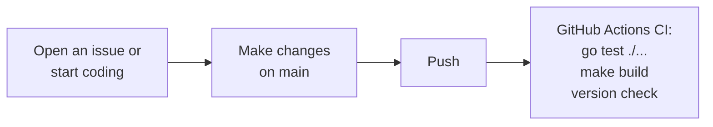

# Eitri — Context

Self-hosted, single-binary AI Agent for Linux. Named after the Norse blacksmith who forged Mjölnir. V1 runs from the user's chosen workspace (process CWD), serves a Chrome-on-Linux browser UI, and supports OpenCode Go, GitHub Copilot, and OpenRouter via litellm-backed LLM transport.

## Domain glossary

| Term | Meaning |
|------|---------|
| **Agent** | Synchronous turn loop that drives LLM → tool call → tool result → LLM until done or max turns. Lives in a single goroutine; SSE events fan out to UI concurrently. |
| **Session** | Single in-memory chat conversation. Has unique ID, message/render history, and active-run state. Lost on server restart in v1. |
| **Tool** | Capability agent can invoke (`bash`, `glob`, `grep`, `read`, `write`, `edit`, `render_mermaid_diagram`, `render_quick_replies`, `skill`). Defined as Go structs with `JSONSchema()` methods; dispatched by name in the agent loop. |
| **Render component** | A browser-visible UI element (tool card, DiffCard, Mermaid diagram, QuickReplies chips) rendered by the server as a Templ fragment and swapped into the DOM via HTMX. Each component is triggered by an SSE `component` event, not by tool return text. |
| **Tool card** | A `<details>` element showing tool progress (running with timer) and final result (collapsible output). Emitted by `tool_call` and `tool_result` SSE events. |
| **Provider** | External LLM service integration that owns authentication, model discovery, endpoint selection, and chat transport. Eitri's auth/discovery/profile layer configures litellm Provider adapters underneath. A Provider exposes one or more Models. |
| **Sub-agent** | A subordinate agent loop spawned by a parent agent via the `delegate` tool. Runs with its own turn loop, tool registry, and system prompt; reports back via `collect`. Cannot spawn further sub-agents in v1. |
| **Child session** | A `UISession` with a `ParentID` field, created when a browser-visible parent delegates to a sub-agent. Appears nested under the parent in the sidebar tree. |
| **Skill** | Agent Skills-compatible directory containing `SKILL.md` instructions and optional `scripts/`, `references/`, and `assets/`. Discovered from fixed project/user roots and activated per session. |
| **Bash tool** | Executes shell commands directly on the host via `os/exec.Command`. No persistent shell state across turns. Proper stdout/stderr separation and exit code handling. Per-command timeout configurable via `command_timeout`. |
| **Model** | LLM accessible via a litellm-backed Provider adapter. OpenCode Go models route by prefix (qwen*/minimax* → Anthropic /v1/messages, rest → OpenAI /chat/completions). GitHub Copilot and OpenRouter use dedicated adapters. Configured via Settings or `~/.eitri/config.json`. |
| **HTML-over-wire shell** | Go/Templ/HTMX-rendered application frame and fragments. Server owns canonical UI state and rendering. |
| **Browser island** | Isolated client-side behavior attached to server-rendered markup; owns only local ephemeral UI state. |
| **Stream island** | Browser island managing `EventSource` lifecycle and token display for one assistant run. |
| **Context panel** | 4th sidebar section showing live context window utilization. Uses a progress bar in compact mode; click expands to per-category breakdown (system prompt, history, skills, completion). Updated after each turn via `context_update` SSE events. |
| **Context update** | An SSE event (`type: "context_update"`) broadcast after each agent turn carrying estimated token counts. Fields: `total_tokens`, `context_window`, `prompt_tokens`, `completion_tokens`, `system_tokens`, `history_tokens`, `skill_tokens`. |
| **Crash dump** | A timestamped directory under `~/.eitri/crash-dump/` containing diagnostic files written when Eitri encounters an unexpected failure (provider HTTP error, agent loop panic, batch run failure). Contains error chain, goroutine stacks, session state, HTTP traces, and sanitized config. |

## Architecture decisions

Architecture decisions are documented as ADRs in `docs/adr/`:

| ADR | Title | Status |
|-----|-------|--------|
| [0001](docs/adr/0001-htmx-templ-ui.md) | HTMX + Templ shell with browser islands | Accepted |
| [0002](docs/adr/0002-agent-skills.md) | Agent Skills support | Accepted |
| [0003](docs/adr/0003-provider-profiles-and-github-copilot.md) | Provider profiles and GitHub Copilot | Accepted |
| [0004](docs/adr/0004-merge-tool-activity-into-inline-tool-cards.md) | Merge tool activity into inline tool cards | Accepted |
| [0005](docs/adr/0005-prompt-caching.md) | Session-scoped prompt caching | Accepted |
| [0006](docs/adr/0006-remove-adk-litellm-transport.md) | Remove ADK, adopt litellm transport + custom agent loop | Accepted |
| [0007](docs/adr/0007-split-render-component-into-per-component-tools.md) | Split render_component into per-component tools | Accepted |
| [0008](docs/adr/0008-add-context-lines-to-grep-tool.md) | Add context lines to grep tool | Accepted |
| [0009](docs/adr/0009-live-context-panel.md) | Live context window utilization panel | Accepted |
| [0010](docs/adr/0010-remove-tmux-executor.md) | Replace tmux executor with direct exec.Command | Accepted |
| [0011](docs/adr/0011-runagent-seam-interfaces.md) | Extract HistoryManager and Confirmer seam interfaces from RunAgent | Accepted |
| [0012](docs/adr/0012-web-fetch-tool.md) | web_fetch tool for fetching URLs | Accepted |
| [0013](docs/adr/0013-sub-agents.md) | Sub-agent support via delegate/collect tools | Accepted |
| [0014](docs/adr/0014-crash-dumps.md) | Crash dump directory for unexpected failures | Accepted |

## Project structure

```
eitri/
├── cmd/eitri/                 # Entry point — starts HTTP+SSE server
├── internal/
│   ├── agent/                 # Agent loop, tool definitions, LLM service interface
│   ├── api/                   # HTTP server, SSE, HTMX/Templ render endpoints
│   │   └── templates/         # Templ source files and generated Go
│   ├── config/                # ~/.eitri config management
│   ├── runner/                # RunService — run lifecycle + agent loop orchestrator, SSE broadcast, auth persist callbacks
│   ├── tool/                  # Built-in tools
│   └── skills/                # Agent Skills discovery, registry, activation
├── scripts/                   # Install script, release tools
├── docs/ARCHITECTURE.md       # Architecture guide for AI agents
├── docs/TESTING.md            # Test runbook
├── docs/providers/            # User-facing provider setup/operation guides
├── docs/adr/                  # Architecture Decision Records
├── docs/agents/               # Agent documentation framework
├── go.mod
├── go.sum
├── VERSION                    # Canonical version string (semver)
├── CHANGELOG.md               # Keep a Changelog-formatted release notes
├── README.md                  # Human-facing project overview
├── initial.md                 # Original product vision
```

> **AI agents**: read `docs/ARCHITECTURE.md` before making changes — it covers module boundaries, key types, data flow, and extension points in detail.

## Running

```bash
go run ./cmd/eitri
# Open http://127.0.0.1:8080
```

Start Eitri from the workspace you want it to read/write. Configure the OpenCode Go API key and model via Settings or `~/.eitri/config.json`.

## Development & release flow

### Versioning

Eitri follows [Semantic Versioning 2.0](https://semver.org/). The canonical version lives in `VERSION` at the repo root.

| Phase | Version format | Notes |
|-------|----------------|-------|
| Pre-1.0 development | `0.Y.Z` | Anything may change (semver §4). `minor` bumps can include breaking changes. |
| Stable release | `1.Y.Z` | Future. |

### Daily development



There is **no required branch strategy** — you can push directly to `main` or use PRs. CI runs on both.

**Changelog discipline:** Every change that adds, removes, or modifies behaviour (features, bug fixes, breaking changes, deprecations) must add an entry under `## [Unreleased]` in `CHANGELOG.md`. Keep entries brief and user-facing. This is how release notes are authored incrementally — the release script just re-arranges the headings.

Optional developer tools:

- `make run` — build and start the server locally
- `make test` — run all unit tests
- `make build` — compile the binary with embedded version
- `./eitri --version` — print the compiled version

The `scripts/agent-loop.sh` script is an optional convenience for those with `gh` installed. It iterates `ready-for-agent` issues and runs each via `eitri -b`. See `docs/agents/batch.md`.

### Cutting a release

An AI agent or human can release with a single command:

```bash
./scripts/release.sh [patch|minor|major|<explicit-version>]
```

For example, from a clean `main` branch:

```bash
./scripts/release.sh patch   # 0.1.0 → 0.1.1
./scripts/release.sh minor   # 0.1.0 → 0.2.0
./scripts/release.sh 0.3.0   # explicit version
```

The release script:

1. **`scripts/bump-version.sh`** — reads `VERSION`, applies the semver bump, writes it back
2. **`scripts/update-changelog.sh`** — moves `[Unreleased]` entries under the new version heading, inserts a fresh `[Unreleased]` section
3. Commits `VERSION` + `CHANGELOG.md`
4. Tags with `v<VERSION>` (e.g. `v0.2.0`)
5. Pushes the commit and tag to GitHub

### Release publishing (CI)

Pushing a `v*` tag triggers `.github/workflows/release.yml`:

1. Verifies the tag matches `VERSION` (safety check)
2. Builds release tarballs for all supported platforms via `make release-all`
3. Generates a GitHub Release with attached tarballs and checksums

| Target platform | Tarball |
|----------------|---------|
| Linux amd64 | `dist/eitri-linux-amd64.tar.gz` |
| Linux arm64 | `dist/eitri-linux-arm64.tar.gz` |
| macOS amd64 (Intel) | `dist/eitri-darwin-amd64.tar.gz` |
| macOS arm64 (Apple Silicon) | `dist/eitri-darwin-arm64.tar.gz` |

### User installation

Users install the latest release:

```bash
curl -sSf https://raw.githubusercontent.com/glemsom/eitri/main/scripts/install.sh | bash
```

Or download a tarball from the GitHub Releases page and verify the SHA256 checksum.

### Key files summary

| File | Purpose | Maintained by |
|------|---------|---------------|
| `VERSION` | Canonical semver string | `bump-version.sh` / hand-edit |
| `CHANGELOG.md` | Human-readable release notes | `update-changelog.sh` / hand-edit |
| `scripts/bump-version.sh` | Semver bump tool (reads/writes VERSION) | AI agent or human |
| `scripts/update-changelog.sh` | Version a new changelog section | AI agent or human |
| `scripts/release.sh` | Orchestrate bump → changelog → tag → push | AI agent or human |
| `.github/workflows/ci.yml` | CI: test + build on push/PR | Committed |
| `.github/workflows/release.yml` | Build + publish on `v*` tag | Committed |
| `scripts/agent-loop.sh` | Batch issue processing (optional) | Committed, optional use |
