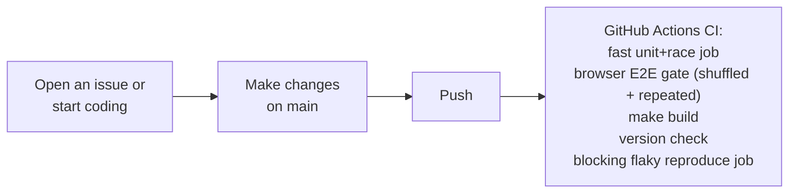

# Eitri — Context

Self-hosted, single-binary AI Agent for Linux. Named after the Norse blacksmith who forged Mjölnir. V1 runs from the user's chosen workspace (process CWD), serves a Chrome-on-Linux browser UI, and supports OpenCode Go, GitHub Copilot, and Custom OpenAI via litellm-backed LLM transport.

## Domain glossary

| Term | Meaning |
|------|---------|
| **Run** | One isolated agent-loop execution with its own context window, turn loop, tool registry, and system prompt, driving LLM → tool call → tool result → LLM until done or max turns. Sub-agents and batch runs are both runs; they differ in transport and in whether they may delegate further. Behavioral detail lives in [ARCHITECTURE § internal/runner](docs/ARCHITECTURE.md#internalrunner--run-service--agent-loop). |
| **Session Report** | A structured, human-readable retrospective of one complete agent session, showing the full conversation transcript, tool calls (with arguments and results), tool failures, timing per LLM call, retry attempts, and token utilization. Produced from persisted snapshots, history, traces, and SSE event timeline; turns join to their HTTP traces by ID (each trace records `run_id`/`turn`; an `llm_call` timeline event carries the turn's trace ID), so timing survives long tool runs and retries. |
| **Session** | Single in-memory chat conversation. Has unique ID, message/render history, and active-run state. Lives only in memory — not restored from disk on startup. A new session is created by clicking the + button in the sidebar. The session cap (default 10) limits only the number of concurrent in-memory instances. |
| **Tool** | Built-in tools — see [ARCHITECTURE.md](docs/ARCHITECTURE.md#built-in-tools). |
| **Render component** | A browser-visible UI element (tool card, Mermaid diagram, QuickReplies chips) rendered by the server as a Templ fragment and swapped into the DOM via HTMX. Each component is triggered by an SSE `component` event, not by tool return text. |
| **Tool card** | A `<details>` element showing tool progress (running with timer) and final result (collapsible output). Emitted by `tool_call` and `tool_result` SSE events. |
| **Provider** | External LLM service integration that owns authentication, model discovery, endpoint selection, and chat transport, exposing one or more models through Eitri's auth/discovery/profile layer over litellm Provider adapters. Profile + auth + litellm detail lives in [ARCHITECTURE § internal/provider](docs/ARCHITECTURE.md#internalprovider--provider-profiles--auth-seams).<br>- **Endpoint** — base URL used to reach the Provider for model discovery and chat; built-in Providers ship default endpoints, Custom OpenAI requires a user-entered one.<br>- **Model** — LLM behind a litellm-backed Provider adapter; OpenCode Go routes by prefix (qwen\*/minimax\* → Anthropic `/v1/messages`, rest → OpenAI `/chat/completions`); GitHub Copilot and Custom OpenAI use dedicated adapters. Configured via Settings or `~/.eitri/config.json`.<br>- **Unverified model** — a model selected in Settings whose availability has not yet been checked against the current draft Provider endpoint and credentials; Save or Test Connection must verify it before use. |
| **Settings draft** | Unsaved Settings form state. User edits, provider-driven endpoint changes, and model selections live in the draft until Save validates and persists them. |
| **Delegated run (sub-agent)** | A leaf run spawned in-process by a parent run via the `delegate` tool, reporting back via `collect`. `delegate`/`collect` are parent-only tools, so delegated runs cannot spawn further delegated runs. A browser-visible parent's delegate creates a child `UISession` (via its `ParentID`) nested under the parent in the sidebar tree; persistence and parent linkage live in [ARCHITECTURE § internal/persist](docs/ARCHITECTURE.md#internalpersist--session-snapshots-traces-and-timelines-on-disk). |
| **Skill** | Agent Skills-compatible directory containing `SKILL.md` instructions and optional `scripts/`, `references/`, and `assets/`. Discovered from fixed project/user roots and activated per session. |
| **Bash tool** | Executes shell commands via `os/exec.Command`. Sandbox and execution details live in the [internal/sandbox/](docs/ARCHITECTURE.md#internalsandbox--bwrap-sandbox-wrapper) and [internal/tool/](docs/ARCHITECTURE.md#internaltool--built-in-tools) sections of `docs/ARCHITECTURE.md`. |
| **Compactor** | LLM-summary compaction of oversized conversation messages, gated by high/low-water context-window thresholds and salience-aware ordering. See [ARCHITECTURE § internal/compactor](docs/ARCHITECTURE.md#internalcompactor--message-compaction). |
| **Pattern compression** | Deterministic, zero-LLM compression of bash tool output by command name (`ls`, `find`, `grep`, `rg`), guaranteed never to inflate tokens. See [ARCHITECTURE § internal/compress](docs/ARCHITECTURE.md#internalcompress--pattern-compression-for-bash-output). |
| **Frontend** | HTMX + Templ shell + browser islands — see [ARCHITECTURE.md](docs/ARCHITECTURE.md#frontend-architecture). |
| **Context panel** | 4th sidebar section showing live context window utilization: a progress bar in compact mode expanding to a per-category breakdown (system prompt, history, skills, completion) fed by `tokenizer.ComputeContext()`. The `context_update` SSE event contract and per-category token fields live in [ARCHITECTURE § internal/tokenizer](docs/ARCHITECTURE.md#internaltokenizer--token-estimation-and-calibration). |
| **Session workspace** | The filesystem root directory scoped to a single `UISession`. Defaults to the process CWD at session creation. All file tools (`bash`, `grep`, `read`, `write`, `edit`) operate within this directory; `read` may additionally target `allowed_read_paths` and `write`/`edit` may target **allowed write paths**. Can be changed at any time via the directory browser UI; takes effect on the next agent run. Independent of the server's launch workspace. |
| **Allowed write paths** | Host paths configured as writable (`sandbox.extra_writable_paths`) that byte-tools (`write`/`edit`) and `bash` may write to, outside the workspace root. See ADR-0031. |
| **Workspace directory browser** | An HTMX-driven server-side file explorer overlay that lets the user navigate to and select a session workspace. Shows directories only, with breadcrumb navigation and a "Select this folder" action. Triggered from the header workspace indicator or each session's sidebar entry. |
| **Crash dump** | A timestamped directory under `~/.eitri/crash-dump/` containing diagnostic files written when Eitri encounters an unexpected failure (provider HTTP error, agent loop panic, batch run failure). Contains error chain, goroutine stacks, session state, HTTP traces, and sanitized config. |
| **Batch run** | A headless `eitri -b` run that executes one prompt and exits, streaming tokens to stdout; a full parent that may delegate. Uses the same run engine and on-disk review trail as UI runs (session snapshot per turn, per-call HTTP traces, per-run timeline). See ADR-0023. |
| **Session persistence** | On-disk JSON persistence layer under `~/.eitri/sessions/<id>/` that survives server restarts, written atomically each turn for troubleshooting/historical debugging — never restored on startup, but loadable on demand via `POST /api/sessions/{id}/load` to bring a historical session back into the in-memory session manager (status forced to idle).<br>- **Snapshot** — point-in-time dump of one Session's full state (messages, components, skills, metadata) written as `session.json` after each complete agent turn (assistant message + all tool results); session messages carry all LLM-oriented fields (tool calls, tool_call_id), making the snapshot the single source of truth.<br>- **HTTP traces** — per-call `traces/<trace_id>.json` files written on LLM provider call completion, surviving restarts for post-mortem debugging; each trace carries the run and turn IDs it belongs to, so session reports correlate turns to traces by ID (issue #988).<br>- The Persister retains up to 1 GiB of timeline and trace files, evicting the oldest across all sessions. |
| **Persister** | The `internal/persist/` package writing/reading session snapshots, conversation histories, and HTTP traces to/from disk under `~/.eitri/`. See [ARCHITECTURE § internal/persist](docs/ARCHITECTURE.md#internalpersist--session-snapshots-traces-and-timelines-on-disk). |
| **Persona** | A named bundle of a system prompt and optional injected skills, stored as `~/.eitri/personas/<name>.yaml`. See [ARCHITECTURE § internal/persona](docs/ARCHITECTURE.md#internalpersona--personas-named-system-prompts). |
| **open_in_browser tool** | Opens a single `http(s)` or `file` URL in the user's host browser via `xdg-open`. Runs unsandboxed in the harness process (unlike the bwrap-sandboxed bash tool); bare paths are normalized to `file://` and sandbox `/tmp` paths are rewritten to the host. See ADR-0026. |
| **Sandbox tmpdir** | The session-scoped host directory mounted at `/tmp` inside every `bash` sandbox of a run. `/tmp` writes persist across commands in the same session and are addressable by `open_in_browser` after `/tmp`-rewriting; deleted at session end. See ADR-0026. |

## Architecture decisions

Architecture decisions are documented as ADRs in `docs/adr/` and indexed in [docs/ADRs.md](docs/ADRs.md).

See [docs/ARCHITECTURE.md](docs/ARCHITECTURE.md#target-repository-layout).

> **AI agents**: read `docs/ARCHITECTURE.md` before making changes — it covers module boundaries, key types, data flow, and extension points in detail.

## Running

```bash
go run ./cmd/eitri
# Open http://127.0.0.1:8080
```

Start Eitri from the workspace you want it to read/write. Configure the OpenCode Go API key and model via Settings or `~/.eitri/config.json`.

## Development & release flow

### Versioning

Eitri follows [Semantic Versioning 2.0](https://semver.org/). The canonical version lives in `VERSION` at the repo root.

| Phase | Version format | Notes |
|-------|----------------|-------|
| Pre-1.0 development | `0.Y.Z` | Anything may change (semver §4). `minor` bumps can include breaking changes. |
| Stable release | `1.Y.Z` | Future. |

### Daily development


```mermaid
flowchart LR
    A["Open an issue or\nstart coding"] --> B["Make changes\non main"]
    B --> C["Push"]
    C --> D["GitHub Actions CI:\nfast unit+race job\nbrowser E2E gate (shuffled + repeated)\nmake build\nversion check\nblocking flaky reproduce job"]
```

There is **no required branch strategy** — you can push directly to `main` or use PRs. CI runs on both.

**Changelog discipline:** Every change that adds, removes, or modifies behaviour (features, bug fixes, breaking changes, deprecations) must add an entry under `## [Unreleased]` in `CHANGELOG.md`. Keep entries brief and user-facing. This is how release notes are authored incrementally — the release script just re-arranges the headings.

Optional developer tools:

- `make run` — build and start the server locally
- `make test` — run all unit tests (fast, browser E2E excluded)
- `make test-browser` — run the standalone browser E2E suite
- `make test-browser-gate` — run the browser E2E regression gate (shuffled + repeated, matches CI)
- `make build` — compile the binary with embedded version
- `./eitri --version` — print the compiled version

The `scripts/agent-loop.sh` script is an optional convenience for those with `gh` installed. It is a dispatcher: it claims up to `-j N` (default 2) `ready-for-agent` issues, runs one `eitri -b` worker per issue in a detached git worktree (`.worktrees/issue-N`), then serially rebases and squash-merges the resulting PRs. Each worker runs one `eitri -b` per issue, leaving a reviewable, auto-generated `~/.eitri/sessions/<id>/` trail per issue (the run reports its `session_id`). See `docs/agents/batch.md`.

### Cutting a release

An AI agent or human can release with a single command:

```bash
./scripts/release.sh [patch|minor|major|<explicit-version>]
```

For example, from a clean `main` branch:

```bash
./scripts/release.sh patch   # 0.1.0 → 0.1.1
./scripts/release.sh minor   # 0.1.0 → 0.2.0
./scripts/release.sh 0.3.0   # explicit version
```

The release script:

1. **`scripts/bump-version.sh`** — reads `VERSION`, applies the semver bump, writes it back
2. **`scripts/update-changelog.sh`** — moves `[Unreleased]` entries under the new version heading, inserts a fresh `[Unreleased]` section
3. Commits `VERSION` + `CHANGELOG.md`
4. Tags with `v<VERSION>` (e.g. `v0.2.0`)
5. Pushes the commit and tag to GitHub

### Release publishing (CI)

Pushing a `v*` tag triggers `.github/workflows/release.yml`:

1. Verifies the tag matches `VERSION` (safety check)
2. Runs `make test-race` (the noise-stripping test wrapper) as the fast unit test gate. The browser E2E suite is `e2e`-build-tagged and excluded from `-race` (issue #1122).
3. Builds release tarballs for all supported platforms via `make release-all`
4. Generates a GitHub Release with attached tarballs and checksums

| Target platform | Tarball |
|----------------|---------|
| Linux amd64 | `dist/eitri-linux-amd64.tar.gz` |

### User installation

Users install the latest release:

```bash
curl -sSf https://raw.githubusercontent.com/glemsom/eitri/main/scripts/install.sh | bash
```

Or download a tarball from the GitHub Releases page and verify the SHA256 checksum.


