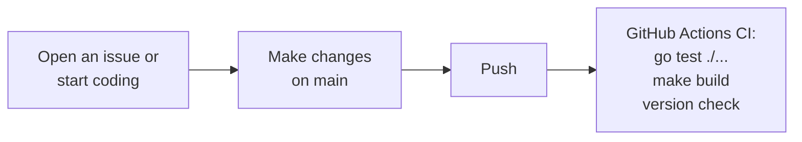

# Eitri — Context

Self-hosted, single-binary AI Agent for Linux. Named after the Norse blacksmith who forged Mjölnir. V1 runs from the user's chosen workspace (process CWD), serves a Chrome-on-Linux browser UI, and supports OpenCode Go, GitHub Copilot, and Custom OpenAI via litellm-backed LLM transport.

## Domain glossary

| Term | Meaning |
|------|---------|
| **Agent** | Synchronous turn loop that drives LLM → tool call → tool result → LLM until done or max turns. Lives in a single goroutine; SSE events fan out to UI concurrently. |
| **Session Report** | A structured, human-readable retrospective of one complete agent session, showing the full conversation transcript, tool calls (with arguments and results), tool failures, timing per LLM call, and token utilization. Produced from persisted snapshots, history, traces, and SSE event timeline. |
| **Session** | Single in-memory chat conversation. Has unique ID, message/render history, and active-run state. Lives only in memory — not restored from disk on startup. A new session is created by clicking the + button in the sidebar. The session cap (default 10) limits only the number of concurrent in-memory instances. |
| **Tool** | Capability agent can invoke (`bash`, `grep`, `read`, `write`, `edit`, `web_fetch`, `render_mermaid_diagram`, `render_quick_replies`, `skill`, `browser`, `delegate`, `collect`). `delegate` and `collect` are parent-only tools — sub-agents cannot spawn further sub-agents. Defined as Go structs with `JSONSchema()` methods; dispatched by name in the agent loop. |
| **Render component** | A browser-visible UI element (tool card, Mermaid diagram, QuickReplies chips) rendered by the server as a Templ fragment and swapped into the DOM via HTMX. Each component is triggered by an SSE `component` event, not by tool return text. |
| **Tool card** | A `<details>` element showing tool progress (running with timer) and final result (collapsible output). Emitted by `tool_call` and `tool_result` SSE events. |
| **Provider** | External LLM service integration that owns authentication, model discovery, endpoint selection, and chat transport. Eitri's auth/discovery/profile layer configures litellm Provider adapters underneath. A Provider exposes one or more Models. |
| **Provider endpoint** | Base URL used to reach a Provider for model discovery and chat. Built-in Providers have default endpoints; Custom OpenAI requires a user-entered endpoint. |
| **Settings draft** | Unsaved Settings form state. User edits, provider-driven endpoint changes, and model selections live in the draft until Save validates and persists them. |
| **Sub-agent** | A subordinate agent loop spawned by a parent agent via the `delegate` tool. Runs with its own turn loop, tool registry, and system prompt; reports back via `collect`. Cannot spawn further sub-agents in v1. |
| **Child session** | A `UISession` with a `ParentID` field, created when a browser-visible parent delegates to a sub-agent. Appears nested under the parent in the sidebar tree. |
| **Skill** | Agent Skills-compatible directory containing `SKILL.md` instructions and optional `scripts/`, `references/`, and `assets/`. Discovered from fixed project/user roots and activated per session. |
| **Bash tool** | Executes shell commands via `os/exec.Command`. Commands run inside a bubblewrap sandbox (defense-in-depth) with read-only root, writable workspace and /tmp. Falls back to direct execution when bwrap is unavailable or profile is "none". Proper stdout/stderr separation, exit code handling. Per-command timeout configurable via `command_timeout`. |
| **Compactor** | The `internal/compactor/` package that scans conversation history for oversized messages and replaces them with LLM-generated summaries. Individual messages are gated by `compaction_message_size_threshold` (default 2000 estimated tokens); compaction runs when the context window crosses `compaction_threshold_percent` (high-water mark) and stops once below `compaction_low_water_percent`. Compaction is salience-aware (`compaction_salience_enabled`): messages are scored by heuristic importance and the least important ones are compacted first. Compacted non-tool messages are tagged with `[MESSAGE COMPACTED]` prefix to prevent re-compaction. Runs automatically after each turn and on demand via `CompactSession`. |
| **Pattern compression** | Deterministic, zero-LLM compression of bash tool output by matching the command name (`ls`, `find`, `grep`, `rg`) against command-specific pattern compressors. Outputs are regrouped and summarized (group by directory, truncate per-group entries, add counts). Guaranteed to never inflate tokens. The raw original is preserved in `RawBlocks` for snapshots and debugging. |
| **Model** | LLM accessible via a litellm-backed Provider adapter. OpenCode Go models route by prefix (qwen*/minimax* → Anthropic /v1/messages, rest → OpenAI /chat/completions). GitHub Copilot and Custom OpenAI use dedicated adapters. Configured via Settings or `~/.eitri/config.json`. |
| **Unverified model** | Model selected in Settings whose availability has not yet been checked against the current draft Provider endpoint and credentials. Save or Test Connection must verify it before use. |
| **HTML-over-wire shell** | Go/Templ/HTMX-rendered application frame and fragments. Server owns canonical UI state and rendering. |
| **Browser island** | Isolated client-side behavior attached to server-rendered markup; owns only local ephemeral UI state. |
| **Stream island** | Browser island managing `EventSource` lifecycle and token display for one assistant run. |
| **Context panel** | 4th sidebar section showing live context window utilization. Uses a progress bar in compact mode; click expands to per-category breakdown (system prompt, history, skills, completion). Updated after each turn via `context_update` SSE events. |
| **Context update** | An SSE event (`type: "context_update"`) broadcast after each agent turn carrying estimated token counts. Fields: `total_tokens`, `context_window`, `prompt_tokens`, `completion_tokens`, `system_tokens`, `history_tokens`, `skill_tokens`. |
| **Session workspace** | The filesystem root directory scoped to a single `UISession`. Defaults to the process CWD at session creation. All file tools (`bash`, `grep`, `read`, `write`, `edit`) operate within this directory. Can be changed at any time via the directory browser UI; takes effect on the next agent run. Independent of the server's launch workspace. |
| **Workspace directory browser** | An HTMX-driven server-side file explorer overlay that lets the user navigate to and select a session workspace. Shows directories only, with breadcrumb navigation and a "Select this folder" action. Triggered from the header workspace indicator or each session's sidebar entry. |
| **Crash dump** | A timestamped directory under `~/.eitri/crash-dump/` containing diagnostic files written when Eitri encounters an unexpected failure (provider HTTP error, agent loop panic, batch run failure). Contains error chain, goroutine stacks, session state, HTTP traces, and sanitized config. |
| **Snapshot** | A point-in-time dump of a single Session's full state (messages, components, skills, metadata) written to disk as JSON. Written after each complete agent turn (assistant message + all tool results). Exists solely for troubleshooting and historical debugging — not used to restore active state on startup. |
| **Session persistence** | On-disk JSON file `~/.eitri/sessions/<id>/session.json` that survives server restarts. Written atomically every turn for troubleshooting/debugging. Not restored on startup, but can be loaded on demand via `POST /api/sessions/{id}/load` to bring a historical session back into the in-memory session manager (status forced to idle). The Persister retains up to 1 GiB of timeline and trace files, evicting the oldest across all sessions. Session messages carry all LLM-oriented fields (tool calls, tool_call_id) so the snapshot is the single source of truth. |
| **Trace persistence** | Individual HTTP trace files written to `~/.eitri/sessions/<id>/traces/<trace_id>.json` on LLM provider call completion. Survive server restarts for post-mortem debugging. |
| **Persister** | The `internal/persist/` package responsible for writing and reading session snapshots, conversation histories, and HTTP traces to/from disk. Owns the 1 GiB retention cap and directory layout under `~/.eitri/`. |
| **Persona** | A named bundle of a system prompt and optional injected skills. Stored as `~/.eitri/personas/<name>.yaml` (user-level only — no workspace-scoped personas). The `generic` persona is always present. Personas determine the agent's behaviour instructions; tools and workspace are shared. |

## Architecture decisions

Architecture decisions are documented as ADRs in `docs/adr/`:

| ADR | Title | Status |
|-----|-------|--------|
| [0001](docs/adr/0001-htmx-templ-ui.md) | HTMX + Templ shell with browser islands | Accepted |
| [0002](docs/adr/0002-agent-skills.md) | Agent Skills support | Accepted |
| [0003](docs/adr/0003-provider-profiles-and-github-copilot.md) | Provider profiles and GitHub Copilot | Accepted |
| [0004](docs/adr/0004-merge-tool-activity-into-inline-tool-cards.md) | Merge tool activity into inline tool cards | Accepted |
| [0005](docs/adr/0005-prompt-caching.md) | Session-scoped prompt caching | Accepted |
| [0006](docs/adr/0006-remove-adk-litellm-transport.md) | Remove ADK, adopt litellm transport + custom agent loop | Accepted |
| [0007](docs/adr/0007-split-render-component-into-per-component-tools.md) | Split render_component into per-component tools | Accepted |
| [0008](docs/adr/0008-add-context-lines-to-grep-tool.md) | Add context lines to grep tool | Accepted |
| [0009](docs/adr/0009-live-context-panel.md) | Live context window utilization panel | Accepted |
| [0010](docs/adr/0010-remove-tmux-executor.md) | Replace tmux executor with direct exec.Command | Accepted |
| [0011](docs/adr/0011-runagent-seam-interfaces.md) | Extract HistoryManager and Confirmer seam interfaces from RunAgent | Accepted |
| [0012](docs/adr/0012-web-fetch-tool.md) | web_fetch tool for fetching URLs | Accepted |
| [0013](docs/adr/0013-sub-agents.md) | Sub-agent support via delegate/collect tools | Accepted |
| [0014](docs/adr/0014-crash-dumps.md) | Crash dump directory for unexpected failures | Accepted |
| [0015](docs/adr/0015-per-session-workspaces.md) | Per-session workspaces with directory browser | Accepted |
| [0016](docs/adr/0016-session-persistence-json-snapshots.md) | Session persistence via JSON snapshots | Accepted |
| [0017](docs/adr/0017-bwrap-sandbox.md) | bwrap sandbox for bash tool | Accepted (amended) |
| [0018](docs/adr/0018-personas.md) | Personas — named system prompts with skill injection | Accepted |
| [0019](docs/adr/0019-adopt-litellm-client-for-transport.md) | Adopt litellm.Client for all LLM transport — replace hand-rolled adapters | Accepted |
| [0020](docs/adr/0020-browser-tool-newremoteallocator.md) | `browser` tool via chromedp NewRemoteAllocator | Accepted |
| [0021](docs/adr/0021-pattern-compression-for-bash-output.md) | Deterministic pattern compression for bash tool output | Accepted |
| [0022](docs/adr/0022-save-only-settings-drafts.md) | Save-only settings drafts | Accepted |

## Project structure

```
eitri/
├── cmd/eitri/                 # Entry point — starts HTTP+SSE server
├── internal/
│   ├── api/                   # HTTP server, SSE, HTMX/Templ render endpoints
│   │   └── templates/         # Templ source files and generated Go
│   ├── compactor/             # Message compaction (summarization of oversized messages)
│   ├── compress/              # Pattern compression for bash output (ls, find, grep, rg)
│   ├── config/                # ~/.eitri config management
│   ├── debug/                 # Crash dumps, HTTP traces, diagnostics
│   ├── fileutil/              # File path validation and I/O operations
│   ├── history/               # LLM conversation history (per-session sliding window)
│   ├── message/               # Message/EitriMessage types — conversation message model shared across packages
│   ├── persist/               # Session snapshots, conversation history, HTTP traces on disk
│   ├── persona/               # Persona (named system prompt) management
│   ├── provider/              # Provider profiles + auth seams
│   ├── report/                # Session report generation
│   ├── runner/                # RunService — run lifecycle + agent loop orchestrator, SSE broadcast, auth persist callbacks
│   │   └── loop/              # Agent turn loop (deep, earns its own package)
│   ├── runstate/              # SSE broadcast infrastructure + context tracking
│   ├── sandbox/               # bwrap sandbox wrapper for bash tool
│   ├── session/               # UI session management (in-memory, browser-facing)
│   ├── skills/                # Agent Skills discovery, registry, activation
│   ├── tokenizer/             # Token estimation and calibration (chars-per-token EMA)
│   └── tool/                  # Built-in tools (bash, read, write, edit, grep, web_fetch, render, browser, skill, delegate, collect)
├── scripts/                   # Install script, release tools
├── docs/ARCHITECTURE.md       # Architecture guide for AI agents
├── docs/TESTING.md            # Test runbook
├── docs/debug-api.md          # Debug API reference (JSON API for operational inspection)
├── docs/adr/                  # Architecture Decision Records
├── docs/agents/               # Agent documentation framework
├── go.mod
├── go.sum
├── VERSION                    # Canonical version string (semver)
├── CHANGELOG.md               # Keep a Changelog-formatted release notes
├── README.md                  # Human-facing project overview
```

> **AI agents**: read `docs/ARCHITECTURE.md` before making changes — it covers module boundaries, key types, data flow, and extension points in detail.

## Running

```bash
go run ./cmd/eitri
# Open http://127.0.0.1:8080
```

Start Eitri from the workspace you want it to read/write. Configure the OpenCode Go API key and model via Settings or `~/.eitri/config.json`.

## Development & release flow

### Versioning

Eitri follows [Semantic Versioning 2.0](https://semver.org/). The canonical version lives in `VERSION` at the repo root.

| Phase | Version format | Notes |
|-------|----------------|-------|
| Pre-1.0 development | `0.Y.Z` | Anything may change (semver §4). `minor` bumps can include breaking changes. |
| Stable release | `1.Y.Z` | Future. |

### Daily development


```mermaid
flowchart LR
    A["Open an issue or\nstart coding"] --> B["Make changes\non main"]
    B --> C["Push"]
    C --> D["GitHub Actions CI:\ngo test ./...\nmake build\nversion check"]
```

There is **no required branch strategy** — you can push directly to `main` or use PRs. CI runs on both.

**Changelog discipline:** Every change that adds, removes, or modifies behaviour (features, bug fixes, breaking changes, deprecations) must add an entry under `## [Unreleased]` in `CHANGELOG.md`. Keep entries brief and user-facing. This is how release notes are authored incrementally — the release script just re-arranges the headings.

Optional developer tools:

- `make run` — build and start the server locally
- `make test` — run all unit tests
- `make build` — compile the binary with embedded version
- `./eitri --version` — print the compiled version

The `scripts/agent-loop.sh` script is an optional convenience for those with `gh` installed. It iterates `ready-for-agent` issues and runs each via `eitri -b`. See `docs/agents/batch.md`.

### Cutting a release

An AI agent or human can release with a single command:

```bash
./scripts/release.sh [patch|minor|major|<explicit-version>]
```

For example, from a clean `main` branch:

```bash
./scripts/release.sh patch   # 0.1.0 → 0.1.1
./scripts/release.sh minor   # 0.1.0 → 0.2.0
./scripts/release.sh 0.3.0   # explicit version
```

The release script:

1. **`scripts/bump-version.sh`** — reads `VERSION`, applies the semver bump, writes it back
2. **`scripts/update-changelog.sh`** — moves `[Unreleased]` entries under the new version heading, inserts a fresh `[Unreleased]` section
3. Commits `VERSION` + `CHANGELOG.md`
4. Tags with `v<VERSION>` (e.g. `v0.2.0`)
5. Pushes the commit and tag to GitHub

### Release publishing (CI)

Pushing a `v*` tag triggers `.github/workflows/release.yml`:

1. Verifies the tag matches `VERSION` (safety check)
2. Builds release tarballs for all supported platforms via `make release-all`
3. Generates a GitHub Release with attached tarballs and checksums

| Target platform | Tarball |
|----------------|---------|
| Linux amd64 | `dist/eitri-linux-amd64.tar.gz` |

### User installation

Users install the latest release:

```bash
curl -sSf https://raw.githubusercontent.com/glemsom/eitri/main/scripts/install.sh | bash
```

Or download a tarball from the GitHub Releases page and verify the SHA256 checksum.

### Key files summary

| File | Purpose | Maintained by |
|------|---------|---------------|
| `VERSION` | Canonical semver string | `bump-version.sh` / hand-edit |
| `CHANGELOG.md` | Human-readable release notes | `update-changelog.sh` / hand-edit |
| `scripts/bump-version.sh` | Semver bump tool (reads/writes VERSION) | AI agent or human |
| `scripts/update-changelog.sh` | Version a new changelog section | AI agent or human |
| `scripts/release.sh` | Orchestrate bump → changelog → tag → push | AI agent or human |
| `.github/workflows/ci.yml` | CI: test + build on push/PR | Committed |
| `.github/workflows/release.yml` | Build + publish on `v*` tag | Committed |
| `scripts/agent-loop.sh` | Batch issue processing (optional) | Committed, optional use |
