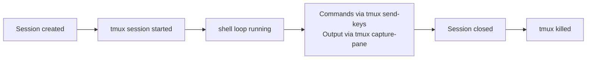

# Eitri — Product Specification

> Production-ready specification. Derived from architecture/test planning and original vision (initial.md). Specifies *what* must be built, not *how* — implementation details live in ARCHITECTURE.md.

---

## 1. Product Overview

**Eitri** is a self-hosted, single-binary AI coding agent for Linux. Named after the Norse blacksmith who forged Mjölnir, Eitri operates as an autonomous agent that executes system commands, reads/writes files.

### Core properties

| Property | Requirement |
|----------|-------------|
| **Deployment** | Single static binary for Linux x86_64. Requires `tmux` on `$PATH`. |
| **Install** | `curl -sSf https://raw.githubusercontent.com/glemsom/eitri/main/scripts/install.sh \| bash`. Downloads Linux x86_64 GitHub Release asset to `~/.local/bin/eitri` and verifies SHA256. |
| **Interface** | Browser-based UI at `http://127.0.0.1:8080`. Supported browser for v1: Chrome on Linux. HTMX + Templ shell with small browser islands. Templ is authoritative renderer; no SPA, no global frontend store, no separate frontend server. UI must show launch workspace path. |
| **LLM backend** | Supported v1 provider: OpenCode Go using its OpenAI-compatible endpoints only. Advanced best-effort provider: custom OpenAI-compatible API. Model names are discovered from provider `/v1/models`; no model ID is hard-coded. |
| **Security** | Agent tool execution via direct system commands (tmux). Direct file writes require visible edit cards but no user confirmation prompt in v1. |
| **Persistence** | Config at `~/.eitri/config.json`. Chat sessions are in-memory and are lost on server restart. |

### Non-goals

- Multi-user support. Eitri is single-user, localhost-only.
- Remote access. No built-in auth, TLS, or network exposure.
- GPU acceleration or local model inference.
- Plugin marketplace or remote extension distribution.
- Windows/macOS support.
- Trust prompts, per-skill enable/disable controls, custom skill paths, or skill deactivation.
- Pre-write approval prompts for file edits. V1 writes directly after tool invocation and reports visible edit/diff cards.
- Interactive terminal/PTY transport separate from tool-result cards.
- Session export/import, metrics, config schema migration, TLS/auth flags, rate limiting, update mechanism, and CSRF protection for localhost mutating routes in the initial release.

---

## 2. Architecture References

Implementation topology, module boundaries, key interfaces, and extension points live in [docs/ARCHITECTURE.md](docs/ARCHITECTURE.md). Product-level requirements in this spec remain normative. Canonical decisions live in [docs/adr/](docs/adr/) and are indexed in [CONTEXT.md](CONTEXT.md#architecture-decisions).

---

## 3. Command Execution Specification

### 3.1 Execution model

Commands run directly on host system via tmux-managed shell sessions. Each tmux session starts in the launch workspace directory (process CWD at startup). Later `cd` commands affect that tmux shell only; file tools remain workspace-relative.

### 3.2 Lifecycle



### 3.3 Session manager

Session lifecycle, limits, ownership, and persistence semantics are canonical in §6.2.

Executor-specific requirements:
- Map of `sessionID → {executor, lastAccess}`. Browser ownership lives in UI/API session state (§6.2).
- `GetOrCreate(sessionID)` returns existing executor or creates new one with initial working directory set to the launch workspace.
- Idle timeout uses `session_timeout` (default 30 minutes); timeout loop checks every 30s.
- `Close(sessionID)` kills that session's active run and tmux executor.
- `CloseAll()` runs on graceful shutdown.

### 3.4 Preflight audit

On startup, verify:
- `tmux` binary exists on `$PATH`
- If `tmux` is missing, fail startup before binding HTTP listener. Print actionable error message to stderr and exit non-zero.

### 3.5 Production hardening

Executor hardening requirements live in §10. Key command requirements: literal `tmux send-keys`, sentinel-delimited output with exit code, final-only command result object, 128 KiB output cap, per-command timeout, process-group kill on `Close()`, one command at a time per session, and tmux-session recovery on next command if the session dies.

---

## 4. Agent Specification

### 4.1 Model abstraction

- Implement `model.LLM` from `google.golang.org/adk/v2/model`.
- Supported providers:
  - `opencode_go`: OpenCode Go via OpenAI-compatible `/v1/chat/completions` SSE streaming.
  - `github_copilot`: GitHub Copilot via OpenAI-style `/chat/completions` SSE streaming. Settings support manual bearer-token entry and GitHub OAuth device flow.
- Advanced provider: `custom_openai` base URL, best-effort only.
- Configurable: `provider`, `api_key`, `base_url`, `model` name. `api_key` stores bearer credential for providers that require one. OpenCode Go default provider base is `https://opencode.ai/zen/go`; GitHub Copilot default provider base is `https://api.githubcopilot.com`. Model IDs must come from live provider discovery rather than hard-coded default.
- OpenCode Go and GitHub Copilot require a bearer credential. Eitri sends it as `Authorization: Bearer <api_key>`.
- Must handle: rate limits (429), auth errors (401/403), context-limit errors, timeouts, connection refused.
- Initial release requires provider-profile model discovery; manual model fallback is out of scope for v1.

#### Minimum streaming chat provider contract

A provider is usable in v1 only if its profile exposes a streaming chat-completions endpoint that supports:

- `POST {base_url}{chat_completions_path}` accepting `model`, `messages`, `tools`, `tool_choice`, and `stream: true`.
- SSE chunks using `data: {...}` and terminal `data: [DONE]`.
- Streaming text deltas at `choices[0].delta.content`.
- Streaming tool calls at `choices[0].delta.tool_calls`, including fragmented tool-call arguments that Eitri assembles before validation/execution.
- `choices[0].finish_reason`.
- Best-effort usage reporting; if absent, Eitri falls back to estimates.

OpenAI-compatible profiles use `/v1/chat/completions`; GitHub Copilot uses `/chat/completions`. Providers without streaming tool-call support are unsupported in v1 and must produce a friendly unsupported-provider error.

### 4.1a Model discovery

Eitri calls the configured provider profile's model-discovery path to discover available model IDs. For `opencode_go`, default `base_url` is `https://opencode.ai/zen/go` and discovery uses `/v1/models`. For `custom_openai`, `base_url` is user-provided and discovery uses `/v1/models`. For `github_copilot`, default `base_url` is `https://api.githubcopilot.com` and discovery uses `/models`. Eitri uses model discovery to:

- **Populate** the Settings UI model selector from live provider data.
- **Require** model selection from discovered model IDs for the initial release.
- **Validate** saved model against provider available list on startup/settings load.
- **Validate Settings save** by calling provider profile model-discovery path with entered provider/API key before accepting provider config.
- **Use** discovered/model-provided context length when available; otherwise assume a 256k-token context window for UI estimates.
- **Disable chat** when model discovery fails or saved model is no longer present.

No model ID is hard-coded as a default. If no model is saved, Settings prompts the user to choose one from the discovered model list, and chat is disabled until a discovered model is selected. If model discovery fails, chat remains disabled with an actionable error. If a saved model is no longer present in discovery results, Settings save/chat setup must reject it. For `opencode_go` and `github_copilot`, missing or rejected bearer credentials block Settings save and chat. For `custom_openai`, API key is optional but `/v1/models` discovery is still required.

GitHub Copilot model discovery parses `data[]` from `/models` and includes only user-pickable chat models: `policy.state != "disabled"`, `model_picker_enabled == true`, and `supported_endpoints` contains `/chat/completions`. Eitri displays and stores model IDs only in MVP.

### 4.2 Built-in tools

| Tool | Function |
|------|----------|
| `terminal_execute` | Run shell command in tmux session, return output |
| `file_viewer` | Read file contents from workspace and permitted skill directories |
| `file_editor` | Write/modify file in workspace |
| `render_component` | Render rich UI components in chat (`MermaidDiagram`, `QuickReplies`, `DiffCard`). See §5.10. |
| `activate_skill` | Load an Agent Skill's full instructions into the current session context. See §4.4. |

**Tool contract**: Each tool function receives `agent.Context` for session ID access. `terminal_execute` calls `sessionMgr.GetOrCreate(sessionID).ExecuteCommand(...)`. Tool args are validated against JSON schemas before execution. Tool transport errors mean invalid args, policy rejection, executor failure, or concurrent command rejection; non-zero shell exit is a normal `terminal_execute` result.

#### Tool schemas and results

`terminal_execute` args:
```json
{"command": "go test ./..."}
```
Result:
```json
{
  "stdout": "...",
  "stderr": "",
  "exit_code": 0,
  "timed_out": false,
  "duration_ms": 1234,
  "truncated": false
}
```
Rules: commands run directly on host in session tmux shell with configured `command_timeout` (default 60s). V1 returns a final-only result after command completion/timeout. tmux captures combined pane output into `stdout`; `stderr` is empty until separate stream capture exists. Output is capped at 128 KiB; excess output sets `truncated=true`. Concurrent commands in the same session are rejected and not queued.

`file_viewer` args:
```json
{"path": "internal/api/server.go", "offset": 1, "limit": 2000}
```
Result:
```json
{"path": "internal/api/server.go", "content": "...", "truncated": false}
```
Rules: reads UTF-8 text files only. `offset` is 1-indexed line offset. `limit` is optional line cap. Reject directories, binary/non-UTF-8 content, NUL bytes, `../` escapes, and absolute paths outside allowed roots.

`file_editor` args:
```json
{"path": "foo.go", "content": "...", "mode": "create|overwrite"}
```
Result:
```json
{
  "path": "foo.go",
  "mode": "overwrite",
  "bytes_written": 1234,
  "old_content": "...",
  "new_content": "...",
  "dirs_created": []
}
```
Rules: v1 supports whole-file create/overwrite only. Writes UTF-8 text files inside workspace only. Reject directories, NUL bytes, `../` escapes, absolute paths outside workspace, create when file exists, and overwrite when file does not exist. `mode=create` creates missing parent directories inside workspace, rejects parent path escapes, and rejects parent components that exist as files. `mode=overwrite` requires target file and parent directories to already exist. On overwrite, Eitri captures previous file content before writing so the UI can render a diff card. On create, Eitri returns created content so the UI can render a created-file preview. Large file edit cards are collapsed by default.

`render_component` args:
```json
{"name": "MermaidDiagram", "data": {"code": "graph TD; A-->B;"}}
```
Rules: validates component name + data shape, then sends `component` SSE packet to client. Supported names are `MermaidDiagram`, `QuickReplies`, and `DiffCard` (§5.10).

`activate_skill` args:
```json
{"name": "code-review"}
```
Rules: validates requested skill name against effective skills registry, deduplicates activations per session, and returns structured skill instructions/resources (§4.4).

**Path constraints**:
- Workspace = CWD at launch. `file_viewer` and `file_editor` validate paths are within workspace by cleaning paths and rejecting `../` escapes or absolute paths to non-workspace locations. `file_viewer` may also read files under effective/active skill directories as specified in §4.4.
- Initial release does **not** resolve symlinks to detect symlink escapes outside workspace/skill roots; this risk is accepted for v1.

### 4.3 System prompt

- Base prompt customizable via config (`system_prompt` field).
- Tool descriptions auto-appended by ADK.
- Combined prompt must fit within the provider/model context window. Eitri does not pre-block runs based on a v1 context estimate; provider context-limit failures are surfaced as friendly errors.
- Default system prompt instructs model to:
  - Use Markdown for all responses (headings, lists, tables, links).
  - Use fenced code blocks with language tags (e.g. ```` ```go ````) for all code.
  - Use ```` ```mermaid ```` fenced blocks for diagrams (architecture, sequence, flow, ER, class).
  - Use `$...$` for inline math and `$$...$$` for display math.
  - Use `render_component` tool for rich visual output: `MermaidDiagram`, `QuickReplies`, and `DiffCard`.
  - When a task matches an available skill description, call `activate_skill` with that skill name before proceeding.
  - Use `QuickReplies` component at end of responses for likely follow-ups.
  - Wrap reasoning/thinking steps in `<think>...</think>` tags (rendered as collapsible accordions).
  - Prefer Mermaid diagrams and diffs over text when they communicate structure or code changes better.

### 4.4 Agent Skills

Eitri supports [Agent Skills](https://agentskills.io/specification). Skills are local directories containing a `SKILL.md` file with YAML frontmatter and Markdown instructions, plus optional `scripts/`, `references/`, and `assets/` directories.

#### Discovery roots and precedence

Eitri scans these fixed roots. Missing directories are ignored; unreadable directories produce diagnostics visible in the Skills UI and logs, but do not block startup or chat.

| Precedence | Scope | Root |
|------------|-------|------|
| 1 | `project-eitri` | `<workspace>/.eitri/skills/` |
| 2 | `project-agents` | `<workspace>/.agents/skills/` |
| 3 | `user-eitri` | `~/.eitri/skills/` |
| 4 | `user-agents` | `~/.agents/skills/` |

Within each root, a skill is any subdirectory containing a file named exactly `SKILL.md`. If multiple skills share the same `name`, the highest-precedence skill is effective and lower-precedence records are marked `shadowed`. The model prompt catalog and `activate_skill` tool expose only effective loaded skills.

Project-level skills are loaded without a trust gate. The Skills UI must make detected project skills visible so users can identify unexpected repository-provided instructions.

#### Parsing and validation

Eitri uses lenient validation with hard minimums:

- Skip a skill if `SKILL.md` is missing, YAML frontmatter is missing/unparseable, `name` is missing/empty, or `description` is missing/empty.
- Warn but load when `name` violates strict spec format, `name` differs from parent directory, `name`/`description` exceed recommended limits, or optional fields are malformed.
- Surface diagnostics in the Skills UI.
- Parse optional `license`, `compatibility`, `metadata`, and `allowed-tools` fields. `allowed-tools` is advisory only and is not enforced.

#### Progressive disclosure

At run start, Eitri appends an available skills catalog to the system prompt containing only effective loaded skills:

```xml
<available_skills>
  <skill>
    <name>code-review</name>
    <description>Review code changes for standards and issue fit.</description>
  </skill>
</available_skills>
```

The prompt instructs the model to call `activate_skill(name)` when a task matches a skill description. If no skills are available, Eitri omits the catalog and skill-use instructions.

#### Skill activation

Skills activate by model tool call or user slash command. Activation is session-scoped and persists for the lifetime of the in-memory chat session. Active skill names are deduplicated and re-applied on every new run in that session. Server restart loses active skills along with chat sessions.

`activate_skill` accepts only an effective loaded skill name. It returns structured, model-friendly content:

```xml
<skill_content name="code-review">
<skill_directory>/abs/path/to/code-review</skill_directory>
<allowed_tools advisory="true">Bash(git:*) Read</allowed_tools>

<instructions>
...SKILL.md body only...
</instructions>

<skill_resources>
  <file>references/standards.md</file>
  <file>scripts/check.sh</file>
</skill_resources>

Relative paths in this skill resolve from skill_directory.
Use file_viewer for references/assets. Scripts are not executed automatically.
</skill_content>
```

The returned instructions exclude YAML frontmatter. Activation fails if the skill body exceeds 200KB. Resource manifests list files under `scripts/`, `references/`, and `assets/`, capped at 200 files and depth 4. Resource files are listed but not eagerly loaded.

`file_viewer` may read workspace files and files under effective/active skill directories. `file_editor` remains workspace-only. `terminal_execute` may run commands/scripts under the existing direct-host execution model; no skill script runs automatically.

#### Slash activation

Chat input supports user-explicit activation:

- `/skill-name` activates the skill in the current session and returns a UI event without starting an LLM run.
- `/skill-name prompt text...` activates the skill, then starts a normal chat run using `prompt text...`.
- `/skill-a /skill-b prompt text...` activates multiple leading skills in order, then sends the remaining prompt.
- If the first token starts with `/` and matches the skill-command shape (`/[a-z0-9][a-z0-9-]*`) but no skill or reserved command exists, the server returns `422 Unknown skill or command`.

#### Refresh lifecycle

Eitri rescans skills at startup, on each chat run start, on `GET /skills`, and on `POST /api/skills/refresh`. No filesystem watcher is required. Active sessions store active skill names, not frozen content; each run resolves names against the current effective registry. If an active skill disappears, the run skips it and surfaces a warning.

---

## 5. Frontend Specification

### 5.1 Technology

Frontend model is an **HTMX + Templ shell with small browser islands**.

| Layer | Technology | Role |
|-------|-----------|------|
| **Templates** | Templ (`.templ` → Go) | Authoritative renderer for full pages, fragments, and components. Type-safe HTML compiled into binary via `templ generate`. Colocated at `internal/api/templates/`. |
| **Hypermedia interactions** | HTMX (~14 KB) | Forms, navigation, partial updates, out-of-band swaps, request indicators, CSS transitions. No frontend framework. |
| **Streaming** | Server-Sent Events (SSE) | Default assistant-run transport. Native browser `EventSource` streams structured JSON envelopes into `eitri-stream`. No HTMX SSE auto-swap. |
| **Browser islands** | Small custom elements / isolated JS | Browser-native capability and fast feedback only: stream display, copy buttons, Mermaid/KaTeX/Prism hooks, and diff toggles. No global SPA store. |
| **Markdown→HTML** | goldmark (Go library) | Server-side Markdown rendering on turn completion. Extensions: tables, fenced code, strikethrough, autolinks, task lists. |
| **Syntax highlighting** | Prism.js (embedded pinned asset) | Post-swap client-side highlighting of code blocks. |
| **Math rendering** | KaTeX (embedded pinned asset) | Post-swap client-side math expression rendering. |
| **Diagram rendering** | Mermaid.js (embedded pinned asset) | Post-swap client-side diagram rendering from ```` ```mermaid ```` blocks and MermaidDiagram component. |
| **Styling** | Custom CSS (embedded pinned stylesheet) | `internal/api/assets/eitri.css`. No Tailwind, npm, bundler, or frontend build. |
| **Client JS** | Base asset bundle or small inline modules | Island definitions + idempotent post-swap hooks. No npm, no bundler, no separate frontend server. |
| **Build** | None | `templ generate` is the only code-gen step. No npm, no Vite, no React/Vue/Svelte/Alpine. |

Go server owns application state, routing, validation, security boundaries, agent runs, sessions, assistant transcripts, and HTML rendering. Browser owns low-latency presentation, streaming display, rich visual components, and small isolated interactions. DOM is state for base UI. Browser islands own only local ephemeral widget state.

WebSocket is not part of the chat protocol.

### 5.2 Architecture: How It Fits Together

Frontend implementation topology lives in [docs/ARCHITECTURE.md](docs/ARCHITECTURE.md#frontend-architecture). Route and SSE packet contracts are canonical in §6.

### 5.2a Browser islands

| Island | Responsibility | Transport |
|--------|----------------|-----------|
| `eitri-stream` | EventSource lifecycle, display-only token buffering, flush cadence, run status, reconnect UI, final message render call | SSE + HTMX render endpoints |
| `eitri-composer` | Textarea keyboard handling and completion menu for `/skill-name` and `@workspace/path` tokens | JSON completion endpoints + HTMX chat submit |
| `eitri-code-block` | Copy button, line wrap toggle, show-all large blocks | none |
| `eitri-mermaid` | Idempotent Mermaid initialization and re-render fallback | none |
| `eitri-diff-card` | Side-by-side/unified toggle, collapse unchanged lines | none |

### 5.3 Templ component inventory

| Component | Purpose |
|-----------|---------|
| `Base(pageTitle)` | HTML document shell: `<head>` with embedded pinned HTMX, Prism, KaTeX, Mermaid, and stylesheet assets. `<body>` contains layout and island definitions/post-swap hooks. |
| `SessionTabs(sessions, activeSessionID)` | Top-bar session strip: active tab, status dot (`idle`/`running`/`error`), close button, and `+` new-session button. |
| `ChatView(session)` | Main chat interface for one active session: message history, streaming target, input form, terminal panel toggle. |
| `ChatBubble(role, contentHTML)` | Single message bubble. Styled differently for user vs assistant. |
| `StreamingBubble(contentHTML)` | Auto-updating bubble during SSE streaming. `eitri-stream` updates text during generation, then HTMX swaps server-rendered Markdown on `done`. |
| `MessageInput(sessionID, disabled)` | Chat input form with `hx-post`, `eitri-composer`, accessible completion listbox, and visible Stop button during active runs. |
| `SetupBanner(configState)` | Chat banner shown when provider config is incomplete/invalid; links to Settings and keeps composer disabled. |
| `WorkspaceIndicator(workspacePath)` | Header/status element showing launch workspace path. |
| `ToolCallCard(toolName, args)` | Tool call indicator, including file edit intent before direct write. |
| `ToolResultCard(toolName, outputHTML)` | Tool result display. |
| `FileEditCard(path, mode, oldContent, newContent)` | Post-write visibility for `file_editor`; renders overwrite diff or created-file preview, collapsed for large edits. |
| `SettingsView(config)` | Config form with `hx-put` for save. |
| `SkillsView(registry)` | Skills page listing detected effective, shadowed, and invalid Agent Skills with diagnostics. |
| `ActiveSkillChips(skills)` | Chat-page chips showing skills active for the current session. |
| `ErrorToast(message)` | Inline error banner, auto-dismiss via HTMX `hx-swap` with CSS transition. |
| `GenerativeUI` components (see §5.10) | Rich browser-native components (diagrams, quick replies, diffs) triggered by `component` SSE packets. |
| `MermaidDiagram(code)` | Renders Mermaid diagram via client-side Mermaid.js. `<pre class="mermaid">` + post-swap init. |
| `QuickReplies(options)` | Row of suggestion chip buttons. Each triggers `hx-post` to `/api/sessions/{id}/chat` with pre-filled message. |
| `DiffCard(oldCode, newCode)` | Side-by-side or unified diff view. Server renders diff HTML; `eitri-diff-card` owns toggle/collapse UI. |

### 5.4 HTMX interaction patterns

HTMX owns request/response interactions: forms, navigation, partial swaps, out-of-band updates, indicators, and CSS transitions. Route contracts are canonical in §6.1; SSE packet contracts are canonical in §6.2. Frontend-specific patterns:

- Session tabs use normal links for switching, `POST /api/sessions` for creation, and `DELETE /api/sessions/{id}` for close. Closing an active run requires UI confirmation.
- Chat submit posts to `/api/sessions/{id}/chat`, appends the returned user bubble, applies OOB disabled input state, shows the Stop button, and uses `HX-Trigger: eitri:connectRunStream` to open SSE.
- First-run or invalid-provider state keeps the chat page visible with a setup banner and disabled composer; users are not redirected to Settings automatically.
- `eitri-stream` opens `GET /api/sessions/{id}/stream` only after successful chat POST. It never starts runs.
- Non-token SSE packets dispatch to server render endpoints via `htmx.ajax`; server returns HTML fragments for tool cards, components, errors, and final Markdown.
- Settings and Skills pages use HTMX-aware read/update endpoints for form/table fragments; direct navigation renders full pages.
- Composer completions call JSON endpoints directly; selection only mutates textarea text. Chat submit remains authoritative.
- Quick reply buttons submit ordinary chat messages to the same chat endpoint.

### 5.5 Client script and stream requirements

Client JS lives in Base asset bundle or small inline modules. No npm, bundler, frontend framework, SPA global store, or separate frontend server. SSE dispatch behavior is canonical in §6.2.

Frontend-only responsibilities:

- Derive active session identity from current page path/form action, not from client-side session state.
- Initialize browser islands on full page load and `htmx:afterSwap`.
- Keep island initialization idempotent across HTMX swaps.
- Tolerate missing optional libraries: Prism, KaTeX, and Mermaid.
- Use text nodes / `textContent` for token display and completion labels; never inject token/user/LLM data as HTML.
- Keep composer completion state ephemeral: current token, open/closed menu, highlighted index, and pending request sequence.

`eitri-stream` requirements are canonical in §6.2: display-only token buffering, 50-100ms/newline flush cadence, no-dead-air state, run phases, reconnect feedback, and final render by server-owned `message_id`.

### 5.6 State management

| Concern | Approach |
|---------|----------|
| **Browser/session identity** | Defined in §6.2 session lifecycle. Browser ownership uses `browser_id`; session identity is explicit in page/API paths. |
| **UI state** | Server-owned `UISession` state: `id`, `browser_id`, `title`, `status`, `messages/events`, timestamps. HTMX swaps DOM — the DOM *is* the state. No client-side state object. |
| **Chat history** | Rendered into page by server from `UISession`. New messages appended via HTMX swaps. ADK session service remains model conversation state, not UI render source. |
| **Streaming state** | Per-run SSE connection open = streaming. Input disabled via `hx-swap-oob`. Runs continue server-side when user switches sessions. |
| **Config form** | Loaded from server on navigation. Saved via `hx-put`. Server returns updated form HTML. |
| **Back/forward** | HTMX `hx-push-url` for history. Server re-renders views on direct navigation (HATEOAS). |

### 5.7 Views

| View | Route | Templ component | Description |
|------|-------|-----------------|-------------|
| **Session redirect** | `/` | n/a | Ensures `browser_id`; redirects to last-active session, or creates first session and redirects to `/sessions/{id}`. |
| **Chat** | `/sessions/{id}` | `SessionTabs` + `ChatView` | Primary interface for selected session: top-bar session tabs, workspace indicator, setup banner when provider config is incomplete, message list, input, collapsible terminal. |
| **Settings** | `/settings` | `SettingsView` | Config form (OpenCode Go provider, GitHub Copilot provider, advanced custom OpenAI-compatible provider, model selector, executor). Navigated via `hx-get` + `hx-push-url`. |
| **Skills** | `/skills` | `SkillsView` | Lists detected Agent Skills, effective/shadowed/invalid status, scope, path, and diagnostics. |

Server renders full pages for direct navigation (`/`, `/settings`) and HTML fragments for HTMX partial swaps.

### 5.8 Behavior

Canonical cross-cutting contracts:

- Session lifecycle, ownership, limits, cancellation, and run concurrency: §6.2.
- Model discovery/selector behavior: §4.1a.
- Workspace and file-tool access: §4.2.
- Route-level responses and status codes: §6.1.
- Skills discovery, activation, slash commands, and refresh lifecycle: §4.4.

Frontend-specific behavior:

| Feature | Requirement |
|---------|-------------|
| Input lifecycle | Server disables composer + send button during active run via OOB swaps; a visible Stop button remains enabled and posts to `/api/sessions/{id}/cancel`. Empty input is blocked client-side and rejected server-side with `422`. Successful chat POST returns immediate user bubble before assistant stream connects. If provider config is incomplete/invalid, chat remains visible with a setup banner and disabled composer. |
| Cancellation | Stop button and Escape cancel the active run. UI phase changes to `cancelling...`; on success input is re-enabled, partial assistant message is marked `Stopped`, and any active tool card transitions to `Cancelled` when applicable. |
| Keyboard composer | Enter sends; Shift+Enter inserts newline; Escape cancels active run. When completion menu is open, Enter accepts highlighted candidate, Escape closes menu, Tab/ArrowDown moves next, Shift+Tab/ArrowUp moves previous. |
| Config form | Save uses `hx-put` and returns updated form + toast that auto-dismisses after 3s. Provider defaults to `opencode_go` with base URL `https://opencode.ai/zen/go`; `github_copilot` is supported with default base URL `https://api.githubcopilot.com`; `custom_openai` is available under advanced/best-effort disclosure. OpenCode API key and GitHub Copilot token are sent as Bearer auth; custom API key is optional. Settings also expose `Authenticate with GitHub` for Copilot device flow. Device flow shows verification URL + user code, polls for approval, stores returned token in config, and refreshes model list. Save verifies provider credentials and model discovery via provider profile model path before accepting config. Empty save preserves existing key; `clear_api_key` clears it. When provider changes, Eitri clears `model` and updates `base_url` to new provider default only if previous base URL was empty or equal to old provider default. |
| Stream status | Run indicator is driven by `EventSource` readyState and stream packets. Phases: `idle`, `connecting`, `streaming`, `tool-running`, `rendering`, `done`, `error`, `reconnecting`. Accessible text required; color never sole signal; no server polling. |
| No-dead-air/reconnect | If no first token/tool event arrives within 500-800ms after stream connection, show working state. If EventSource reconnects mid-run, show reconnecting until stream resumes, completes, or errors. |
| Errors | SSE `error` dispatches to `/api/sessions/{id}/render/error`; server returns ErrorToast HTML for `#errors`. Banner is non-modal and auto-dismisses. Config/model/LLM/tool failures use friendly messages with action hints (§5.8a). Provider context-limit errors say: `Model context limit exceeded. Start a new session or ask a shorter question.` No pre-run context estimation/blocking is required in v1. |
| Tool output | Tool cards appear at tool start with spinner and duration timer, then transition to result summary. Large output is collapsed by default and copyable. Terminal panel is collapsible/hidden by default; command output appears through `tool_result` cards, not a separate terminal stream. `file_editor` results render `FileEditCard`: overwrites show a diff, creates show a created-file preview, large edits collapsed by default. |
| Markdown | During streaming, tokens render as raw text. On `done`, server renders stored assistant text with goldmark. Extensions: tables, fenced code, strikethrough, autolinks, task lists, footnotes. Raw HTML is disabled. |
| Code blocks | Server renders `<pre><code class="language-X">` with copy button. Prism runs after swaps if loaded. Line numbers use CSS counters. Blocks over 500 lines get max-height + show-all toggle; `eitri-code-block` also owns line-wrap toggle. |
| Math | Server wraps inline/block math with `.math-inline` / `.math-block`; KaTeX processes after swaps. If KaTeX is missing, raw LaTeX remains visible. |
| Thinking sections | `<think>...</think>` becomes collapsed `<details>` server-side before goldmark rendering. |
| Mermaid | Fenced `mermaid` blocks and MermaidDiagram components render as `<pre class="mermaid">`; Mermaid.js processes after swaps with pan/zoom interactivity. Missing Mermaid shows raw code with notice. |
| Generative components | `render_component` emits component packets; server renders MermaidDiagram, QuickReplies, and DiffCard (§5.10). QuickReplies submit normal chat messages. |
| Context tracking | Token usage/estimate appears in message footer after `done`; it is not streamed during generation. If provider/model metadata does not expose a context length, percentage/fullness estimates use `context_window_tokens` (default 256k). |
| Skills UI | `/skills` lists effective, shadowed, and invalid skills with name, description, scope, status, path, diagnostics. Chat shows active skill chips as informational only; no deactivation control. Manual/slash activation appends visible event: `Skill activated: <name>` or `Skill already active: <name>`. |
| Completion scope | Completion applies only to current cursor token. `/` triggers skill completion; `@` triggers workspace file completion. No LLM call participates. `@path` stays plain prompt text; server does not auto-read, attach, or validate mentioned files on chat submit. |
| Skill completion | Lists only effective loaded skills; excludes shadowed/invalid. Case-sensitive prefix match against `name`; selection inserts `/skill-name `. |
| File completion | Lists launch-CWD workspace entries only, never skill dirs. Rejects `..`/absolute paths, reads one directory level, never recurses. Dirs end with `/` and keep menu open; files insert trailing space. Sort dirs before files, lexicographic. Hidden entries appear only after dot segment. Skip `.git`, `node_modules`, `vendor`, `dist`, `build`, `target`, `.cache`. |
| Workspace display | Every full chat/settings/skills page shows the launch workspace path. Eitri has no v1 CLI workspace argument; users must start `eitri` from the workspace they want to edit. |
| Browser support | V1 supported browser is Chrome on Linux. Other browsers are best-effort and not release-gated. |
| Completion limits/accessibility | Endpoints return ≤50 candidates. Client debounces by 100ms and ignores stale responses via sequence. Server targets ~100ms best-effort and may return partial/error results. Composer uses combobox/listbox ARIA (`aria-controls`, `aria-expanded`, `aria-activedescendant`, `role=listbox`, `role=option`, `aria-selected`) plus status text. |

### 5.8a Friendly error taxonomy

Eitri must translate common failures into short user-facing messages with action hints. Raw provider/executor details may be logged, but the UI should show actionable copy.

| Condition | User message | Action hint |
|-----------|--------------|-------------|
| Missing provider config | `Provider setup required` | Open Settings |
| Missing OpenCode API key | `OpenCode API key required` | Enter API key in Settings |
| Missing GitHub Copilot token | `GitHub Copilot token required` | Enter token or use Authenticate with GitHub in Settings |
| 401/auth failure | `Provider rejected API key` | Update API key |
| 429/rate limit | `Provider rate limit reached` | Retry later |
| Connection refused/unreachable | `Cannot reach provider at <base_url>` | Check provider is running and URL is correct |
| Model missing | `Selected model no longer available` | Choose another model |
| Unsupported streaming tool calls | `Provider does not support required streaming tool calls` | Use OpenCode Go or another compatible provider |
| Context limit exceeded | `Model context limit exceeded. Start a new session or ask a shorter question.` | Start new session |
| Command timeout | `Command timed out after <duration>` | Try a narrower command |
| Concurrent run | `Session already running` | Stop current run or wait |
| Port conflict | `Cannot bind <addr>: address already in use` | Try `EITRI_ADDR=127.0.0.1:8081 eitri` |

### 5.9 Production hardening

| Concern | Requirement |
|---------|-------------|
| Untrusted content | Tokens and completion labels use text nodes / `textContent`; goldmark raw HTML disabled; no `innerHTML` with user/LLM data. |
| Error/loading states | HTMX requests use `hx-indicator`; stream island exposes accessible phase text; errors render into dedicated `#errors` container. |
| Client validation | HTML5 validation mirrors server validation where possible (`required`, `type="url"`, `min`, `max`). Server remains authoritative (§7.2). |
| Optional assets | Prism, KaTeX, and Mermaid failures degrade to readable raw/plain output without JS exceptions. |
| Asset loading | Pinned HTMX, Prism, KaTeX, Mermaid, and stylesheet assets are self-hosted from embedded binary assets; no CDN. If HTMX/JS is unavailable, Base shows `JavaScript required` plus `<noscript>` fallback. |
| SSE resilience | Reconnect and keep-alive behavior is specified in §6.3; stream island must surface reconnecting state. |

### 5.10 Generative UI Components

Eitri renders rich browser-native UI from structured data. The LLM outputs data through `render_component`; Go validates and renders Templ HTML; browser libraries/islands provide interactivity. If a JS library fails, raw data remains visible.

| Component name | LLM output | Server renders | Client behavior |
|----------------|------------|----------------|-----------------|
| `MermaidDiagram` | `{"code": "graph TD; A-->B;"}` | `<pre class="mermaid">graph TD; A-->B;</pre>` | Mermaid.js renders diagram |
| `QuickReplies` | `{"options": ["Summarize", "Make shorter", "Give example"]}` | Row of HTMX chip buttons posting to `/api/sessions/{id}/chat` | Ordinary chat submit |
| `DiffCard` | `{"old": "...", "new": "...", "lang": "go"}` | Side-by-side or unified diff HTML | `eitri-diff-card` toggles view/collapse |

End-to-end flow:
1. Agent calls `render_component` with `{name, data}`.
2. Tool handler validates component name and data shape against the catalog.
3. Server emits SSE `component` packet.
4. Client posts packet data to `/api/sessions/{id}/render/component`.
5. Server dispatches to Templ component and returns HTML fragment.
6. HTMX swaps fragment; post-swap hooks initialize any needed island/library.

Component-use prompting requirements live in §4.3. Tool registration lives in §4.2 and must validate `name` against this catalog. Additional component ideas live in [docs/ROADMAP.md](docs/ROADMAP.md).

## 6. API Specification

### 6.1 HTTP routes

| Method | Path | Purpose | Returns |
|--------|------|---------|---------|
| `GET` | `/health` | Health check. | `{"status":"ok"}` |
| `GET` | `/api/config` | Read current config (API key masked). HTMX-aware: `HX-Request=true` returns Settings form fragment; normal requests return JSON. | HTML fragment or JSON |
| `PUT` | `/api/config` | Partial config update. Triggers runner invalidation. Returns updated form HTML. | HTML fragment |
| `POST` | `/api/sessions` | Create a blank in-memory session for the `browser_id` cookie. Enforces 10 total server-session cap. | Redirect/HTML fragment or error toast |
| `GET` | `/sessions/{id}` | Full chat page for one session. Validates session ownership by `browser_id`. If session is missing/stale for an otherwise valid browser (for example after server restart), redirects to `/` to create/select a new session instead of showing a raw 404. Ownership mismatch remains `404`. | HTML |
| `DELETE` | `/api/sessions/{id}` | Close session. If run active, UI must confirm first; server cancels run, kills tmux executor, deletes in-memory state, frees slot. | Redirect/HTML fragment |
| `POST` | `/api/sessions/{id}/chat` | Submit user message. Appends user bubble to chat, starts background assistant run for explicit session, returns `HX-Trigger: eitri:connectRunStream` so the client opens the per-run SSE stream. Rejects concurrent active run for same session. | HTML fragment (user bubble + OOB input state) |
| `GET` | `/api/sessions/{id}/complete/skills` | Return completion candidates for effective skills. Query `q` is the skill-name prefix without leading `/`. Validates ownership by `browser_id`. Excludes shadowed/invalid skills. | JSON (`{"items":[{"name":"code-review","description":"...","scope":"user-eitri"}]}`) |
| `GET` | `/api/sessions/{id}/complete/files` | Return workspace-relative file/directory completion candidates. Query `q` is the path prefix without leading `@`. Validates ownership by `browser_id`, rejects `..` and absolute paths, lists only launch-CWD workspace entries. | JSON (`{"items":[{"path":"docs/","kind":"dir"},{"path":"SPEC.md","kind":"file"}]}`) |
| `GET` | `/api/sessions/{id}/stream` | Attach to active assistant run for explicit session and stream LLM response tokens, tool calls, tool results, and components. Does not start a run. | SSE event stream (JSON envelope) |
| `POST` | `/api/sessions/{id}/cancel` | Cancel current agent run for explicit session. Closes SSE stream. | HTML fragment (input re-enabled) |
| `POST` | `/api/sessions/{id}/render/markdown` | Render server-owned assistant message to HTML (goldmark). Accepts `{"message_id": "..."}` in body. Validates ownership by `browser_id`. | HTML fragment |
| `POST` | `/api/sessions/{id}/render/tool-card` | Render tool call or tool result card from JSON. Accepts `{"type": "tool_call\|tool_result", "tool": "...", ...}`. Validates ownership by `browser_id`. | HTML fragment |
| `POST` | `/api/sessions/{id}/render/component` | Render generative UI component. Accepts `{"name": "...", "data": {...}}`. Validates ownership by `browser_id`. See §5.10. | HTML fragment |
| `POST` | `/api/sessions/{id}/render/error` | Render error toast. Accepts `{"message": "..."}`. Validates ownership by `browser_id`. | HTML fragment |
| `GET` | `/` | Redirect to last-active session for `browser_id`, or create first session and redirect to `/sessions/{id}`. | Redirect/HTML |
| `GET` | `/api/models` | Proxy available models from configured provider's model-discovery path using provider-specific auth/profile parsing. Discovery failure returns friendly error; chat remains disabled until discovery succeeds and user selects a model. | JSON (`{"object":"list","data":[...]}`) |
| `GET` | `/settings` | Full settings page (server-rendered). | HTML |
| `GET` | `/skills` | Full Skills page (server-rendered). | HTML |
| `GET` | `/api/skills` | Read current skills registry. HTMX-aware: `HX-Request=true` returns Skills table fragment; normal requests return JSON. | HTML fragment or JSON |
| `POST` | `/api/skills/refresh` | Rescan fixed skill roots and return updated registry/table. | HTML fragment or JSON |
| `POST` | `/api/sessions/{id}/skills/{name}/activate` | Activate an effective skill for the explicit session without starting a chat run. Validates ownership by `browser_id`. | HTML fragment |

### 6.2 SSE streaming protocol

#### Connection

`POST /api/sessions/{id}/chat` starts the assistant run in a background goroutine after validating ownership and appending the user message. The server owns the canonical assistant transcript: every token delta is appended to the active run buffer before being sent to attached SSE clients. Client then opens a per-run `EventSource` to `GET /api/sessions/{id}/stream`. The stream handler validates that `{id}` belongs to the `browser_id` cookie, attaches to the active run's event channel, and holds the connection open while the agent processes. Stream endpoints never start runs. The stream closes on `done`, `error`, `closed`, or cancel. Switching to another session does not cancel the run; runs are server-owned, not view-owned.

#### JSON envelope format

All SSE events use a single `message` event type. Data is a JSON object with a `type` discriminator. Client dispatcher routes each packet to the correct handler.

```json
{"type": "token", "content": "I'll fix that bug by..."}

{"type": "tool_call", "tool": "terminal_execute", "args": {"command": "go build ./..."}}


{"type": "tool_result", "tool": "terminal_execute", "output": "..."}

{"type": "component", "name": "MermaidDiagram", "data": {"code": "graph TD; A-->B;"}}

{"type": "component", "name": "QuickReplies", "data": {"options": ["Summarize", "Make shorter", "Give example"]}}

{"type": "done", "message_id": "msg_123"}

{"type": "error", "message": "LLM request failed: connection refused"}

{"type": "closed", "message": "Session closed"}
```

#### Packet types

| Type | `content`/`data` | Client action |
|------|-------------------|---------------|
| `token` | Markdown text delta | Appended server-side to canonical transcript, then displayed client-side by `eitri-stream` with newline or 50-100ms batching. Displayed as text only in `#streaming`; never injected as HTML. |
| `tool_call` | Tool name + args object | Renders ToolCallCard via Templ endpoint, appends to `#messages` |
| `tool_result` | Tool name + result object/string | Renders ToolResultCard via Templ endpoint, appends to `#messages` |
| `component` | `name` + `data` object | Dispatches to component renderer (see §5.10). Server renders HTML fragment, HTMX swaps into chat. |
| `done` | `message_id` for final assistant message | Triggers goldmark render of server-owned assistant message. Finalizes streaming bubble, re-enables input |
| `error` | Error message string | Renders ErrorToast, auto-dismiss |
| `closed` | Optional message | Active attached stream closes because session was deleted elsewhere; UI redirects to nearest remaining session or `/` |

#### Client-side dispatch

Structured JSON envelope remains canonical. `eitri-stream` dispatches rendering to server endpoints; server owns HTML and assistant transcripts. Raw token packets append text only and never HTML. On `done`, client sends `message_id` to `/api/sessions/{id}/render/markdown`; server renders the stored assistant message and returns sanitized HTML. Token display flushes on newline or every 50-100ms. If first token or tool event takes more than 500-800ms, the client shows no-dead-air working state. Run phase UI covers `idle`, `connecting`, `streaming`, `tool-running`, `rendering`, `done`, `error`, and `reconnecting`.

#### Session lifecycle

- `browser_id` generated server-side (UUID v4), set as cookie on first response needing browser identity. Old `session_id` cookies are ignored and may be expired.
- `sessionID` generated server-side (UUID v4) when `POST /api/sessions` creates a session or `GET /` auto-creates the first session.
- Session IDs are explicit in page/API paths. Client JS does not store session IDs separately; forms/links carry the active path.
- Each session stores its owning `browser_id`. Access with a mismatched browser returns `404`.
- Same browser profile shares the same session set across tabs. Different tabs can view different `/sessions/{id}` pages.
- Maximum of 10 total server sessions. At cap, new-session requests return `429` and an error toast. Closing a session frees a slot immediately.
- Sessions are in-memory only. Server restart loses tabs/history and tmux executors.
- New session starts blank with a fresh chat history and fresh tmux executor on first command.
- New session title starts as `Session N`, then auto-updates to a truncated preview of the first user message. Titles are not editable.
- One active assistant run per session. A new `POST /api/sessions/{id}/chat` while that session has an active run returns `409 Conflict` (or HTMX error fragment) with a clear message instead of queueing.
- Each session stores active skill names. Activated skills are deduplicated, persist for the in-memory session lifetime, and are re-applied to each new run.
- Multiple sessions may run concurrently.
- `POST /api/sessions/{id}/cancel` stops current agent run for the selected session, closes its SSE stream, and does not destroy the session.
- `DELETE /api/sessions/{id}` closes the session: cancels active run, kills tmux executor, deletes in-memory UI state, frees slot. If a browser is attached to that stream, it receives `closed` before disconnect.

### 6.3 Production hardening

| Concern | Production requirement |
|---------|----------------------|
| SSE keep-alive | Server sends `:keepalive` comment every 15s to prevent proxy/connection timeout. |
| SSE reconnect | Native browser `EventSource` reconnects automatically during an active run. If stream drops mid-generation, client reconnects to `/api/sessions/{id}/stream` with the same `browser_id` cookie — server treats it as a new attachment to the active run. V1 does not require replay of missed token deltas; final render remains complete because server owns the transcript. Stream island shows reconnecting status until stream resumes, completes, or errors. |
| Message size limits | Max request body: 1MB for POST/PUT. Reject oversized with 413. |
| Concurrent sessions | Limit of 10 total server sessions. Reject new-session requests with 429 and clear message. |
| Concurrent runs | Limit of 1 active assistant run per session. Reject new chat POST with 409 while active run exists. |
| Error responses | Error HTML fragments for HTMX requests (form errors, stream errors). Error JSON for non-HTMX `/api/config` GET fallback. |
| Request logging | Structured logging per request: method, path, status, duration_ms, session_id. |
| CSRF | Not implemented in initial release. Risk accepted because default bind is loopback-only. |

---

## 7. Configuration Specification

### 7.1 Schema

```json
{
    "provider": "opencode_go",
    "api_key": "sk-...",
    "base_url": "https://opencode.ai/zen/go",
    "model": "",
    "system_prompt": "",
    "session_timeout": 1800000000000,
    "command_timeout": 60000000000,
    "max_turns": 25,
    "context_window_tokens": 256000
}
```

| Field | Type | Default | Description |
|-------|------|---------|-------------|
| `provider` | string enum | `"opencode_go"` | Provider identity. Allowed v1 values: `opencode_go` (supported), `github_copilot` (supported), and `custom_openai` (advanced/best-effort). |
| `api_key` | string | `""` | Bearer credential for LLM provider. Required for `opencode_go`; for `github_copilot` it remains Settings-visible secret field and masking source, while runtime auth may resolve from provider-owned auth state. Optional for `custom_openai`. Masked in GET responses. |
| `provider_auth` | object | omitted | Optional provider-owned auth state for providers that need richer auth than plain `api_key`. v1 uses this for `github_copilot` device-flow/manual-token state. Never returned by `GET /api/config`. |
| `base_url` | string | `"https://opencode.ai/zen/go"` | Provider base URL. Default targets OpenCode Go. GitHub Copilot default is `https://api.githubcopilot.com`; enterprise users may set a custom Copilot API base such as `https://copilot-api.<enterprise-domain>`. `custom_openai` requires user-provided base URL. Eitri appends provider-profile paths for model discovery and chat (`/v1/models` + `/v1/chat/completions` for OpenAI-compatible providers, `/models` + `/chat/completions` for GitHub Copilot). If an OpenAI-compatible base URL already ends with `/v1`, the suffix is stripped before appending to avoid double `/v1` (e.g. `https://api.openai.com/v1` → `https://api.openai.com/v1/models`, not `/v1/v1/models`). |
| `model` | string | `""` | Model name sent in API requests. Selection/discovery behavior is specified in §4.1a. |
| `system_prompt` | string | `""` | Custom system prompt. Overrides default if set. Ships with a crafted default (~50-80 lines) covering Markdown, code blocks, Mermaid diagrams, math, `<think>` collapsibles, and tool usage. |
| `session_timeout` | int64 | `1800000000000` (30m) | Idle timeout in nanoseconds before session is destroyed. |
| `command_timeout` | int64 | `60000000000` (60s) | Per-command execution timeout in nanoseconds. |
| `max_turns` | int | `25` | Maximum agent turns per chat run before stopping to prevent infinite loops. |
| `context_window_tokens` | int | `256000` | Assumed model context window for UI token-usage/fullness estimates when provider/model metadata does not expose an explicit context length. Does not pre-block runs; provider context-limit errors remain authoritative. |

### 7.2 Behavior

- **Location**: `~/.eitri/config.json`.
- **Defaults**: File missing → use defaults in memory. Create `~/.eitri/config.json` only on first save. Startup must not create or mutate the config file. Default `provider` is `opencode_go`, default `base_url` is `https://opencode.ai/zen/go`, default `model` is empty, and default assumed context window is `256000` tokens; model discovery/selection behavior is specified in §4.1a.
- **Provider changes**: When `provider` changes, Eitri clears `model`. Eitri updates `base_url` to the new provider default only when the previous base URL is empty or equals the old provider default; custom URLs are preserved.
- **Hot-reload**: Config changes via `PUT /api/config` take effect on next chat message/run start (runner cache invalidated). Active runs keep the config/model they started with. No restart required.
- **Validation**: `provider` must be `opencode_go`, `github_copilot`, or `custom_openai`. `base_url` must be valid URL before chat. `opencode_go` requires non-empty `api_key`. `github_copilot` requires resolved auth from `provider_auth` or `api_key`; Settings save validates provider credentials and model list by calling provider profile model-discovery path; save is rejected with `422` field errors if discovery/auth fails. Copilot device flow may temporarily hold pending auth state without saved `api_key`, but final saved config still requires resolvable token. `custom_openai` API key is optional. `session_timeout` must be ≥ 1 minute. `command_timeout` must be ≥ 1 second. `max_turns` must be ≥ 1. `context_window_tokens` must be ≥ 1024. `model` must satisfy §4.1a discovery/selection rules. Validated server-side with `422` on save/chat start. Client-side HTML5 validation as well.
- **Masking**: `GET /api/config` returns/displays `api_key` as `"sk-...abc"` (first 5 + last 3 chars) if set. Normal JSON includes masked value. HTMX Settings form shows masked key as read-only text; API key input is empty. Raw `provider_auth` is never returned to browser clients.
- **API key save semantics**: Empty API key input preserves existing key. Non-empty input replaces key. A dedicated `clear_api_key` checkbox clears key.
- **HTMX-aware reads**: `GET /api/config` checks `HX-Request`. If `true`, returns the pre-filled Settings form HTML fragment. Otherwise returns masked JSON for API/non-browser clients.
- **File permissions**: When creating config storage, create `~/.eitri` with `0700` and `config.json` with `0600`. Atomic temp files must also use `0600`. If startup sees broader permissions, log a warning and surface a Settings warning. Save may fix permissions automatically.

### 7.3 Environment variables

| Variable | Purpose | Default |
|----------|---------|---------|
| `EITRI_ADDR` | Listen address | `127.0.0.1:8080` |
| `EITRI_CONFIG` | Override config path | `~/.eitri/config.json` |
| `EITRI_OPEN_BROWSER` | Browser auto-open control: `1` force, `0` disable, unset = auto when desktop env detected | unset |
| `EITRI_GITHUB_CLIENT_ID` | GitHub OAuth App client ID used for GitHub Copilot device flow | unset |

If `EITRI_ADDR` binds a non-loopback host (for example `0.0.0.0:8080`), startup prints a warning that Eitri has no authentication and can execute host commands.

On successful startup, Eitri prints the launch workspace path and URL. If bind fails because the address is in use, Eitri exits non-zero with an actionable hint such as `Try: EITRI_ADDR=127.0.0.1:8081 eitri`; it does not auto-select a random port. Eitri prints the URL always and attempts to open it with `xdg-open` only when `EITRI_OPEN_BROWSER=1`, or when unset and an interactive desktop environment is detected (`DISPLAY` or `WAYLAND_DISPLAY`, not `CI=true`). Browser-open failure is non-fatal.

### 7.4 Installer

`scripts/install.sh` initial-release contract:

- Supports Linux x86_64 only.
- Downloads latest GitHub Release asset `eitri-linux-amd64.tar.gz`.
- Downloads `checksums.txt` and verifies SHA256 when `sha256sum` exists; checksum mismatch fails installation.
- Installs binary to `~/.local/bin/eitri`, creating directory when needed.
- Re-running script overwrites existing binary only after successful download and checksum verification.
- Does not create or mutate `~/.eitri/config.json`.
- Does not install `tmux`; detects missing `tmux` and prints distro-specific hints.
- If `~/.local/bin` is not on `PATH`, prints shell snippet to add it.

### 7.5 Release artifact contract

Release build must produce one Linux x86_64 tarball and checksum file that match the installer contract.

Recommended release commands:

```bash
templ generate
mkdir -p dist
CGO_ENABLED=0 GOOS=linux GOARCH=amd64 go build -trimpath -ldflags="-s -w" -o dist/eitri ./cmd/eitri
tar -C dist -czf dist/eitri-linux-amd64.tar.gz eitri
sha256sum dist/eitri-linux-amd64.tar.gz > dist/checksums.txt
```

Requirements:

- Tarball name: `eitri-linux-amd64.tar.gz`.
- Tarball contains binary named `eitri`.
- `checksums.txt` contains SHA256 for `eitri-linux-amd64.tar.gz`.
- Binary targets `linux/amd64` with `CGO_ENABLED=0`.
- Run `templ generate` before release build.
- Release readiness includes `go test ./...`, `go test -tags=browser ./internal/api/`, and installer smoke test against tarball/checksum fixtures.

---

## 8. Testing Strategy

Canonical test commands, browser coverage, fixtures, and test helpers live in [docs/TESTING.md](docs/TESTING.md). Release readiness requires the layers documented there: Go unit/integration tests, executor tests with real `tmux`, API tests with `httptest`, and chromedp browser E2E tests (runtime-skip if Chrome not found).

---

## 9. Operations

### 9.1 Startup sequence

1. Parse CLI flags / env vars (`EITRI_ADDR`, `EITRI_CONFIG`).
2. Run executor audit (`tmux` binary check).
3. Load config from `~/.eitri/config.json` (use defaults in memory if missing; do not create file until first save).
4. Initialize in-memory session manager (no session recovery).
5. Initialize skills service and scan fixed skill roots.
6. Initialize built-in tools, including `activate_skill`.
7. Initialize ADK session service (in-memory).
8. Initialize runner manager (lazy — first runner on first chat).
9. Start HTTP server. On bind failure, print clear error and `EITRI_ADDR` override hint; do not auto-pick a port.
10. Print workspace path and URL, then attempt non-fatal browser open via `xdg-open` according to `EITRI_OPEN_BROWSER` rules.
11. Start session timeout loop (background goroutine, 30s tick).

### 9.2 Graceful shutdown

1. Catch `SIGINT` / `SIGTERM`.
2. Stop accepting new HTTP connections.
3. Close all active SSE connections.
4. `sessionMgr.CloseAll()` — closes all executors, kills tmux process groups.
5. Exit 0.

### 9.3 Health check

`tmux` is the only prerequisite. No bwrap/sandbox required. Eitri fails startup before binding HTTP if `tmux` is missing, so `/health` is only available after prerequisites pass.

`GET /health` returns:
```json
{
    "status": "ok"
}
```

### 9.4 Logging

Structured logging via `log/slog` (JSON to stdout).
- Levels: `debug`, `info`, `warn`, `error`.
- Per-request fields: `method`, `path`, `status`, `duration_ms`, `session_id`.
- Agent events: `session_id`, `tool`, `turn`, `tokens_used`.
- Executor events: `session_id`, `command`, `exit_code`, `duration_ms`.
- No secrets in logs (API keys, command output containing credentials).

---

## 10. Release Requirements

### 10.1 Critical

| # | Gap | Fix |
|---|-----|-----|
| H1 | No config validation on save/chat start | Implement §7.2 validation, including §4.1a model discovery/selection rules. Return 422 with field errors. |
| H2 | File tools bypass path validation | Implement §4.2 basic path validation against workspace/skill roots. Symlink escape checks are out of scope for v1. |
| H3 | No command timeout | Each `ExecuteCommand` must use configurable `command_timeout` (default 60s). Kill command on timeout. |
| H4 | tmux process group leak on crash | `Close()` must kill entire process group. Test with `SIGKILL` to parent. |
| H5 | No retry on LLM errors | Exponential backoff (1s, 2s, 4s) on 429, 5xx. Max 3 retries. Surface final error. |
| H5b | Client-only token estimate | Use server-side token counting if API provides `usage`; fall back to estimate. |
| H5c | Tool call args unvalidated | Validate tool args against JSON schema before execution. |
| H6 | SSE stream drops silently | Implement §6.2/§6.3 server-owned transcript, SSE keep-alive/reconnect behavior, and run stream status updates. |
| H7 | Zero frontend error handling | Server returns error HTML fragments (ErrorToast component). HTMX swaps into `#errors` target. Toasts auto-dismiss via CSS transition. |
| H7b | No Markdown rendering | Implement §5.8 Markdown rendering behavior. |
| H7c | No collapsible thinking sections | Convert `<think>...</think>` blocks to `<details>` accordions server-side before goldmark rendering. Default collapsed. |
| H7d | No code copy button | Server-rendered copy button per code block. JS hook on `htmx:afterSwap` wires `navigator.clipboard.writeText()`. |
| H21 | Skill discovery correctness untested | Unit-test fixed roots, precedence, shadowing, malformed files, unreadable directories, and diagnostics in `internal/skills`. |
| H22 | Skill activation safety untested | Ensure `activate_skill` accepts only effective loaded skills, enforces 200KB cap, deduplicates per session, and reports disappeared active skills. |
| H23 | Skill resource path validation missing | `file_viewer` may read workspace plus effective/active skill dirs only; `file_editor` stays workspace-only. Test path escapes. |
| H24 | Slash activation parser missing | Test `/skill`, `/skill prompt`, multiple leading skills, unknown slash `422`, and no accidental LLM run for slash-only activation. |

### 10.2 High

| # | Gap | Fix |
|---|-----|-----|
| H8 | No max turns limit | Configurable `max_turns` (default 25). Stop agent loop and surface message. |
| H9 | No request logging | Structured JSON logging per HTTP request and per agent turn. |
| H10 | Concurrent commands in same session | Mutex per session. Reject concurrent `ExecuteCommand` calls with clear error. |
| H10b | tmux session death recovery missing | If tmux session dies, recreate on next command and surface error to user. |
| H11 | Session memory unbounded | Enforce 10 total server sessions and remove UI/ADK/executor state on close/idle timeout. |
| H12 | Config file corruption | Atomic write (write to temp file, rename). Validate JSON on load. |
| H13 | Installer missing release contract | Implement §7.4 GitHub Release download to `~/.local/bin/eitri` with SHA256 verification. |

---

## 11. Repository Structure

Target module/file layout lives in [docs/ARCHITECTURE.md](docs/ARCHITECTURE.md#target-repository-layout).

---

## 12. References

- **ARCHITECTURE.md** — Module boundaries, key types, data flow, extension points. Implementation details.
- **TESTING.md** — Test runbook. Commands, layers, browser test patterns.
- **docs/providers/github-copilot.md** — User-facing GitHub Copilot provider setup and operation guide.
- **CONTEXT.md** — Domain glossary, architecture decisions (ADRs).
- **initial.md** — Original product vision (historical).
- **Google ADK Go SDK**: `google.golang.org/adk/v2`
- **OpenCode Go**: `https://opencode.ai/docs/go/`
- **Agent Skills specification**: `https://agentskills.io/specification`
