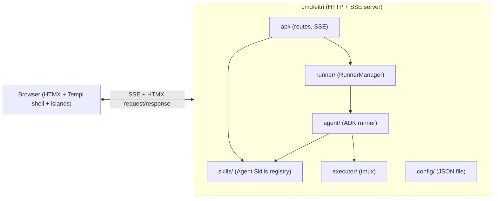
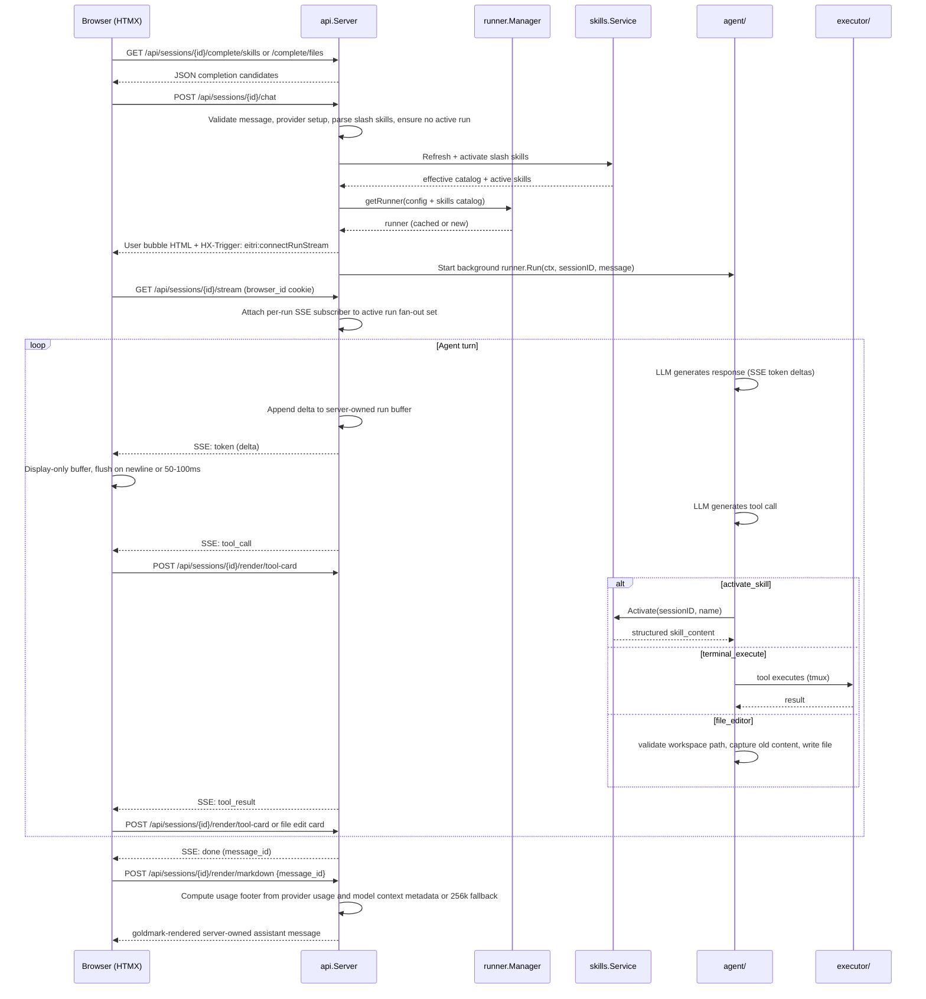

# Eitri — Architecture Guide

> For AI agents navigating the codebase. Explains module boundaries, key types, data flow, and extension points.
> Derived from SPEC.md decisions. Describes target implementation.
> SPEC.md is canonical for product, API, tool, frontend-behavior, skills, and config requirements. This guide is canonical for implementation topology, package boundaries, data flow, and extension seams.

## Overview

Eitri is a self-hosted, single-binary AI coding agent for Linux. It launches an HTTP server with an HTMX-based chat UI for Chrome on Linux. A browser profile can keep up to 10 in-memory chat sessions via top-bar tabs. Each session gets a tmux-managed shell session for command execution, initially rooted at the launch workspace (process CWD). No sandbox.



## Module map

### `cmd/eitri/main.go` — Entry point

Orchestrates startup:
1. **Runtime audit** (`executor.RunAudit`) — verifies `tmux` binary on `$PATH`
2. **Workspace capture** — resolves process CWD as the launch workspace; v1 has no CLI workspace argument
3. **Config manager** (`config.Manager`) — reads `~/.eitri/config.json`
4. **Session manager** (`executor.SessionManager`) — manages per-chat tmux executor lifecycle; sessions are in-memory; tmux sessions start in launch workspace; startup also begins idle-timeout cleanup using configured `session_timeout`
5. **Skills service** (`skills.Service`) — scans Agent Skills roots, resolves precedence, exposes effective/shadowed/invalid records
6. **Built-in tools** (`agent.NewTools`) — `terminal_execute`, `file_viewer`, `file_editor`, `render_component`, `activate_skill`
7. **ADK session service** (`session.InMemoryService`) — stores conversation history
8. **Runner manager** (`runner.NewManager`) — caches ADK runner, hot-reloads on config or skills-catalog changes
9. **HTTP server** (`api.NewServer`) — registers routes via `net/http` (Go 1.22+ ServeMux), delegates runner creation to RunnerManager; prints workspace + URL and optionally opens URL via `xdg-open`

Key lifecycle: sets up graceful shutdown via `signal.NotifyContext` → notifies active SSE clients, cancels active runs, closes executors, then shuts down HTTP.

### `internal/agent/` — ADK agent + model

| File | Responsibility |
|------|---------------|
| `agent.go` | `NewAgent()` — factory wrapping `google.golang.org/adk/v2/agent/llmagent` |
| `openai_model.go` | `NewOpenAIModel()` / `NewOpenAIModelForProvider()` — custom `model.LLM` impl for OpenAI-style chat completions via provider profiles |
| `tools.go` | `NewTools()` — registers 5 built-in function tools |

**Key design choice**: ADK v2 only ships `model/gemini` and `model/apigee`. Eitri implements `model.LLM` directly via plain HTTP through provider profiles. Existing OpenAI-compatible profiles (`opencode_go`, `custom_openai`) discover models at `/v1/models` and chat at `/v1/chat/completions`; `custom_openai` remains advanced/best-effort when it satisfies Eitri's minimum OpenAI-compatible streaming tool-call contract. GitHub Copilot auth now resolves through `internal/provider` provider-auth helpers before both model discovery and chat requests, so Settings UX, validation, discovery, and runtime requests share one auth seam.

**Tool model**: Tools are defined as Go structs with JSON tags + `jsonschema:` struct tags (parsed by ADK internally). Each tool maps to a Go function that receives `agent.Context` for session ID access.

Built-in tool contracts are specified in [SPEC.md §4.2](../SPEC.md#42-built-in-tools). Implementations live in `internal/agent/tools.go`. The `activate_skill` tool delegates to `internal/skills` and returns structured skill instructions/resources for the current session.

### `internal/api/` — HTTP server + Templ templates

| File | Responsibility |
|------|---------------|
| `server.go` | `Server` struct — route registration, config CRUD, SSE handler, render endpoints |
| `templates/` | Templ source files (`.templ` → Go via `templ generate`) |
| `assets/` | Pinned frontend assets served from `embed.FS` (HTMX, Prism, KaTeX, Mermaid, and stylesheet assets). |

Route contract and SSE packet semantics live in [SPEC.md §6](../SPEC.md#6-api-specification). Architecture note: `getRunner()` delegates to `RunnerManager`; `/api/sessions/{id}/stream` subscribes to active run state keyed by explicit path `sessionID` after validating `browser_id` ownership and never starts runs. Active runs own their subscriber set, so multiple EventSource clients and reconnects are fan-out safe and disconnected clients cannot block run completion. Completion endpoints under `/api/sessions/{id}/complete/*` also validate `browser_id` ownership and return JSON for the composer island, not HTML fragments. The top-level HTTP handler also owns cross-cutting middleware: 1MB POST/PUT body limits and structured per-request logging (`method`, `path`, `status`, `duration_ms`, `session_id`).

**UI session state**: `api.Server` owns in-memory `UISession` records for browser-facing state: `id`, `browser_id`, `title`, `status` (`idle`/`running`/`error`), renderable messages/events, active run buffers, active skills, and timestamps. Server also exposes launch workspace path, provider setup state, and token-usage/context-window estimates to templates. Server-owned run buffers are canonical assistant transcripts; browser token buffers are display-only. ADK session service remains model conversation state; templates render from `UISession`, not ADK internals. Sessions are not persisted. Stale `/sessions/{id}` full-page loads after restart redirect to `/`; API calls for missing sessions return friendly 404 fragments/JSON.

**Templ templates** colocated at `internal/api/templates/`:

| Template | Purpose |
|----------|---------|
| `base.templ` | HTML document shell + embedded pinned assets + browser island scripts |
| `chat.templ` | `ChatView` — workspace indicator, setup banner for invalid provider config, message list, input, visible Stop button, completion menu container, SSE target for selected session |
| `session_tabs.templ` | `SessionTabs` — top-bar session strip with title, status dot, close button, and new-session button |
| `settings.templ` | `SettingsView` — config form, provider + model selectors |
| `skills.templ` | `SkillsView` — detected Agent Skills table, refresh action, diagnostics |
| `components/active_skill_chips.templ` | Active skill chips for the current chat session |
| `components/chat_bubble.templ` | User/assistant message bubbles |
| `components/tool_card.templ` | Tool call + result cards |
| `components/file_edit_card.templ` | Post-write diff/created-file card for `file_editor` results |
| `components/error_toast.templ` | Error banner, auto-dismiss |
| `components/mermaid_diagram.templ` | Mermaid diagram container |
| `components/quick_replies.templ` | Suggestion chip buttons |
| `components/diff_card.templ` | Side-by-side diff view |

### `internal/skills/` — Agent Skills discovery + activation

Package owns Agent Skills scanning, parsing, precedence resolution, diagnostics, resource manifests, and activation. Product policy is canonical in [SPEC.md §4.4](../SPEC.md#44-agent-skills).

| File | Responsibility |
|------|---------------|
| `skills.go` | Core types: `Skill`, `Scope`, `Status`, `Diagnostic`, `ActivatedSkill` |
| `discover.go` | Scan fixed skill roots for subdirectories containing `SKILL.md` |
| `parse.go` | Extract YAML frontmatter and Markdown body with lenient validation |
| `registry.go` | Resolve precedence, effective map, shadowed records, lookup by name |
| `resources.go` | Build capped resource manifests under `scripts/`, `references/`, and `assets/` |
| `skills_test.go` | Unit tests for roots, precedence, validation, diagnostics, activation caps |

**Service API**:
```go
type Service struct { ... }

func (s *Service) Refresh(ctx context.Context) (*Registry, error)
func (s *Service) Current() *Registry
func (s *Service) Activate(ctx context.Context, sessionID, name string) (*ActivatedSkill, error)
```

`api.Server` stores active skill names per UI session. `agent` calls `Activate` through the built-in `activate_skill` tool. API and agent packages consume this service; they never scan skill files directly.

### `internal/runner/` — Runner lifecycle

| File | Responsibility |
|------|---------------|
| `manager.go` | `Manager` struct — caches ADK `runner.Runner`, hot-reloads on config change |
| `manager_test.go` | Table-driven tests for cache hit, cache miss, invalidation |

**Runner caching**: `Manager.GetRunner()` creates ADK `runner.Runner` lazily and caches it by config key (`provider|apiKey|baseURL|model|skillsCatalogHash`). Changing settings in the UI or effective skills catalog changes triggers runner invalidation — new runner created on next message. `Invalidate()` forces rebuild on next call.

### `internal/executor/` — command execution

| File | Responsibility |
|------|---------------|
| `executor.go` | `CommandExecutor` interface — abstract command execution |
| `tmux.go` | Real tmux implementation |
| `session.go` | `SessionManager` — per-session executor lifecycle, idle timeout |
| `audit.go` | `RunAudit()` — preflight check for tmux binary |
| `mock.go` | `MockExecutor` — test double with canned responses |

**CommandExecutor interface**:
```go
type CommandResult struct {
    Stdout     string
    Stderr     string
    ExitCode   int
    TimedOut   bool
    DurationMs int64
    Truncated  bool
}

type CommandExecutor interface {
    ExecuteCommand(ctx context.Context, command string) (CommandResult, error)
    Close() error
}
```

`ExecuteCommand` is final-only in v1. It returns after command completion, timeout, cancellation, or executor failure. Non-zero shell exit is represented in `CommandResult.ExitCode`, not as a Go error. Timeout sets `TimedOut`; context cancellation stops active command promptly and returns a context error.

**Tmux executor architecture**:
1. Starts a long-running tmux session with a shell loop inside
2. Commands sent via `tmux send-keys` with literal string (no shell interpolation)
3. Output captured via `tmux capture-pane`, delimited by sentinel markers
4. Shell state (env, cwd) persists between commands within same session
5. Configurable timeout per command (default 60s). Concurrent commands in the same session are rejected with a clear error. Initial tmux working directory is the launch workspace; later shell `cd` persists inside that tmux session only.
6. Output capped at 128 KiB; excess output sets `CommandResult.Truncated`.
7. Process group killed on `Close()`.
8. **Session death recovery** — if the tmux session is killed externally, `ExecuteCommand` recreates it automatically on the next call.

**SessionManager**:
- Map of `sessionID → managedSession` (holds `CommandExecutor` + timeout state)
- `GetOrCreate(sessionID)` — returns existing executor or creates new one
- `StartTimeoutLoop()` — background goroutine checks idle timeout every 30s (default 30m)
- `Close(sessionID)` — cancels/tears down one executor and frees the slot
- `CloseAll()` on graceful shutdown
- No session metadata/history persistence; server restart loses sessions

### `internal/config/` — configuration

Config schema, defaults, masking, validation, and environment variables live in [SPEC.md §7](../SPEC.md#7-configuration-specification). Architecture note: `config.Manager` owns atomic JSON file writes, secure config permissions (`~/.eitri` `0700`, config/temp files `0600`), default loading without file creation, provider validation/model discovery on save, `context_window_tokens` fallback defaults (256k tokens for UI estimates when provider/model metadata lacks context length), and hot-reload on `PUT /api/config` / runner creation. Config also persists provider-owned auth state in `provider_auth` for providers that need richer auth than plain `api_key`; `GET /api/config` must never expose that raw state back to browser clients.

## Frontend architecture

Architecture name: **HTMX + Templ shell with browser islands**. Product behavior is canonical in [SPEC.md §5](../SPEC.md#5-frontend-specification); route and SSE contracts are canonical in [SPEC.md §6](../SPEC.md#6-api-specification).

**Stack**: Templ (`.templ` → Go), HTMX, small custom-element/browser-island scripts, embedded CSS, Prism.js, KaTeX, Mermaid.js. No npm, bundler, Tailwind, or SPA framework. Only code-generation step is `templ generate`.

**Ownership boundary**:
- Go server owns canonical state, sessions, routing, validation, security boundaries, agent runs, assistant transcripts, and HTML rendering.
- Templ renders pages, fragments, and rich UI components.
- HTMX handles forms, navigation, partial updates, OOB swaps, indicators, and transitions.
- DOM is base UI state.
- Browser islands own only ephemeral widget state: stream buffer, completion menu, copy toggles, rendered-library lifecycle, diff view mode.
- No island owns canonical app state or global store.

**Island lifecycle**:
- Initialize on full page load and `htmx:afterSwap`.
- Idempotent setup: no duplicate handlers, double renders, or timer leaks.
- Read configuration from server-rendered `data-*` attributes.
- Tolerate missing Prism/KaTeX/Mermaid.
- Use text nodes or server-rendered sanitized HTML for untrusted content; never `innerHTML` from user/LLM data.

**Key islands**:
- `eitri-stream`: opens `/api/sessions/{id}/stream` only after chat POST trigger; parses JSON envelopes; batches display-only tokens; handles run phases, no-dead-air, reconnect state, cancellation UI, render endpoint dispatch, and final Markdown render by `message_id`.
- `eitri-composer`: owns textarea keyboard behavior and `/` skill + `@` file completion menu state; calls JSON completion endpoints with debounce/sequence checks; preserves HTMX chat submit as authoritative transport.
- `eitri-code-block`, `eitri-mermaid`, `eitri-diff-card`: local widget behavior for copy/wrap/show-all, Mermaid rendering, and diff view toggles.

**Asset strategy**: `internal/api/assets/` contains pinned vendor assets served from `embed.FS` to avoid CDN availability, offline, and privacy failure modes. Exact vendor versions are intentionally deferred until implementation; do not use CDN or npm/bundler.

**Generative UI seam**: `render_component` emits structured data; server renders Templ components; islands add optional browser-native behavior without turning app into an SPA.

## Data flow (chat request)



## Extension points

### Adding a new built-in tool

1. Define args/result structs in `internal/agent/tools.go`
2. Register with `functiontool.New()` and append to the returned `[]tool.Tool`
3. Tool function receives `agent.Context` — call `ctx.SessionID()` to get executor/session-scoped state

### Extending Agent Skills support

1. Keep discovery/parsing/precedence logic in `internal/skills`; API and agent packages should consume the service API rather than scanning files directly.
2. Add new skill roots only through a documented precedence change and ADR update.
3. Keep `allowed-tools` advisory until Eitri has a real approval/permission model.
4. Preserve resource access invariant: `file_viewer` can read workspace and skill directories; `file_editor` remains workspace-only.

### Adding a new API route

1. In `internal/api/server.go`, add `mux.HandleFunc(...)` in `NewServer()`
2. Access `configMgr`, `sessionMgr`, `sessionSvc` via `s` fields
3. Check `r.Header.Get("HX-Request")` to distinguish full page vs HTMX partial

### Adding a new generative UI component

1. Add component name to `render_component` tool enum in `tools.go`
2. Create Templ template in `internal/api/templates/components/`
3. Wire server-side dispatch in `/api/sessions/{id}/render/component` handler
4. Add browser island initialization only if component needs local browser-native behavior

### Adding a browser island

1. Server renders custom element/container via Templ.
2. Island script lives in Base asset bundle or a small module served by `internal/api/assets/`.
3. Island reads configuration from `data-*` attributes.
4. Island never owns canonical application state.
5. Island initialization is idempotent across full page loads and HTMX swaps.
6. If island renders untrusted content, it uses text nodes or server-rendered sanitized HTML, never `innerHTML` from LLM/user data.
7. Island keyboard behavior preserves existing composer contracts unless explicitly changed.
8. Browser E2E test covers island behavior.

### Supporting a non-OpenAI backend

1. Study `internal/agent/openai_model.go` — implements `model.LLM` interface
2. Create a new file (e.g. `anthropic_model.go`) with same interface
3. Swap in `agent.NewAgentConfig.Model` based on provider config

## Target repository layout

```text
eitri/
├── cmd/eitri/                 # Entry point
├── internal/
│   ├── agent/                 # ADK agent + model.LLM + built-in tools
│   ├── api/                   # HTTP/SSE server, assets, Templ templates
│   ├── config/                # Config loading, validation, atomic writes
│   ├── executor/              # tmux command executor + session manager
│   ├── provider/              # Provider profiles + auth seams: defaults, credential policy, provider_auth resolution, discovery/chat paths, parsers, headers, device-flow helpers
│   ├── runner/                # ADK runner cache/invalidation
│   └── skills/                # Agent Skills discovery, registry, activation
├── scripts/install.sh
├── docs/
│   ├── ARCHITECTURE.md
│   ├── TESTING.md
│   ├── ROADMAP.md
│   ├── adr/
│   └── agents/
├── SPEC.md
├── CONTEXT.md
├── AGENTS.md
├── go.mod / go.sum
└── initial.md                 # Historical vision
```

Tests are colocated as `*_test.go`. Browser E2E tests live under `internal/api` behind the `browser` build tag. Templ-generated `*_templ.go` files are committed next to `.templ` sources.

## Testing patterns

Canonical test commands, fixtures, browser setup, and per-layer coverage live in [TESTING.md](TESTING.md). Architecture-specific test seams: `CommandExecutor` is mockable via `internal/executor/mock.go`; API tests use `httptest`; browser E2E uses chromedp against server-rendered HTMX DOM.

## Key ADRs

ADR index lives in [CONTEXT.md](../CONTEXT.md#architecture-decisions).

## Runtime configuration

Config file, listen address, and environment variable contract live in [SPEC.md §7](../SPEC.md#7-configuration-specification).
