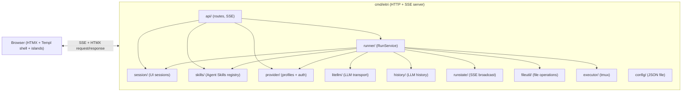

# Eitri — Architecture Guide

> For AI agents navigating the codebase. Explains module boundaries, key types, data flow, and extension points.
> This guide is canonical for implementation topology, package boundaries, data flow, and extension seams.

## Overview

Eitri is a self-hosted, single-binary AI coding agent for Linux. It launches an HTTP server with an HTMX-based chat UI for Chrome on Linux. A browser profile can keep up to 10 in-memory chat sessions via top-bar tabs. Each session gets a tmux-managed shell session for command execution, initially rooted at the launch workspace (process CWD). No sandbox.



## Module map

### `cmd/eitri/main.go` — Entry point

Orchestrates startup:
1. **Runtime audit** (`executor.RunAudit`) — verifies `tmux` binary on `$PATH`
2. **Workspace capture** — resolves process CWD as the launch workspace; v1 has no CLI workspace argument
3. **Config manager** (`config.Manager`) — reads `~/.eitri/config.json`
4. **tmux session manager** (`executor.SessionManager`) — manages per-chat tmux executor lifecycle; sessions are in-memory; tmux sessions start in launch workspace; startup also begins idle-timeout cleanup using configured `session_timeout`
5. **UI session manager** (`session.Manager`) — in-memory browser-facing session state with `browser_id` ownership and max-session cap
6. **Skills service** (`skills.Service`) — scans Agent Skills roots, resolves precedence, exposes effective/shadowed/invalid records
7. **Built-in tools** — `bash`, `glob`, `grep`, `read`, `write`, `edit`, `render_mermaid_diagram`, `render_quick_replies`, `skill`. Implementations live in `internal/tool/` — each tool has one job and a minimal parameter schema.
8. **LLM history service** (`internal/history/`) — stores LLM conversation history with sliding window
9. **File utility** (`internal/fileutil/`) — file path validation, workspace checks, read/write operations
10. **Run service** (`runner.RunService`) — run lifecycle, agent loop, SSE broadcast via `runstate.State`
11. **HTTP server** (`api.NewServer`) — registers routes via `net/http` (Go 1.22+ ServeMux); uses `session.Manager`, `runner.RunService`, `config.Manager`, and `skills.Service`

Key lifecycle: sets up graceful shutdown via `signal.NotifyContext` → notifies active SSE clients, cancels active runs, closes executors, then shuts down HTTP.

### `internal/history/` — LLM conversation history

| File | Responsibility |
|------|---------------|
| `session.go` | `SessionManager` — per-chat LLM conversation history with sliding window cap |
| `session_test.go` | Unit tests for session lifecycle, history, sliding window |

Stores per-session LLM message history with configurable exchange cap. System prompt stored separately and prepended on reads. Used by `runner` loop to load history before each agent turn. Lost on server restart.

### `internal/fileutil/` — File path validation and operations

| File | Responsibility |
|------|---------------|
| `path.go` | `ValidateWorkspacePath`, `ValidatePathWithAllowed` — workspace path validation |
| `path_test.go` | Unit tests for path validation |
| `filetools.go` | `ReadFile`, `ReadFileWithLineInfo`, `LineHash`, `EditFile`, `InsertLine`, `WriteFile`, `ListDirectory`, `FileViewerResult` |
| `filetools_test.go` | Unit tests for file operations |

Used by the `read`, `write`, `edit`, and `grep` tools for all file I/O and path validation. Workspace-aware: all path operations validate against allowed directories.

### `internal/provider/` — Provider profiles + auth seams

| File | Responsibility |
|------|---------------|
| `discovery.go` | `DiscoverModels()` — model-discovery seam. Resolves auth, refreshes provider-owned auth, fetches selectable models, returns refreshed auth state for caller persistence. |
| `profiles.go` | Provider-internal profile table + caller-safe metadata descriptors (`Describe`, `MustDescribe`). |
| `auth.go` | Auth helpers: config-auth validation/normalization, GitHub Copilot device-flow start/poll status mapping, token-to-auth-state conversion, refresh. |

**Role**: thin package — profile metadata, auth, discovery only. LLM transport lives in `internal/litellm/`. Callers use `NewLLMService()` from litellm, not raw provider internals.

Built-in tools: `bash`, `glob`, `grep`, `read`, `write`, `edit`, `render_mermaid_diagram`, `render_quick_replies`, and `skill`. Implementations live in `internal/tool/`. The `skill` tool delegates to `internal/skills` and returns structured skill instructions/resources for the current session.

### `internal/litellm/` — LLM transport abstraction

| File | Responsibility |
|------|---------------|
| `types.go` | Core types: `Request`, `Message`, `Response`, `StreamEvent`, `ToolDef`, `AdapterConfig` — domain types for the transport layer |
| `service.go` | `LLMService` interface — `Chat()` and `ChatStream()` |
| `factory.go` | `NewLLMService()` — route provider ID to adapter (opencode_go → OpenAI or Anthropic, custom_openai → OpenAI, openrouter → OpenRouter, github_copilot → GitHub Copilot) |
| `openai.go` | `OpenAI` — OpenAI-compatible adapter |
| `anthropic.go` | `Anthropic` — Anthropic Messages API adapter (used for qwen*/minimax* models via opencode_go) |
| `openrouter.go` | `OpenRouter` — OpenRouter adapter with optional ref/title headers |
| `github_copilot.go` | `GitHubCopilot` — GitHub Copilot adapter with token refresh |
| `wire_types.go` | Wire-format types for OpenAI and Anthropic JSON APIs |
| `sse_scanner.go` | SSE stream scanner for parsing `data:` lines from streaming responses |
| `common.go` | Shared helpers |

**Layer isolation**: `litellm` is the sole package that speaks to LLM wire protocols. Callers (`runner`) construct adapters via `NewLLMService()`. New backends add an adapter file + factory route.

### `internal/runstate/` — SSE broadcast + context tracking

| File | Responsibility |
|------|---------------|
| `runstate.go` | `State` — subscriber fan-out, event history, text buffer, `SSEEvent`, `TokenUsage` types |
| `compute_context.go` | `ComputeContext()` — estimate token breakdown (system/prompt/history/skill/completion) for a message list |
| `runstate_test.go` | Tests for SSE broadcast and context computation |

Network-agnostic: manages channels, not HTTP connections. Each active runner run creates one `State` via `runstate.New()`. The runner broadcasts `SSEEvent` values; `api.Server` connects subscribers to SSE HTTP streams.

**Context panel**: runner broadcasts `context_update` SSE events after each agent turn. Browser island `eitri-context` renders per-category progress bars using data from `ComputeContext()`. Falls back to 256k context window when provider metadata lacks context length.

### `internal/session/` — UI session management

| File | Responsibility |
|------|---------------|
| `session.go` | `Manager` — in-memory `UISession` records with browser_id ownership, max-session cap, title generation |
| `session_test.go` | Unit tests for session lifecycle, browser scoping, message limits |

Replaces inline `UISession` map in early `api.Server`. Server-owned canonical session state: ID, browser_id, title, status (`idle`/`running`/`error`), messages, active skills, timestamps. `api.Server` stores `*session.Manager` and passes session data to templates. Not persisted — server restart loses all sessions.

### `internal/api/markdown*.go` — Markdown rendering

| File | Responsibility |
|------|---------------|
| `markdown.go` | Core rendering pipeline: goldmark setup, render helper functions |
| `markdown_enhance.go` | Custom AST transformers and renderer enhancements |
| `markdown_math.go` | LaTeX math block rendering (KaTeX integration) |
| `markdown_code.go` | Code block rendering (syntax highlighting via Prism.js) |

### `internal/api/` — HTTP server + Templ templates

| File | Responsibility |
|------|---------------|
| `server.go` | `Server` struct — route registration, config CRUD, SSE handler, render endpoints |
| `templates/` | Templ source files (`.templ` → Go via `templ generate`) |
| `assets/` | Pinned frontend assets served from `embed.FS` (HTMX, Prism, KaTeX, Mermaid, and stylesheet assets). |

Route contract: `api.Server` registers routes via Go 1.22+ ServeMux. SSE packets are JSON-enveloped events with `event`, `data`, and optional `id` fields. Settings page load/save and `/api/models` cross model-discovery seam: `provider.DiscoverModels()`, then persist returned auth refresh. GitHub Copilot device-flow UI polls through provider-owned `PollGitHubCopilotDeviceFlow()` status + `AuthUpdate`. `RunService.StartRun()` builds LLM service via `litellm.NewLLMService()` and persists auth refresh via `PersistAuth` callback. `/api/sessions/{id}/stream` subscribes to active run state via `RunService.Subscribe()` after validating `browser_id` ownership. Active runs own `runstate.State` subscriber set, making multiple EventSource clients and reconnects fan-out safe. Run start snapshots user-configured runtime limits (e.g., `max_turns`) — later Settings changes affect only later runs. Completion endpoints under `/api/sessions/{id}/complete/*` validate `browser_id` ownership and return JSON for the composer island. The top-level HTTP handler owns cross-cutting middleware: 1MB POST/PUT body limits and structured per-request logging (`method`, `path`, `status`, `duration_ms`, `session_id`).

**UI session state**: Delegated to `internal/session.Manager`. Stores browser-facing state: `id`, `browser_id`, `title`, `status` (`idle`/`running`/`error`), messages, active skills, timestamps. `api.Server` holds `*session.Manager` and passes data to templates. Run buffers live in `runstate.State` per active run. Browser token buffers are display-only. Not persisted — server restart loses all sessions.

**Templ templates** colocated at `internal/api/templates/`:

| Template | Purpose |
|----------|---------|
| `base.templ` | HTML document shell + embedded pinned assets + browser island scripts. Sidebar is a four-panel flex column: `#session-panel` (sessions list, fixed height), `#tool-activity` (tool activity cards, max 6 entries), `#thinking-panel` (LLM reasoning content, flex-grows), `#context-panel` (context window progress bars) |
| `chat.templ` | `ChatView` — workspace indicator, setup banner for invalid provider config, message list, input, visible Stop button, completion menu container, SSE target for selected session |
| `session_tabs.templ` | `SessionTabs` — session list with title, status dot, close button, and new-session button in header |
| `settings.templ` | `SettingsView` — config form, provider + model selectors, custom system prompt |
| `skills.templ` | `SkillsView` — detected Agent Skills table, refresh action, diagnostics |
| `message_input.templ` | `MessageInput` — textarea with skill `/` and file `@` completion |
| `components/active_skill_chips.templ` | Active skill chips for the current chat session |
| `components/chat_bubble.templ` | User/assistant message bubbles |
| `components/tool_card.templ` | Unified tool card (running/done status) |
| `components/file_edit_card.templ` | Post-write diff/created-file card for `write` and `edit` tool results; overwrite mode reuses shared interactive diff viewer |
| `components/error_toast.templ` | Error banner, auto-dismiss |
| `components/mermaid_diagram.templ` | Mermaid diagram container |
| `components/quick_replies.templ` | Suggestion chip buttons |
| `components/diff_card.templ` | Shared interactive diff viewer for DiffCard components and file edit overwrite results |
| `settings_view_model.go` | View model helpers for settings page rendering |
| `helpers.go` | Shared template rendering helpers |
| `diff.go` / `diff_test.go` | Diff computation for file edit display |

### `internal/skills/` — Agent Skills discovery + activation

Package owns Agent Skills scanning, parsing, precedence resolution, diagnostics, resource manifests, and activation. Skills are discovered from fixed project/user roots containing `SKILL.md`; precedence follows last-wins scoping.

| File | Responsibility |
|------|---------------|
| `skills.go` | Core types: `Skill`, `Scope`, `Status`, `Diagnostic`, `ActivatedSkill` |
| `discover.go` | Scan fixed skill roots for subdirectories containing `SKILL.md` |
| `parse.go` | Extract YAML frontmatter and Markdown body with lenient validation |
| `registry.go` | Resolve precedence, effective map, shadowed records, lookup by name |
| `resources.go` | Build capped resource manifests under `scripts/`, `references/`, and `assets/` |
| `skills_test.go` | Unit tests for roots, precedence, validation, diagnostics, activation caps |

**Service API**:
```go
type Service struct { ... }

func (s *Service) Refresh(ctx context.Context) (*Registry, error)
func (s *Service) Current() *Registry
func (s *Service) Activate(ctx context.Context, sessionID, name string) (*ActivatedSkill, error)
```

`api.Server` stores active skill names per UI session. The `skill` tool (in `internal/tool/`) delegates to `skills.Service`. At chat-run start, `runner.RunService` re-resolves those active names against current effective registry state, drops disappeared/invalid/shadowed Skills with a warning, and injects ephemeral skill tool-call context into that Run's LLM request so Skill instructions re-apply without permanently duplicating them into conversation history. API and runner packages consume this service; they never scan skill files directly.

### `internal/runner/` — Run service + agent loop

| File | Responsibility |
|------|---------------|
| `service.go` | `RunService` — run lifecycle: agent building, runner cache, SSE broadcast, session persistence, auth persist callbacks |
| `run.go` | `StartRun()` — validates config, snapshot runtime limits (max_turns), builds LLM service via `litellm.NewLLMService()`, resolves skill context, creates tool registry, starts agent loop, handles MaxTurnsExceededError |
| `confirm.go` | `confirmPath()` — channel-based confirmation for user approval of file operations; sends `needs_confirmation` SSE event, blocks until API endpoint response |
| `skill_context.go` | `resolveSessionSkillContext()` — re-resolves active skill names against current registry, drops stale/shadowed skills, builds ephemeral skill context for agent loop |
| `loop.go` | `RunAgent()` — synchronous agent turn loop (LLM call → tool execution → feedback loop), handles streaming, turn caps, SSE events, context updates |
| `loop_helpers.go` | Helper functions for the agent loop |
| `service_test.go` | Unit tests exercising the RunService seam |
| `loop_test.go` | Unit tests for agent loop edge cases (empty input, turn caps, error recovery, context updates) |

**RunService**: consolidates run lifecycle behind a single seam. `RunState` holds `runstate.State` for SSE broadcast + cancel + done signal. `Subscribe()`/`Unsubscribe()` delegate to `runstate.State`. Auth refresh persistence handled via `PersistAuth` callback. Conversation history managed via `internal/history.SessionManager`; UI session state via `internal/session.Manager`. `Cancel()`/`CancelAll()` stop active runs. `AppendEvent()` broadcasts SSE events and persists assistant messages. Config is read fresh on each `StartRun()` — no runner cache persisting across runs.

### `internal/executor/` — command execution

| File | Responsibility |
|------|---------------|
| `executor.go` | `CommandExecutor` interface — abstract command execution |
| `tmux.go` | Real tmux implementation |
| `session.go` | `SessionManager` — per-session executor lifecycle, idle timeout |
| `audit.go` | `RunAudit()` — preflight check for tmux binary |
| `mock.go` | `MockExecutor` — test double with canned responses |

**CommandExecutor interface**:
```go
type CommandResult struct {
    Stdout     string
    Stderr     string
    ExitCode   int
    TimedOut   bool
    DurationMs int64
    Truncated  bool
}

type CommandExecutor interface {
    ExecuteCommand(ctx context.Context, command string) (CommandResult, error)
    Close() error
}
```

`ExecuteCommand` is final-only in v1. It returns after command completion, timeout, cancellation, or executor failure. Non-zero shell exit is represented in `CommandResult.ExitCode`, not as a Go error. Timeout sets `TimedOut`; context cancellation stops active command promptly and returns a context error.

**Tmux executor architecture**:
1. Starts a long-running tmux session with a shell loop inside
2. Commands sent via `tmux send-keys` with literal string (no shell interpolation)
3. Output captured via `tmux capture-pane`, delimited by sentinel markers
4. Shell state (env, cwd) persists between commands within same session
5. Configurable timeout per command (default 60s). Concurrent commands in the same session are rejected with a clear error. Initial tmux working directory is the launch workspace; later shell `cd` persists inside that tmux session only.
6. Output capped at 128 KiB; excess output sets `CommandResult.Truncated`.
7. Process group killed on `Close()`.
8. **Session death recovery** — if the tmux session is killed externally, `ExecuteCommand` recreates it automatically on the next call.

**SessionManager**:
- Map of `sessionID → managedSession` (holds `CommandExecutor` + timeout state)
- `GetOrCreate(sessionID)` — returns existing executor or creates new one
- `StartTimeoutLoop()` — background goroutine checks idle timeout every 30s (default 30m)
- `Close(sessionID)` — cancels/tears down one executor and frees the slot
- `CloseAll()` on graceful shutdown
- No session metadata/history persistence; server restart loses sessions

### `internal/config/` — configuration

Config schema with defaults, masking, validation, and environment variable names are defined in `internal/config/manager.go`. Architecture note: `config.Manager` owns atomic JSON file writes, secure config permissions (`~/.eitri` `0700`, config/temp files `0600`), default loading without file creation, provider validation/model discovery on save, `context_window_tokens` fallback defaults (256k tokens for UI estimates when provider/model metadata lacks context length), and hot-reload on `PUT /api/config` / runner creation. Config reads provider defaults through caller-safe Provider descriptors rather than raw profile internals. Config also persists provider-owned auth state in `provider_auth` for providers that need richer auth than plain `api_key`; `GET /api/config` must never expose that raw state back to browser clients.

## Frontend architecture

Architecture name: **HTMX + Templ shell with browser islands**. Server owns canonical state and rendering; browser islands own only local ephemeral UI state.

**Stack**: Templ (`.templ` → Go), HTMX, small custom-element/browser-island scripts, embedded CSS, Prism.js, KaTeX, Mermaid.js. No npm, bundler, Tailwind, or SPA framework. Only code-generation step is `templ generate`.

**Ownership boundary**:
- Go server owns canonical state, sessions, routing, validation, security boundaries, agent runs, assistant transcripts, and HTML rendering.
- Templ renders pages, fragments, and rich UI components.
- HTMX handles forms, navigation, partial updates, OOB swaps, indicators, and transitions.
- DOM is base UI state.
- Browser islands own only ephemeral widget state: stream buffer, completion menu, copy toggles, rendered-library lifecycle, diff view mode.
- No island owns canonical app state or global store.

**Island lifecycle**:
- Initialize on full page load and `htmx:afterSwap`.
- Idempotent setup: no duplicate handlers, double renders, or timer leaks.
- Read configuration from server-rendered `data-*` attributes.
- Tolerate missing Prism/KaTeX/Mermaid.
- Use text nodes or server-rendered sanitized HTML for untrusted content; never `innerHTML` from user/LLM data.

**Key islands**:
- `eitri-stream`: opens `/api/sessions/{id}/stream` only after chat POST trigger; parses JSON envelopes; batches display-only tokens; handles run phases, no-dead-air, reconnect state, cancellation UI, render endpoint dispatch, and final Markdown render by `message_id`.
- `eitri-composer`: owns textarea keyboard behavior and `/` skill + `@` file completion menu state; calls JSON completion endpoints with debounce/sequence checks; preserves HTMX chat submit as authoritative transport.
- `eitri-context`: reads `context_update` SSE events, renders per-category progress bars (system/prompt/history/skill/completion) against context window cap, persists state across session switches via `sessionStorage`, toggles expanded/collapsed view.
- `eitri-code-block`, `eitri-mermaid`, `eitri-diff-card`: local widget behavior for copy/wrap/show-all, Mermaid rendering, and diff view toggles.

**Asset strategy**: `internal/api/assets/` contains pinned vendor assets served from `embed.FS` to avoid CDN availability, offline, and privacy failure modes. Exact vendor versions are intentionally deferred until implementation; do not use CDN or npm/bundler.

**Generative UI seam**: `render_mermaid_diagram` and `render_quick_replies` tools emit structured data; server renders Templ components via `/api/sessions/{id}/render`; islands add optional browser-native behavior without turning app into an SPA.

## Data flow (chat request)

```mermaid
sequenceDiagram
    participant Browser as Browser (HTMX)
    participant API as api.Server
    participant RunSvc as runner.RunService
    participant LLM as litellm.LLMService
    participant Skills as skills.Service
    participant Executor as executor/

    Browser->>API: GET /api/sessions/{id}/complete/skills or /complete/files
    API-->>Browser: JSON completion candidates
    Browser->>API: POST /api/sessions/{id}/chat
    API->>API: Validate message, provider setup, parse slash skills, ensure no active run
    API->>Skills: Refresh + activate slash skills
    Skills-->>API: effective catalog + active skills
    API->>API: Re-resolve session active skills via skill_context.go, warn/drop stale ones
    API->>RunSvc: StartRun(sessionID, message)
    RunSvc->>RunSvc: Build LLM via litellm.NewLLMService(), build tool registry, resolve skills
    RunSvc->>RunSvc: RunAgent() — synchronous agent turn loop
    API-->>Browser: User bubble HTML + HX-Trigger: eitri:connectRunStream
    Browser->>API: GET /api/sessions/{id}/stream (browser_id cookie)
    API->>API: Subscribe to runstate.State subscriber set for this run
    
    loop Agent turn
        RunSvc->>LLM: ChatStream(request with history + skill context)
        LLM-->>RunSvc: stream of SSEEvent (token deltas)
        RunSvc->>runstate.State: Broadcast token events
        RunSvc-->>Browser: SSE: token (delta)
        Browser->>Browser: Display-only buffer, flush on newline or 50-100ms
        LLM-->>RunSvc: tool call
        RunSvc-->>Browser: SSE: tool_call
        Browser->>Browser: Activity panel entry only; no tool_call card rendered
        alt skill
            RunSvc->>Skills: Activate(sessionID, name)
            Skills-->>RunSvc: structured skill_content
        else bash
            RunSvc->>Executor: tool executes (tmux)
            Executor-->>RunSvc: result
        else write / edit
            RunSvc->>RunSvc: validate workspace path, write or modify file via fileutil
        end
        RunSvc->>runstate.State: Broadcast context_update (ComputeContext)
        RunSvc-->>Browser: SSE: tool_result
        Browser->>API: POST /api/sessions/{id}/render {kind: "tool_card"}
    end

    RunSvc-->>Browser: SSE: done (message_id)
    Browser->>API: POST /api/sessions/{id}/render {kind: "markdown", message_id}
    API->>API: Compute usage footer from litellm usage and model context metadata or 256k fallback
    API-->>Browser: goldmark-rendered server-owned assistant message (via unified /render)
```

## Extension points

### Adding a new built-in tool

1. Define tool in `internal/tool/` implementing the `ToolHandler` interface (`Name()`, `Description()`, `JSONSchema()`, `Call()`) with a struct that embeds `SchemaOf[T]()` for parameter schemas
2. Register with `tool.NewRegistry().Register(...)`
3. Tool receives `context.Context` with `tool.SessionIDKey` for session-scoped state

### Extending Agent Skills support

1. Keep discovery/parsing/precedence logic in `internal/skills`; API and agent packages should consume the service API rather than scanning files directly.
2. Add new skill roots only through a documented precedence change and ADR update.
3. Keep `allowed-tools` advisory until Eitri has a real approval/permission model.
4. Preserve resource access invariant: `read` can read workspace and skill directories; `write` and `edit` remain workspace-only.

### Adding a new API route

1. In `internal/api/server.go`, add `mux.HandleFunc(...)` in `NewServer()`
2. Access `configMgr`, `sessionMgr`, `sessionSvc` via `s` fields
3. Check `r.Header.Get("HX-Request")` to distinguish full page vs HTMX partial

### Adding a new generative UI component

1. Create a new tool in `internal/tool/` (e.g. `render_foo.go`) implementing `ToolHandler` with a JSON schema for parameters
2. Register it in `tool.NewRegistry()` inside `runner/service.go` or `cmd/eitri/main.go`
3. Create Templ component template in `internal/api/templates/components/`
4. Wire server-side dispatch in `/api/sessions/{id}/render` handler with the new kind
5. Add browser island initialization only if component needs local browser-native behavior

### Adding a browser island

1. Server renders custom element/container via Templ.
2. Island script lives in Base asset bundle or a small module served by `internal/api/assets/`.
3. Island reads configuration from `data-*` attributes.
4. Island never owns canonical application state.
5. Island initialization is idempotent across full page loads and HTMX swaps.
6. If island renders untrusted content, it uses text nodes or server-rendered sanitized HTML, never `innerHTML` from LLM/user data.
7. Island keyboard behavior preserves existing composer contracts unless explicitly changed.
8. Browser E2E test covers island behavior.

### Supporting a non-OpenAI backend

1. Study existing adapters in `internal/litellm/` — `openai.go`, `anthropic.go`, `openrouter.go`, `github_copilot.go`
2. Create a new adapter file implementing `LLMService` interface (`Chat()` + `ChatStream()`)
3. Add wire types in `wire_types.go` if the API uses a different JSON shape
4. Register in `factory.go` `NewLLMService()` by provider ID

## Target repository layout

```text
eitri/
├── cmd/eitri/                 # Entry point
├── internal/
│   ├── history/               # LLM conversation history
│   ├── fileutil/              # File path validation and I/O operations
│   ├── api/                   # HTTP/SSE server, assets, Templ templates
│   ├── config/                # Config loading, validation, atomic writes
│   ├── executor/              # tmux command executor + session manager
│   ├── litellm/               # LLM transport abstraction (OpenAI, Anthropic, OpenRouter, GitHub Copilot)
│   ├── provider/              # Provider profiles + auth seams
│   ├── runner/                # Run lifecycle + agent loop
│   ├── runstate/              # SSE broadcast infrastructure + context tracking
│   ├── session/               # UI session management (browser-facing)
│   ├── tool/                  # Built-in tools
│   └── skills/                # Agent Skills discovery, registry, activation
├── scripts/install.sh
├── docs/
│   ├── ARCHITECTURE.md
│   ├── TESTING.md
│   ├── ROADMAP.md
│   ├── adr/
│   ├── agents/
│   ├── drafts/                # Design drafts (e.g., context panel)
│   └── providers/             # Provider integration notes (e.g., GitHub Copilot)
├── CONTEXT.md
├── AGENTS.md
├── go.mod / go.sum
```

Tests are colocated as `*_test.go`. Browser E2E tests live under `internal/api` behind the `browser` build tag. Templ-generated `*_templ.go` files are committed next to `.templ` sources.

## Testing patterns

Canonical test commands, fixtures, browser setup, and per-layer coverage live in [TESTING.md](TESTING.md). Architecture-specific test seams: `CommandExecutor` is mockable via `internal/executor/mock.go`; API tests use `httptest`; browser E2E uses chromedp against server-rendered HTMX DOM.

## Key ADRs

ADR index lives in [CONTEXT.md](../CONTEXT.md#architecture-decisions).

## Runtime configuration

Config file (`~/.eitri/config.json`), listen address (`--listen` flag, default `127.0.0.1:8080`), and environment variable overrides are defined in `internal/config/manager.go`.
