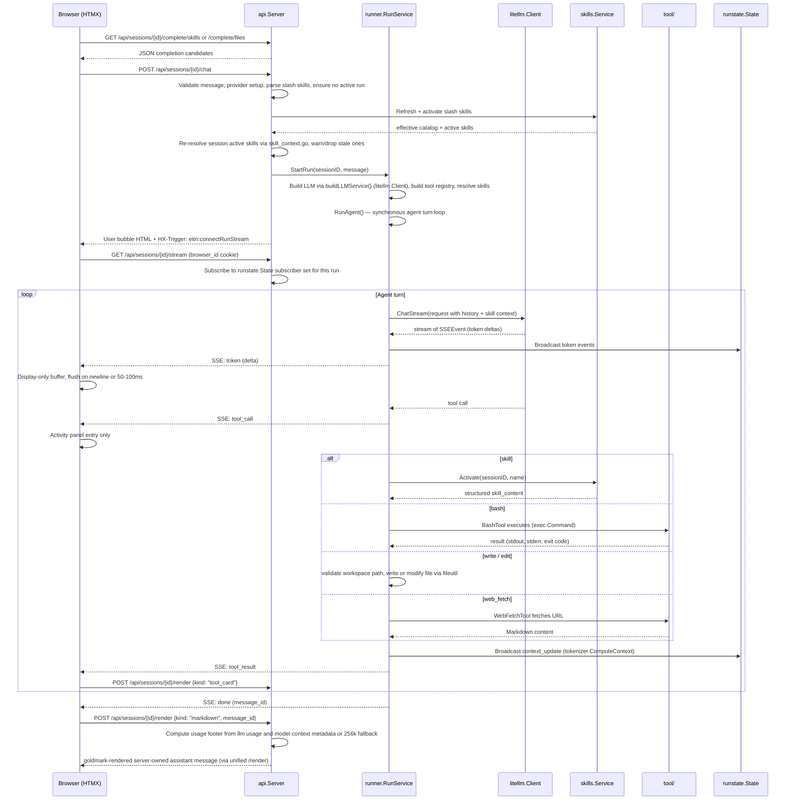

# Eitri — Architecture Guide

> For AI agents navigating the codebase. Explains module boundaries, key types, data flow, and extension points.
> This guide is canonical for implementation topology, package boundaries, data flow, and extension seams.

## Overview

Eitri is a self-hosted, single-binary AI coding agent for Linux. It launches an HTTP server with an HTMX-based chat UI for Chrome on Linux. A browser profile can keep up to 10 in-memory chat sessions via a four-panel sidebar. Shell commands execute via `os/exec.Command` inside an optional bubblewrap sandbox (read-only root, writable workspace and /tmp) for defense-in-depth. Falls back to direct execution when bwrap is unavailable or sandbox is disabled. No tmux dependency.


```mermaid
flowchart LR
    Browser["Browser (HTMX + Templ shell + islands)"]

    subgraph Server["cmd/eitri (HTTP + SSE server)"]
        API["api/ (routes, SSE)"]
        RunSvc["runner/ (RunService + loop/)"]
        UISess["session/ (UI sessions + messages)"]
        LLMHist["history/ (LLM history)"]
        RunSt["runstate/ (SSE broadcast)"]
        Timeline["timeline/ (per-run timeline)"]
        FileUtil["fileutil/ (file operations)"]
        Skills["skills/ (Agent Skills registry)"]
        Tools["tool/ (built-in tools)"]
        Sandbox["sandbox/ (bwrap wrapper)"]
        Config["config/ (JSON file)"]
        Provider["provider/ (profiles + auth)"]
        Debug["debug/ (crash dumps, HTTP traces)"]
        Persist["persist/ (session snapshots, traces)"]
        Compactor["compactor/ (message compaction)"]
        Compress["compress/ (pattern compression)"]
        Msg["message/ (shared message types)"]
        Persona["persona/ (named system prompts)"]
        Report["report/ (session reports)"]
        Tokenizer["tokenizer/ (token estimation + calibration)"]
    end

    Browser <-->|SSE + HTMX request/response| Server
    API --> RunSvc
    API --> UISess
    API --> Skills
    API --> Provider
    RunSvc --> LLMHist
    RunSvc --> RunSt
    RunSvc --> Timeline
    RunSvc --> FileUtil
    RunSvc --> Skills
    RunSvc --> UISess
    RunSvc --> Provider
    RunSvc --> Tools
    RunSvc --> Msg
    Tools --> Sandbox
    Tools --> Compress
```

## Module map

### `cmd/eitri/main.go` — Entry point

Orchestrates startup:
1. **Workspace capture** — resolves process CWD as the launch workspace; currently has no CLI workspace argument
2. **Config manager** (`config.Manager`) — reads `~/.eitri/config.json`
3. **Debug recorder** (`debug.Recorder`) — captures HTTP traces for crash dump diagnostics
4. **UI session manager** (`session.Manager`) — in-memory browser-facing session state with `browser_id` ownership and max-session cap (default 10)
5. **LLM history service** (`internal/history/`) — stores LLM conversation history with sliding window
6. **Skills service** (`skills.Service`) — scans Agent Skills roots, resolves precedence, exposes effective/shadowed/invalid records
7. **Run service** (`runner.RunService`) — run lifecycle, agent loop, SSE broadcast via `runstate.State`
8. **Report service** (`report.Service`) — constructed once from the persister and injected via `ServerConfig.ReportService`; the report handlers consume it instead of building a per-request service (issue #1206)
9. **HTTP server** (`api.NewServer`) — registers routes via `net/http` (Go 1.22+ ServeMux); uses `session.Manager`, `runner.RunService`, `report.Service`, `config.Manager`, and `skills.Service`

Key lifecycle: sets up graceful shutdown via `signal.NotifyContext` → notifies active SSE clients, cancels active runs, then shuts down HTTP. On crash, `RunService` writes a crash dump via `debug.WriteCrashDump` capturing config summary, sessions, HTTP traces, logs, and system diagnostics.

### `internal/history/` — LLM conversation history

| File | Responsibility |
|------|---------------|
| `session.go` | `SessionManager` — per-chat LLM conversation history with sliding window cap |
| `session_test.go` | Unit tests for session lifecycle, history, sliding window |

Stores per-session LLM message history with configurable exchange cap. System prompt stored separately and prepended on reads. Used by `runner` loop to load history before each agent turn. Histories are restored on startup from persisted snapshots via `RestoreHistory`, so they survive server restarts.

### `internal/fileutil/` — File path validation and operations

| File | Responsibility |
|------|---------------|
| `path.go` | `ValidateWorkspacePath`, `ValidatePathWithAllowed` — workspace path validation |
| `path_test.go` | Unit tests for path validation |
| `writable.go` | `ResolveWritablePath`, `TmpdirFor` — shared write/edit target resolution: rewrites `/tmp/...` targets to the session sandbox tmpdir on the host when tracked (ADR-0026), then validates against the workspace root and configured writable roots; a target outside all roots is a hard error |
| `writable_test.go` | Unit tests for writable-path resolution |
| `filetools.go` | `ReadFile`, `ReadFileWithLineInfo`, `LineHash`, `EditFile`, `InsertLine`, `WriteFile`, `ListDirectory`, `FileViewerResult` |
| `filetools_test.go` | Unit tests for file operations |
| `walk.go` | `WalkFiles` — directory walking for file exploration |
| `walk_test.go` | Tests for directory walking |

Used by the `read`, `write`, `edit`, and `grep` tools for all file I/O and path validation. Workspace-aware: all path operations validate against allowed directories. `ResolveWritablePath` is the seam the `write`/`edit` tools will use to write to configured writable paths outside the workspace root — it shares the `/tmp` → session-sandbox-tmpdir mapping that `open_in_browser` uses (ADR-0026), with identical fallback semantics (untracked sessions pass `/tmp/` through unchanged), and hard-errors on targets outside all roots without a confirmation prompt.

### `internal/provider/` — Provider profiles + auth seams

| File | Responsibility |
|------|---------------|
| `discovery.go` | `DiscoverModels()` — model-discovery seam. Resolves auth, refreshes provider-owned auth, fetches selectable models, returns refreshed auth state for caller persistence. |
| `profiles.go` | Provider-internal profile table + caller-safe metadata descriptors (`Describe`, `MustDescribe`). |
| `auth.go` | Auth helpers: config-auth validation/normalization, GitHub Copilot device-flow start/poll status mapping, token-to-auth-state conversion, refresh. |

**Role**: thin package — profile metadata, auth, discovery, and LLM client construction. The `litellm.go` file maps adapter configs to `litellm.Client` provider configs. Callers (runner) use `buildLLMService()`, not raw provider internals.

### `internal/sandbox/` — bwrap sandbox wrapper

| File | Responsibility |
|------|---------------|
| `sandbox.go` | `WrapCommand()` / `Manager` — wraps a shell command inside a bubblewrap sandbox; falls back to direct execution if bwrap is unavailable, OS is not Linux, or profile is `"none"` |
| `sandbox_test.go` | Unit and integration tests for `WrapCommand` and the session-scoped tmpdir `Manager` (skip if bwrap not on PATH) |

Provides `Manager.WrapCommand(workspace, command, sessionID)` which returns the executable, arguments, and a cleanup function for running a command inside a bubblewrap sandbox. The sandbox creates a temporary directory and binds it as `/tmp` inside the sandbox. When `sessionID` is non-empty the tmpdir is **session-scoped** (ADR-0026): one host directory per run, mounted at `/tmp` for every sandboxed command of that run, so files written to `/tmp` survive across calls and are removed by `EndSession(sessionID)` at run end — the per-call cleanup is a no-op. When `sessionID` is empty the tmpdir is ephemeral and removed by the returned cleanup, preserving per-command isolation. The session tmpdir is created lazily on first use. Sandbox-disabled execution (bwrap missing/useless, non-Linux, or profile `"none"`) creates no tmpdir and runs the command directly. Falls back to direct execution if bwrap is not installed or the profile is `"none"`. Configurable via the global config (`sandbox.profile`, `sandbox.network`, `sandbox.extra_writable_paths`). See ADR-0017 for the full argument rationale and ADR-0026 for session scoping.

### `internal/runstate/` — SSE broadcast

| File | Responsibility |
|------|---------------|
| `runstate.go` | `State` — subscriber fan-out, event history, text buffer, `SSEEvent` types; `Writer` — typed SSE event helpers |
| `runstate_test.go` | Tests for SSE broadcast |

Network-agnostic: manages channels, not HTTP connections. Each active runner run creates one `State` via `runstate.New()`. The runner broadcasts `SSEEvent` values; `api.Server` connects subscribers to SSE HTTP streams.

`Writer.Token` and `Writer.ThinkingDelta` batch stream text server-side: consecutive deltas are flushed as a single SSE event on a ~50ms interval or a 4096-char budget (also on type/turn changes, non-token events, subscribe, and stream close), so the client receives the same text with far fewer network frames. Run-state event history is bounded by event count (4096) and a 1 MiB byte budget for high-volume token/thinking content, so a long reasoning stream stays memory-bounded and replay-on-reconnect delivers only the recent tail.

Token accounting types carried on SSE events (`TokenUsage` on the done event, `ContextUpdate` on `context_update`) live in `internal/tokenizer`; runstate imports them rather than defining its own.

**Context panel**: runner broadcasts `context_update` SSE events after each agent turn. Browser island `eitri-context` renders per-category progress bars using data from `tokenizer.ComputeContext()`. Falls back to 256k context window when provider metadata lacks context length. Both `ComputeContext()` and `EstimateUsage()` live in `internal/tokenizer` and accept an optional `*tokenizer.CalibrationStore` for model-specific chars-per-token ratios. The live call sites pass the active store and model name: `tokenizer.ComputeContext` is fed by the run loop's `CalibrationStore`/`ModelName` options, and the auto-compaction high-water gate (`compactSessionHistory`) estimates with the same store so threshold checks track the calibrated ratio for the current model.

### `internal/uixt/` — User-facing string helpers

A standalone package for human-friendly outcome messages that render identically in the UI and batch output. `FormatErrorMessage(error)` maps provider/ADK errors to user-facing messages (connection-refused, auth, rate-limit, context-length, model unavailable, streaming, timeout, port-in-use, host lookups); `MaxTurnsMessage(int)` returns the max-turns message. HTML-strip regexes/helpers behind `FormatErrorMessage`'s fallback are unexported members of this package. Keeping these here means changing "how an error reads" never touches SSE fan-out (`internal/runstate`) code.

### `internal/tokenizer/` — Token estimation and calibration

| File | Responsibility |
|------|---------------|
| `calibration_store.go` | `CalibrationStore` — per-model chars-per-token (CPT) exponential moving average with thread-safe access; `Save`/`Load` JSON persistence under the Eitri data dir (`~/.eitri/calibration.json` by default) |
| `estimate.go` | `Estimate` — the single canonical chars-per-token estimator; `EstimateUsage` / `ComputeContext` — token-usage and context breakdown types |
| `calibration_store_test.go` | Unit tests for EMA math, concurrent access, default fallback, reset, and save/load round-trips |
| `estimate_test.go` | Equivalence-table and calibrated-CPT tests for `Estimate` |
| `estimate_usage_test.go` | Tests for `EstimateUsage` and `ComputeContext` |

The `CalibrationStore` starts each model at a default CPT of 4.0. After each streaming LLM response completes, the agent loop feeds provider usage data (`PromptTokens`, input text length) into the store to compute `observedCPT = inputLen / PromptTokens`. The input length counts all message text the provider tokenizes — including tool-result content — so the measurement matches the prompt-token count; observations below 1.0 chars/token are rejected as implausible (measurement mismatch) and never enter the EMA. The store updates its smoothed average using an exponential moving average (α = 0.3) so estimates gradually become model-accurate over multiple turns. Calibration data is restored from disk on startup and saved on shutdown (server mode) and at the end of batch runs, so observations survive restarts; an absent or empty file falls back to current defaults.

Every token count in the system routes through the single `Estimate(text, store, model)` primitive — the Context panel breakdown (system/history/skill tokens via `ComputeContext`), per-run usage figures via `EstimateUsage`, compactor thresholds, and the bash-output inflation guard. It runs on the allocation-free hot path (bare int return).

The persisted per-run timeline no longer lives here: the condensed timeline domain (`TimelineEvent`, `TerminationReason`, `CondensedEvents`, `Timeline`) was extracted into `internal/timeline` (issue #1155). `runstate` is now a pure SSE broadcast seam — see the internal/timeline section below.

### `internal/timeline/` — Persisted per-run timeline

| File | Responsibility |
|------|---------------|
| `timeline.go` | `TimelineEvent`, `TerminationReason`, `Timeline`, `CondensedEvents` — the per-run timeline domain: condensed event derivation and persisted types |
| `timeline_test.go` | Tests for timeline serialization and condensation |

A pure seam describing a single run's event history. It reads SSE event history (from `internal/runstate`) and token accounting types (from `internal/tokenizer`) and produces the condensed semantic event stream persisted to disk and consumed by the Session Report. It neither broadcasts events nor persists them itself — broadcast stays in `internal/runstate`, and on-disk writes live in `internal/persist`. `runner` derives and persists a run timeline on every exit path (completed, cancelled, max-turns, error); the terminal status and termination reason come from the single exit taxonomy shared by the UI, batch, and sub-agent transports (ADR-0029).

### `internal/compactor/` — Message compaction

| File | Responsibility |
|------|---------------|
| `compactor.go` | `Compactor.Compact()` — pure-function compaction of oversized messages into LLM-generated summaries; salience scoring, role-aware compaction, tool-call argument pruning |
| `doc.go` | Package documentation incl. threshold semantics and usage |
| `compactor_test.go` | Unit tests with a mock LLM service |

**Role**: side-effect-free message transformer. `Compactor.Compact(ctx, messages, llmSvc, thresholds)` takes conversation history in and returns compacted messages out, plus the number of messages compacted, approximate tokens freed, and number of tool-call argument blocks pruned. Because it has no side effects, it is fully unit-testable with a mock LLM service.

Compaction is gated by estimated-token thresholds (`compactor.Thresholds`): it triggers when total estimated tokens exceed `HighWater` and stops once below `LowWater`; an individual message must exceed `MessageSizeThreshold` (default 2000 estimated tokens) to be eligible. The runner derives these from `compaction_threshold_percent` (high-water, default 90) and `compaction_low_water_percent` (default 30) of the context window, gated by `compaction_enabled`. Auto-compaction runs after each complete agent turn for UI parent runs, batch parent runs, and sub-agent runs through the unified `runCompleter`'s per-turn path (persist → shared `autoCompactAfterTurn` → re-persist, ADR-0028), so the config settings are honored identically across all run kinds — a batch run or sub-agent task that exceeds the high-water mark compacts to below the low-water mark just like a UI run. Sub-agent runs inherit the parent's context window and compaction settings (the parent `RunConfig`), and the compacted history is written back to the request-based history via the history seam's replace-history capability (`loop.HistoryManager.ReplaceHistory`). On-demand compaction runs via `RunService.CompactSession`, exposed as `POST /api/sessions/{id}/compact` and the `/compact` slash command.

Compaction is salience-aware (`compaction_salience_enabled`, default true): messages are scored by heuristic importance (error/failure indicators, stack traces, file paths, function/method names, numeric results, message length) and the least important messages are compacted first. `compaction_tool_call_retention_turns` (default 5) preserves `ToolCall` arguments on recent assistant messages and prunes older ones to a compact placeholder. Compacted non-tool messages are tagged with `[MESSAGE COMPACTED]` (tool results with `[TOOL RESULT COMPACTED]`) to prevent re-compaction; system messages are never compacted. Token estimates use the tokenizer's per-model chars-per-token calibration when available.

### `internal/session/` — UI session management

| File | Responsibility |
|------|---------------|
| `types.go` | Shared types — `UISession`, `SessionMeta`, `Conversation`, `SessionConfig`, `Status`, `Manager` struct |
| `manager.go` | `Manager` lifecycle — construction, CRUD, browser-ownership checks, session cap, disk snapshot loads |
| `helpers.go` | Internal assemble/split helpers and session ID generation |
| `metadata.go` | Session metadata mutations — title, status, closed-at timestamps |
| `conversation.go` | Conversation mutations — messages, components, quick replies, active skills |
| `config.go` | Per-session config/workspace |
| `browser.go` | Browser session ordering and indexing |
| `child.go` | Parent-child (sub-agent) session management |
| `ring.go` | Rendered-message-ID dedup ring buffer |
| `session_test.go` | Unit tests for session lifecycle, browser scoping, message limits |

Replaces inline `UISession` map in early `api.Server`. Server-owned canonical session state: ID, browser_id, title, status (`idle`/`running`/`error`), messages, active skills, timestamps. `api.Server` stores `*session.Manager` and passes session data to templates. Not persisted — server restart loses all sessions.

Session titles derive from the exported `session.TitlePreview` helper (first 31 runes of the latest user message, whitespace-normalized, ellipsis-suffixed when truncated) — exported so headless (batch) runs can derive titles exactly like the UI (issue #1038).

### `internal/persist/` — Session snapshots, traces, and timelines on disk

| File | Responsibility |
|------|---------------|
| `persister.go` | `Persister` — disk I/O for session snapshots, HTTP traces, and run timelines; 1 GiB retention cap with oldest-first eviction, async trace queue, shutdown flush, legacy history reads |
| `tracequery.go` | `QueryTraces` — `TraceFilter`/`TracePage`/`TraceAggregate` query surface over the persisted trace archive |
| `persister_test.go`, `tracequery_test.go` | Unit tests |

Owns all disk persistence under a root data directory (default `~/.eitri/`) with directory layout `<root>/sessions/<sessionID>/`: `session.json` snapshot (the single source of truth, written atomically each turn), `traces/<trace_id>.json` HTTP traces, and `timeline/<timestamp>.json` run timelines. Old-format history files (`HistorySchema`) remain readable on startup for backward compatibility. Headless batch runs write the same layout under their session ID (auto-generated ID), so batch runs are reviewable and reportable exactly like UI sessions — see ADR-0023.

Enforces a 1 GiB retention cap by default: `Prune` evicts the oldest timeline and trace files across all sessions when total size exceeds the cap. Trace persistence is asynchronous (`SaveTraceAsync`) through a bounded worker queue (256) so disk I/O never blocks the HTTP path; shutdown `Flush` drains the queue and re-scans the debug recorder so nothing is lost. Traces of permanently deleted sessions (no `session.json` on disk) are never written. `QueryTraces` filters by session/provider/model/time with limit/offset pagination and computes aggregates (error rate, p50/p95 latency, token totals) for the debug UI and session reports. See ADR-0016.

The read side returns typed artifacts instead of raw bytes: `LoadTimeline` → `*timeline.Timeline`, `LoadSession` → `*session.UISession` (nil when no snapshot exists; parse failures return an error wrapping `ErrCorruptSnapshot`), `LoadTrace` → `*debug.HTTPTrace`, and `ListTraces` → `[]*debug.HTTPTrace` (unreadable/corrupt files skipped), so consumers — the Session Report and the runner's on-demand session restore — never re-unmarshal persisted artifacts. Raw-file operations stay filename-based: `ListTraceFilenames` enumerates every trace file on disk (corrupt ones included) and `ClearAllTraces` removes them, which is how the cleanup UI's clear-all-traces still deletes unreadable trace files. `LoadSessionInfo` and `QueryTraces` stay the lightweight metadata/query surfaces.

Sub-agent runs are persisted as child sessions keyed by their task ID (issue #1041): `SpawnSubAgent` writes an initial `sessions/<taskID>/session.json` (parent linkage, task-derived title) before the run starts — so the sub-agent's HTTP traces, recorded under the same task ID, land under `sessions/<taskID>/traces/` instead of being dropped — then a per-turn snapshot via the unified `runCompleter` (the same `loop.TurnCompleter` seam UI and batch runs use, parameterized with a request-based history source — issues #1107, #1201), and a terminal snapshot + timeline on every exit path (completed / cancelled / max-turns / error), with the terminal status and termination reason classified by the single exit taxonomy shared with the UI and batch paths (ADR-0029). Sub-agent turn completion also runs the shared auto-compaction step (issue #1096), so a long task compacts its request-based history below the low-water mark and the follow-up snapshot reflects it. This works in both UI and batch modes; the in-memory sidebar child session is unchanged.

### `internal/report/` — Session Report model + assembly

| File | Responsibility |
|------|---------------|
| `report.go` | `Service` — assembles `SessionReport`s from persisted timelines, snapshots, and HTTP traces; owns the canonical `Turn` model and the attribution heuristics |
| `report_test.go`, `report_derivations_test.go` | Unit tests (no browser) |

`internal/report` is the single owner of the Session Report model and behavior (ADR-0030): the canonical turn representation is `report.Turn` (consumed by the report routes and templates), and the timeline's own persisted artifact stays `timeline.TimelineEvent`. Assembly is layered: `buildReportFromTimeline` projects timeline events into turns in emission order (issue #1158), `enrichFromSnapshot` attributes real user messages by timestamp with snapshot-array-order tie-break and drops empty placeholder user cards (issues #1159/#1160), and `enrichFromTraces` joins assistant turns to their HTTP traces by ID with (run, turn) group and ±30s timestamp fallbacks, refining per-call measurements and summary retry/cache totals (issue #988). The turn derivations `Turn.HasLLMMeta` and `ContextPercent` are report-module behavior, so they are testable without a browser. Templates never re-derive model behavior: `TurnView` embeds `report.Turn` and only adds pre-rendered HTML.

### `internal/debug/` — Crash dumps, HTTP traces, diagnostics

| File | Responsibility |
|------|---------------|
| `dump.go` | `WriteCrashDump()` — writes structured crash dump to `~/.eitri/crash-dump/` |
| `recorder.go` | `Recorder` — ring buffer of HTTP request/response traces for diagnostics. Each `HTTPTrace` is enriched with provider-reported usage, `finish_reason`, model name, retry attempt number, time-to-first-byte, time-to-first-token, and the run/turn correlation IDs. |
| `tracemeta.go` | `TraceMeta` — per-LLM-call bridge carried on the request context; the run loop records parsed usage/finish_reason/model, the attempt number, run/turn correlation IDs, and time-to-first-token, and the recorder merges them into the trace at finalize time. The `llm_call` timeline event (via `runstate.Writer.LLMCall`) carries the successful attempt's trace ID so session reports join turns to traces by ID (#988) |
| `log_handler.go` | `RingBufferHandler` — circular log buffer for crash dump capture |
| `doc.go` | Package documentation |

### `internal/api/` — HTTP server + Templ templates + markdown rendering

| File | Responsibility |
|------|---------------|
| `server.go` | `Server` struct — route registration, config CRUD, SSE handler, render endpoints |
| `handlers_chat.go` | Chat POST handler, stream connection, completion endpoints |
| `handlers_config.go` | Config GET/PUT, model discovery, provider auth flow |
| `handlers_sessions.go` | Session CRUD, rename, close |
| `handlers_skills.go` | Skills list, diagnostics |
| `handlers_confirm.go` | Confirmation approval/denial endpoints |
| `handlers_compact.go` | Conversation compaction endpoint |
| `handlers_personas.go` | Persona list/set endpoints |
| `handlers_report.go` | Session report generation endpoint |
| `handlers_report_page.go` | Session Report page renderer (page + HTMX run-swap fragment) |
| `handlers_workspace.go` | Workspace file browser |
| `handlers_browse_directory.go` | Directory listing with breadcrumbs |
| `copilot_device_flow.go` | GitHub Copilot device-flow UI handler |
| `debug.go` | GUI overlay for crash dump listing, HTTP traces |
| `markdown.go` | Core rendering pipeline: goldmark setup, render helper functions |
| `markdown_enhance.go` | Custom AST transformers and renderer enhancements. Server-side link handling mirrors the streaming renderer: `http`/`https`/`mailto` links render as `<a ... target="_blank" rel="noopener">` (open in a new tab) and links with any disallowed scheme (`javascript:`, `data:`, `file:`, `vbscript:`) are stripped to plain text, so the committed message always matches the live stream. |
| `markdown_math.go` | LaTeX math block rendering (KaTeX integration) |
| `markdown_code.go` | Code block rendering (syntax highlighting via Prism.js) |
| `render_helpers.go` | Shared message-rendering helpers (mermaid detection, component rendering) |
| `templates/` | Templ source files (`.templ` → Go via `templ generate`) |
| `assets/` | Pinned frontend assets served from `embed.FS` (HTMX, Prism, KaTeX, Mermaid, and stylesheet assets) |

The four report handlers (list reports, get report, report page, report fragment) all consume the `report.Service` injected once at startup via `ServerConfig.ReportService` — per-request `report.New(persister)` construction is gone (issue #1206). A nil service (no persister) yields the same empty/404 responses as before.

Route contract: `api.Server` registers routes via Go 1.22+ ServeMux. SSE packets are JSON-enveloped events with `event`, `data`, and optional `id` fields. Settings page load/save and `/api/models` cross model-discovery seam: `provider.DiscoverModels()`, then persist returned auth refresh. GitHub Copilot device-flow UI polls through provider-owned `PollGitHubCopilotDeviceFlow()` status + `AuthUpdate`. `RunService.StartRun()` builds LLM service via `buildLLMService()` in `runner/system_prompt.go` (creates a `litellm.Client` through provider config) and persists auth refresh via `PersistAuth` callback. `/api/sessions/{id}/stream` subscribes to active run state via `RunService.Subscribe()` after validating `browser_id` ownership. Active runs own `runstate.State` subscriber set, making multiple EventSource clients and reconnects fan-out safe. Run start snapshots user-configured runtime limits (e.g., `max_turns`) — later Settings changes affect only later runs. Completion endpoints under `/api/sessions/{id}/complete/*` validate `browser_id` ownership and return JSON for the composer island. The top-level HTTP handler owns cross-cutting middleware: 1MB POST/PUT body limits and structured per-request logging (`method`, `path`, `status`, `duration_ms`, `session_id`).

**Templ templates** colocated at `internal/api/templates/`:

| Template | Purpose |
|----------|---------|
| `base.templ` | HTML document shell + embedded pinned assets + browser island scripts. Sidebar is a four-panel flex column rendered as four visually distinct zones (each carries its own subtle background tint; sentence-case SemiBold panel labels): `#session-panel` (sessions list, fixed height), `#tool-activity` (tool activity cards, max 6 entries), `#thinking-panel` (LLM reasoning content in a readable tinted code panel, flex-grows), `#context-panel` (context window progress bar with a thick, rounded-end track). Session items gain a left-accent border on hover. (#1181) |
| `chat.templ` | `ChatView` — workspace indicator, setup banner for invalid provider config, message list, input, visible Stop button, completion menu container, SSE target for selected session |
| `session_tabs.templ` | `SessionTabs` — session list with title, status dot, close button, and new-session button in header |
| `settings.templ` | `SettingsView` — config form wrapper that composes the per-section sub-templates (profile, provider/auth, model, prompt, limits, compaction, sandbox, diagnostics, browser) |
| `settings_sections_auth.templ` | Settings sub-templates: profile, provider & server-auth, and model sections |
| `settings_sections_runtime.templ` | Settings sub-templates: system-prompt, timeouts & limits, compaction, and sandbox sections |
| `settings_sections_diagnostics.templ` | Settings sub-templates: debug & diagnostics and browser sections |
| `skills.templ` | `SkillsView` — detected Agent Skills table, refresh action, diagnostics |
| `sessions.templ` | `SessionsPage` — full sessions management page (active + persisted on disk) |
| `personas.templ` | `PersonaList`, `PersonaAddForm` (create), `PersonaEditForm` (edit), `PersonaSelector` — persona selector cards |
| `report_page.templ` | `ReportPage` page shell (plus `ReportNotFound` fragment) |
| `report_summary.templ` | Report summary strip — `ReportHeader`, `TerminationChip`, `RunSelector` |
| `report_timeline.templ` | Turn timeline — `ReportTimeline`, `TurnCard`, `ContextBar` |
| `report_turn_metrics.templ` | Per-turn LLM telemetry strip — `LLMMetaSection` |
| `report_artifacts.templ` | Report artifacts — `ToolCallCard`, `ReportSubAgents` |
| `screenshot_display.templ` | `ScreenshotDisplay` — browser screenshot `` block with caption |
| `message_input.templ` | `MessageInput` — textarea with skill `/` and file `@` completion |
| `chat_bubble.templ` | User/assistant message bubbles |
| `error_toast.templ` | Error banner, auto-dismiss |
| `mermaid_diagram.templ` | Mermaid diagram container |
| `quick_replies.templ` | Suggestion chip buttons |
| `directory_browser.templ` | Workspace file browser view |
| `settings_view_model.go` | View model helpers for settings page rendering |
| `report_view_model.go` | `TurnView` — thin template edge projection embedding `report.Turn` + pre-rendered HTML |
| `report_helpers.go` | Pure formatting helpers for report rendering (durations, numbers, bytes, cache tokens, JSON) |
| `helpers.go` | Shared template rendering helpers |

### `internal/skills/` — Agent Skills discovery + activation

Package owns Agent Skills scanning, parsing, precedence resolution, diagnostics, resource manifests, and activation. Skills are discovered from fixed project/user roots containing `SKILL.md`; precedence follows last-wins scoping.

| File | Responsibility |
|------|---------------|
| `skills.go` | Core types: `Skill`, `Scope`, `Status`, `Diagnostic`, `ActivatedSkill` |
| `discover.go` | Scan fixed skill roots for subdirectories containing `SKILL.md` |
| `parse.go` | Extract YAML frontmatter and Markdown body with lenient validation |
| `registry.go` | Resolve precedence, effective map, shadowed records, lookup by name |
| `resources.go` | Build capped resource manifests under `scripts/`, `references/`, and `assets/` |
| `slash.go` | Slash-command parsing (`/skillname`) |
| `skills_test.go` | Unit tests for roots, precedence, validation, diagnostics, activation caps |

**Service API**:
```go
type Service struct { ... }

func (s *Service) Refresh(ctx context.Context) (*Registry, error)
func (s *Service) Current() *Registry
func (s *Service) Activate(ctx context.Context, sessionID, name string) (*ActivatedSkill, error)
```

`api.Server` stores active skill names per UI session. The `skill` tool (in `internal/tool/`) delegates to `skills.Service`. At chat-run start, `runner.RunService` re-resolves those active names against current effective registry state, drops disappeared/invalid/shadowed Skills with a warning, and injects ephemeral skill tool-call context into that Run's LLM request so Skill instructions re-apply without permanently duplicating them into conversation history. API and runner packages consume this service; they never scan skill files directly.

### `internal/persona/` — Personas (named system prompts)

| File | Responsibility |
|------|---------------|
| `persona.go` | `PersonaDefinition` (name, system_prompt, required_skills, visible_skills), `Save`/`Load`/`Delete`/`List`, `EnsureGeneric`, `SetGenericPromptWithHome` (mirrors the settings prompt into generic.yaml), file-name sanitization |
| `persona_test.go` | Unit tests |

A persona is a named bundle of a system prompt and optional injected skills. Personas are stored as YAML under `~/.eitri/personas/<name>.yaml` — user-level only, never workspace-scoped (unlike skills, which support workspace overrides): they represent the user's agent behaviour preferences, not project-specific capabilities. Files are written with `0600` permissions in a `0700` directory; names are sanitized for safe filenames. Adaptable example persona templates (e.g. the review-gated loop's `code-build`/`code-test`/`code-review`) ship under `docs/personas/` — copy one to `~/.eitri/personas/`, not auto-installed.

The `generic` persona is the built-in default; `persona.DefaultPrompt` is the single canonical source for its prompt and `history.DefaultSystemPrompt` aliases it, so the history fallback and the generic persona always resolve to identical text. The `generic` persona is always present; `EnsureGeneric` materializes `generic.yaml` on startup. The Settings "prompt" field is the **generic persona's prompt** (issue #1141): saving it mirrors the value into `generic.yaml` via `SetGenericPromptWithHome`, so the broken-persona fallback honours the settings override instead of silently using a top-precedence built-in/shadow value. A healthy active persona's own prompt always wins over the settings prompt. Up to `MaxCustomPersonas` (10) custom personas may be defined. A persona may also declare an opt-in `visible_skills` list (distinct from `required_skills`): when set, only those skills' name/description entries are injected into the system prompt's `<available_skills>` catalog (see `internal/runner` above), narrowing what the agent sees as available while leaving the `skill()` load mechanism unchanged. When blank, every effective skill is listed. Personas determine the agent's behaviour instructions; tools and the workspace are shared across personas. The API exposes persona list/set endpoints (`handlers_personas.go`) and the UI offers a persona selector (`eitri-persona-selector` island). See ADR-0018.

The persona **add/edit forms** (issue #1140) pre-fill the system-prompt textarea with `persona.DefaultPrompt` as an **editable starting point**, so a user specialising a persona does not silently lose the concise/be-focused/reasoning-budget guardrails. The new-persona form always pre-fills; the edit form pre-fills only when the existing prompt is empty (a non-empty prompt is left verbatim). The value is a plain editable textarea — the user keeps full control and may change or clear it — and it derives from the single canonical `persona.DefaultPrompt` constant rather than a second hand-maintained copy.

### `internal/runner/` — Run service + agent loop

| File | Responsibility |
|------|---------------|
| `service.go` | `RunService` — run lifecycle, confirmation handling, SSE broadcast bridge, auth persist callbacks |
| `prepare.go` | `prepareRun()` — the unified run-preparation seam for UI parents, batch, and delegated runs (ADR-0024/0025): builds the LLM service, tool registry (base tools incl. `skill`; `delegate`/`collect` gated by `allow_delegate`, `render_quick_replies` only with a UI session), the `*litellm.Request` (`max_output_tokens`, session-scoped `prompt_cache_key`, thinking level), and the system prompt |
| `run.go` | `StartRun()` — validates config, snapshot runtime limits, resolves skill context, calls the shared `prepareRun` seam, starts agent loop; wires a UI-mode `runCompleter` as the per-turn `TurnCompleter` (ADR-0028); persists the run timeline on every exit path (completed, cancelled, max-turns, error) via a RunState-free path callable from headless batch runs; terminal status and termination reason come from the shared exit taxonomy (ADR-0029) |
| `compact.go` | `autoCompactAfterTurn()` — the shared auto-compaction step for UI and batch parent runs and sub-agents (issues #1093, #1096): builds the summarization LLM service, gates on high-water, runs the compactor with the configured thresholds/salience/tool-call retention, and replaces the run's history with the compacted version via the history manager's replace-history capability |
| `system_prompt.go` | `buildSystemPrompt()`, `resolveBasePrompt()`, `buildLLMService()` — resolves the base prompt from the active persona (or the generic persona/`persona.DefaultPrompt` fallback), then appends repo instructions + skills catalog + active skills; `buildLLMService()` creates the `*litellm.Client` via `provider.NewLitellmClient` and the base tool registry |
| `skill_context.go` | `resolveSessionSkillContext()` — re-resolves active skill names against current registry |
| `subagent.go` | `SpawnSubAgent()`, `CollectSubAgents()` — in-process delegated run (leaf) lifecycle; spawned via `prepareRun` with `allowDelegate=false` (no `delegate`/`collect`/`render_quick_replies`); persists each delegated run as a child session on disk (snapshot + traces + timeline under `~/.eitri/sessions/<taskID>/`) in both UI and batch modes, with terminal status classified by the shared exit taxonomy (ADR-0029); auto-compacts via the shared `autoCompactAfterTurn` step (ADR-0025). `CollectSubAgents` blocks on in-flight tasks, and returns a completed sub-agent's durable result even after its in-memory record has been reaped (past the TTL) — it never errors a reaped-but-real task-id (issue #1200) |
| `subagent_store.go` | Thread-safe sub-agent task storage and cancellation; keeps a durable store of terminal sub-agent results (surviving the TTL reap) so a later `collect` recovers them (issue #1200) |
| `run_completer.go` | `runCompleter` — the unified per-turn run-completer for UI, batch, and sub-agent runs (issues #1107, #1201; ADR-0025, ADR-0028): persists a running-status snapshot after each complete turn, runs the shared `autoCompactAfterTurn` step and re-snapshots when compacted, and on every exit path writes a terminal snapshot + timeline. Also hosts `classifyRunExit`, the single exit taxonomy shared by the UI, batch, and sub-agent transports (ADR-0029). The conversation source is parameterized through the `loop.HistoryManager` seam (session-manager-backed for UI/batch, request-based for sub-agents) and the snapshot facade through a per-transport snapshot-source seam: UI runs live-sync the UI conversation and snapshot via `CopySession` (full fidelity — `ActiveSkills`, `ClosedAt`, `RenderedMessageIDs`), batch/sub-agent runs build the facade from history via `buildUISession`. The strip-system-message invariant lives in one place (`stripLeadingSystemMessage`) |
| `context_files.go` | `ScanContextFiles()` — scans workspace for `AGENTS.md` and linked context files loaded into the prompt |
| `model_api.go` | `resolveModelAPI()` — resolves the GitHub Copilot model API endpoint |
| `repo_instructions.go` | `readRepositoryInstructions()` — reads workspace `AGENTS.md` into `<repository_instructions>` tags (capped at 4 KB) |
| `runconfig.go` | `RunConfig` — runtime configuration snapshot from config + workspace |
| `broadcast.go` | `Broadcaster` — fan-out event distribution used by runner |
| `batch.go` | `BatchRun()` — headless batch execution with token streaming to `io.Writer`; streams both ordinary text tokens and reasoning/thinking deltas to stdout, the latter delimited by `[thinking]`…`[/thinking]` markers so reasoning is distinguishable from final text (issue #1095); shares the unified `prepareRun` seam with UI runs (skills catalog, `skill` tool, `max_output_tokens`, prompt-cache key, thinking level, `EndSession` cleanup, loop-panic crash dumps — ADR-0024); persists session snapshots per turn (via the `TurnCompleter` seam) and a terminal snapshot + timeline on every exit path under `~/.eitri/sessions/<id>/`, with terminal status classified by the shared exit taxonomy (ADR-0029: idle on cancellation/max-turns, error on true failure — the CLI exit code stays driven by the returned error); auto-compacts the conversation history via the shared `autoCompactAfterTurn` step when the configured high-water mark is exceeded (issue #1093); sub-agents spawned from batch mode auto-compact too (issue #1096); session ID auto-generated via the shared `runJobID` helper (ADR-0025), title from `session.TitlePreview` |
| `loop/` | Agent turn loop (`loop.go`, `loop_helpers.go`, `tool_call.go`, `debug.go`) + `adapters.go` (confirmation seam: `ConfirmationFunc`, `NewFuncConfirmer`; history seam: `HistoryManager` with `sessionHistoryManager` and `requestHistoryManager` adapters, both supporting `ReplaceHistory` so auto-compaction writes the compacted history back for session-manager-backed and request-based histories). Streaming (ChatStream consumption) lives in `loop.go` |

**Key flow**: `RunService.StartRun()` delegates to `startRunWithConfig()` which:
1. Validates config, snapshots runtime limits (`max_turns`, `context_window_tokens`)
2. Resolves skill context from session's active skills
3. Calls the shared `prepareRun()` seam (ADR-0024) → resolves auth, creates a `*litellm.Client` via `provider.NewLitellmClient`, builds the tool registry (base tools including `skill`, plus parent-only `delegate`, `collect`; `render_quick_replies` when a UI session exists), assembles the `*litellm.Request` (`max_output_tokens`, session-scoped `prompt_cache_key`, thinking level), and the system prompt — the same seam `BatchRun` uses
4. Creates `runstate.State` for SSE broadcast
5. Calls `RunAgent()` — synchronous agent turn loop in `loop.RunAgent()`

### `internal/compress/` — Pattern compression for bash output

| File | Responsibility |
|------|---------------|
| `compress.go` | `Compress(command, output)` — command-name dispatch (`ls`, `find`, `grep`, `rg`) and anti-inflation guard |
| `ls.go` | `ls` output compressors (short and long formats) |
| `find.go` | `find`/`fd` path-list compressor — groups by directory |
| `grep.go` | `grep`/`rg`/`ripgrep` match compressor — groups by file |
| `*_test.go` | Unit tests per compressor |

Deterministic, zero-LLM compression of bash tool output. `Compress(command, output)` matches the command name (`ls`, `find`, `grep`, `rg`; a leading `$ ` hint is stripped) against command-specific pattern compressors that regroup and summarize output — group by directory/file, truncate per-group entries, add counts. Every compressor guarantees it never inflates: if the compressed result would use as many or more estimated tokens (chars/4 heuristic) as the original, the original is returned unchanged.

Wired into `BashTool` (see `internal/tool/`): raw output is capped at 8 KiB before compression; when compression changes the output, the raw original is preserved in `ToolResult.RawBlocks` for snapshots and debugging. See ADR-0021.

<a id="built-in-tools"></a>
### `internal/tool/` — Built-in tools

| File | Responsibility |
|------|---------------|
| `tool.go` | `ToolHandler` interface, `SchemaOf[T]()` helper for JSON Schema generation |
| `dispatch.go` | `NewRegistry()` — registry of tool handlers registered by name |
| `bash.go` | `BashTool` — direct `exec.Command` execution with stdout/stderr capture, exit code, timeout via `context.WithTimeout`, 8 KiB output cap (before pattern compression) |
| `grep.go` | `GrepTool` — workspace-scoped grep with context lines |
| `read.go` | `ReadTool` — read file with line info and hashes; output capped at the requested line range (default 1-100) |
| `write.go` | `WriteTool` — write file with workspace validation |
| `edit.go` | `EditTool` — edit file with line-hash anchors |
| `render_mermaid_diagram.go` | `RenderMermaidDiagram` — emit mermaid diagram data for server-side rendering |
| `render_quick_replies.go` | `RenderQuickReplies` — emit suggestion chips for UI |
| `web_fetch.go` | `WebFetchTool` — fetch a web page and convert to Markdown |
| `open_browser.go` | `OpenBrowserTool` — open a single `http`/`https`/`file` URL or bare path in the user's host browser via `xdg-open`, with scheme hard-rejection and sandbox `/tmp/...`-to-host rewriting (ADR-0026); exported `OpenURL` is the shared launcher also used by the `EITRI_OPEN_BROWSER` startup auto-open |
| `browser.go` | `BrowserTool` (`NativeBrowserTool`) — control a remote Chrome via CDP (`list_targets`, `navigate`, `get_dom`, `click`, `type`, `screenshot`, `new_tab`, `close_tab`, `select`, `get_value`); `get_dom` capped at 32k chars (selector mode) / 24k chars (structural summary) |
| `skill.go` | `SkillTool` — delegate to `skills.Service` for Agent Skills activation |
| `delegate.go` | `DelegateTool` — spawn a sub-agent in the background, returns task_id immediately |
| `collect.go` | `CollectTool` — block until sub-agent tasks complete, returns structured JSON results; recovers completed results for tasks whose in-memory record was reaped past the retention TTL (issue #1200) |
| `helpers.go` | Shared types: `SubAgentManager` interface, `SubAgentResult`, `SessionIDKey` |
| `result.go` | `ToolResult` struct with `Blocks`, `IsError`, `NeedsConfirm` flags; constructor helpers `Success`, `ToolError`, `NeedsConfirmPath`, `TextResult`, `TextBlocks` |

**BashTool** replaces the old `TmuxExecutor`:
- Creates `exec.Command` per call — no persistent shell session
- Commands run inside a bubblewrap sandbox (read-only root, writable workspace and /tmp, separate PID namespace) by default
- Falls back to direct `bash -c` execution when bwrap is unavailable or sandbox profile is `"none"`
- Receives `workspace`, `timeout`, and `sandbox.Config` as constructor params
- Captures stdout and stderr separately via pipes
- Exit code from `cmd.ProcessState.ExitCode()`
- Per-command timeout via `context.WithTimeout` (default 60s from `command_timeout` config)
- Output capped at 8 KiB (before pattern compression)
- No cross-turn shell state (agent must use `&&` chains or explicit env vars), **except** `/tmp`, which is session-scoped (ADR-0026): files written to `/tmp` in one sandboxed call persist for the rest of the run and are removed at run end

**OpenBrowserTool** (`open_in_browser`) runs in-process in the unsandboxed harness, so unlike the bwrap-sandboxed `bash` tool it reaches the host X11/Wayland socket. It opens exactly one `http`, `https`, or `file` URL (or bare path) per call: any other scheme (`javascript:`, `mailto:`, `data:`, …) is hard-rejected before anything is launched; a bare path without a scheme is normalized to `file://`, resolved against the workspace when relative, and must exist on disk; and a path starting with `/tmp/` is rewritten to the matching host file in the run's session-scoped sandbox tmpdir (only when that host path exists, else passed through). It shares the sandbox `Manager` with `BashTool` so the `/tmp` mapping is deterministic. It is silent (no confirmation prompt), visible in the transcript, and registered in the base toolset so sub-agents can open URLs too; Linux-only behind a small per-platform seam. Both the tool and the `EITRI_OPEN_BROWSER` startup auto-open share one launcher (`tool.OpenURL`) detached into its own process group with a ~10s wait cap; missing `DISPLAY`/`WAYLAND_DISPLAY` is a tool error.

**Tool registration** happens in one place, `prepareRun()` in `internal/runner/prepare.go` (ADR-0024/0025): it registers the core tools (`bash`, `grep`, `read`, `write`, `edit`, `render_mermaid_diagram`, `web_fetch`, `browser`, `open_in_browser`) plus `skill` when a skills service is wired, and — gated by the `allow_delegate` option — `delegate`/`collect` (parent runs only; delegated runs are leaves). `render_quick_replies` registers only when a UI session exists. Recursion/leaf gating is a config value, not a registry omission (issue #1092, ADR-0013, ADR-0025).

### `internal/config/` — Configuration

| File | Responsibility |
|------|---------------|
| `manager.go` | `Manager` — load/save config JSON, validation, atomic writes, environment variable overrides, provider/model discovery on save |
| `doc.go` | Package documentation |

Config schema with defaults, masking, validation, and environment variable names are defined in `internal/config/manager.go`. Key details: `config.Manager` owns atomic JSON file writes, secure config permissions (`~/.eitri` `0700`, config/temp files `0600`), default loading without file creation, provider validation/model discovery on save, `context_window_tokens` fallback defaults (256k tokens for UI estimates when provider/model metadata lacks context length), and hot-reload on `PUT /api/config` / runner creation. Config reads provider defaults through caller-safe Provider descriptors rather than raw profile internals. Config also persists provider-owned auth state in `provider_auth` for providers that need richer auth than plain `api_key`; `GET /api/config` must never expose that raw state back to browser clients.

The config file lives at `~/.eitri/config.json`; environment variable overrides, including the listen address (`EITRI_ADDR`, default `127.0.0.1:8080`), are applied by `manager.go`. Batch mode runs headlessly via the `-b` flag (see `docs/agents/batch.md`).

## Frontend architecture

Architecture name: **HTMX + Templ shell with browser islands**. Server owns canonical state and rendering; browser islands own only local ephemeral UI state.

**Stack**: Templ (`.templ` → Go), HTMX, small custom-element/browser-island scripts, embedded CSS, Prism.js, KaTeX, Mermaid.js. No npm, bundler, Tailwind, or SPA framework. Only code-generation step is `templ generate`.

**Ownership boundary**:
- Go server owns canonical state, sessions, routing, validation, security boundaries, agent runs, assistant transcripts, and HTML rendering.
- Templ renders pages, fragments, and rich UI components.
- HTMX handles forms, navigation, partial updates, OOB swaps, indicators, and transitions.
- DOM is base UI state.
- Browser islands own only ephemeral widget state: stream buffer, completion menu, copy toggles, rendered-library lifecycle, sidebar resizing.
- No island owns canonical app state or global store.

**Island lifecycle**:
- Initialize on full page load and `htmx:afterSwap`.
- Idempotent setup: no duplicate handlers, double renders, or timer leaks.
- Custom elements that register `document`/`document.body`-level listeners in `connectedCallback` must remove them in `disconnectedCallback` (storing the exact bound handler reference so removal matches); re-entry into `connectedCallback` is guarded (e.g. an `_initialized` flag) so moving or re-rendering an element can never stack handlers, and any deferred/retry initialization loop (e.g. the composer waiting for its form after an HTMX swap) is bounded so a missing dependency terminates the retries instead of looping forever. Non-element islands keep document-level listeners either registered exactly once at module scope (delegated handlers that query the current DOM) or transient with guaranteed removal. (#1069)
- Read configuration from server-rendered `data-*` attributes.
- Tolerate missing Prism/KaTeX/Mermaid — and degrade gracefully when the lazy
  loader's on-demand fetch of one of them fails: `eitri-lazy-load` catches the
  rejection (no unhandled promise rejection), logs it once, and dispatches a
  `*-load-failed` event so the islands fall back to the raw content with a
  visible message instead of silently dropping the diagram/equation/
  highlighting. (#1078)
- Use text nodes or server-rendered sanitized HTML for untrusted content; never `innerHTML` from user/LLM data.

**Islands** (scripts in `internal/api/assets/`, loaded via `base.templ`):
- `eitri-session-id`: shared session-ID extraction used by every island. Session IDs are opaque strings that may contain hex characters as well as `-` and `_` (e.g. imported or restored sessions), so no island parses session IDs itself — each calls `window.eitriGetSessionId()` (or passes a URL string, as the composer does for its chat form action). This keeps URL-to-session resolution identical everywhere, so non-hex session IDs auto-connect in the streaming and events islands exactly like hex ones. (issue #1077)
- `eitri-stream`: opens `/api/sessions/{id}/stream` only after chat POST trigger; parses JSON envelopes; batches display-only tokens; handles run phases, no-dead-air, reconnect state, cancellation UI, render endpoint dispatch, and final Markdown render by `message_id`. The stream lifecycle is hardened: a run finalizes exactly once per run (duplicate/replayed `done` packets are ignored via a run-status guard), tool-card elapsed timers are stopped when their cards leave the DOM (not only on `tool_result`/FIFO eviction), and a transient EventSource `onerror` during an active run preserves tool activity/elapsed data so cards resume after reconnect with replay-stable keys instead of duplicating. (issue #1070) Streaming replies are announced to screen readers through a visually-hidden `#stream-announcer` live region (`role="status"`/`aria-live="polite"`): the visible streaming bubble is re-rendered every ~80ms flush and is deliberately NOT a live region, so instead only *new* text deltas are handed to the announcer at a throttled cadence (1s) and flushed on run completion/error — assistive tech hears the reply in chunks without the full stream being re-read at token cadence. Task-list checkboxes in streaming markdown are wrapped in `<label>`s. (issue #1071) The stream island is factored into per-concern modules that share a single `window.eitriStream` runtime (loaded in `base.templ` before the orchestrator): `eitri-stream-common.js` (constants + pure helpers + per-session stream state + shared tool-card timer maps), `eitri-stream-toolcards.js` (live tool cards + elapsed timers), `eitri-stream-announcer.js` (screen-reader stream announcements), `eitri-stream-tokens.js` (streaming token bubble + flush + token-usage + thinking panel), `eitri-stream-confirmation.js` (redirect-confirmation modal + undo toast), `eitri-stream-scroll.js` (optimistic bubble + auto-scroll + scroll-to-bottom button), `eitri-stream-render.js` (final Markdown render + error render via HTMX), and `eitri-stream.js` (EventSource + packet dispatch + run status + boot). (issue #1113)
- `eitri-composer`: owns textarea keyboard behavior and `/` skill + `@` file completion menu state; calls JSON completion endpoints with debounce/sequence checks; preserves HTMX chat submit as authoritative transport.
- `eitri-context`: reads `context_update` SSE events, renders per-category progress bars (system/prompt/history/skill/completion) against context window cap, persists state across session switches via `sessionStorage`, toggles expanded/collapsed view.
- `eitri-events`: browser-level event stream for real-time session status updates.
- `eitri-mermaid`: idempotent Mermaid diagram initialization on page load and HTMX swaps.
- `eitri-persona-selector`: persona selector dropdown behavior. The trigger is a button that opens a single-select listbox (WAI-ARIA listbox pattern, roving tabindex): ArrowUp/ArrowDown/Home/End navigate options, Enter/Space activate the focused option, Tab closes the widget, and Escape closes it and returns focus to the trigger; activating a persona hands focus back to the re-rendered trigger so keyboard users can keep operating the dropdown. The trigger advertises the popup via `aria-haspopup`/`aria-expanded`/`aria-controls`, and options expose their selection state via `aria-selected`. (issue #1074)
- `eitri-renderers`: code-block, Prism, and KaTeX hooks; runs on load and after HTMX swaps.
- `eitri-resize`: sidebar drag-to-resize.
- `eitri-session-rename`: inline session title editing.
- `eitri-settings`: settings-page interactivity (dirty guards, model refresh, test connection).

**Asset strategy**: `internal/api/assets/` contains pinned vendor assets served from `embed.FS` to avoid CDN availability, offline, and privacy failure modes. Do not use CDN or npm/bundler. The stylesheet is not authored as one file: `eitri.css` is generated by `go generate ./internal/api/assets` (see `gen_eitri_css.go`) from the per-area CSS partials under `assets/partials/` (`tokens`, `layout`, `sidebar`, `chat`, `composer`, `settings`, `report`, `utilities`), keeping each partial under ~500 lines so the canonical rules stay easy to find. Only the assembled `eitri.css` is embedded and served — `/static/` never exposes the partials — and `TestEmbeddedCSSFromPartials` fails if the aggregate ever drifts from the partials. UI fonts (Geist, JetBrains Mono) are self-hosted as `woff2` under `assets/fonts/`, declared via `@font-face` in `eitri.css` with `font-display: swap`, and precached by the service worker — the page shell makes zero external font/CDN requests. (#970, #1115, #1177)

**Design tokens**: every color in `eitri.css` flows from semantic custom properties declared in the `:root` token blocks — a dark root plus a light-theme override inside `@media (prefers-color-scheme: light)`. The two roots are kept symmetric (same token names) so no dark value can leak into light mode, and tints derived from a token (`user-message` background, focus rings, termination chips, glow pulses) are computed with `color-mix(in srgb, var(--token) N%, transparent)` so they follow the theme's token automatically. Each semantic role has exactly one canonical token — the half-migrated alias names that duplicated a canonical value (`--muted`, `--border-muted`, `--danger`, `--text-secondary`, `--bg-secondary`, `--bg-tertiary`, `--fg`, `--fg-muted`, `--mono-font`) were removed and all usages consolidated onto the canonical token. A Go test acts as the CI stylelint rule: `TestEmbeddedCSSNoBareHexOutsideTokenRoot` fails on any bare hex/rgba color outside the token root declarations (the Prism syntax-highlighting palette is the sole exempt surface), `TestEmbeddedCSSAllTokensDefined` fails when a component references an undeclared token, `TestEmbeddedCSSTokenRootSymmetry` fails when the light root drifts from the dark one, `TestEmbeddedCSSTokensAllUsed` fails when a declared token is never referenced, `TestEmbeddedCSSNoAliasTokens` fails when a duplicate-value alias token that should map to one canonical name is declared in `:root`, and `TestEmbeddedCSSNoOrphanSelectors` fails when a rule targets a class that no template/JS/Go code emits (keeping the stylesheet free of dead rules and merged duplicates). The button system gets its hierarchy from structured selectors, not `!important`: the generic `button` and `.form-actions` defaults are zero-specificity `:where()` rules, so the `.btn` / `.btn-primary` / `.btn-danger` / `.btn-secondary` classes win the cascade on any element (`<button>`, `<a>`, `<span>`); the only remaining `!important` usages are vendored-library overrides (the Prism light palette and `pre.mermaid` chrome), each commented and locked in by `TestEmbeddedCSSButtonHierarchyNoImportant`. (issues #1068, #1072, #1079, #1112)

**Accessibility preferences**: `eitri.css` honours the user-preference media queries. Under `@media (prefers-reduced-motion: reduce)` every decorative/infinite animation collapses to a static render — the avatar glow pulses become a static box-shadow (stream status stays visible), and face breathing, typing dots, spinners, opacity pulses, and the undo countdown width animation are disabled (`animation: none`). Under `@media (prefers-reduced-transparency: reduce)` every `backdrop-filter` glass surface (dropdowns, persona/completion menus, modals, the sticky form-actions footer) drops the blur and substitutes a solid token background (`--surface-raised` / `--surface`); the modal overlay scrim keeps its dimming background but loses its backdrop blur. (issue #1075)

**Generative UI seam**: `render_mermaid_diagram` and `render_quick_replies` tools emit structured data; server renders Templ components via `/api/sessions/{id}/render`; islands add optional browser-native behavior without turning app into an SPA.

## Data flow (chat request)


```mermaid
sequenceDiagram
    participant Browser as Browser (HTMX)
    participant API as api.Server
    participant RunSvc as runner.RunService
    participant LLM as litellm.Client
    participant Skills as skills.Service
    participant Tool as tool/

    Browser->>API: GET /api/sessions/{id}/complete/skills or /complete/files
    API-->>Browser: JSON completion candidates
    Browser->>API: POST /api/sessions/{id}/chat
    API->>API: Validate message, provider setup, parse slash skills, ensure no active run
    API->>Skills: Refresh + activate slash skills
    Skills-->>API: effective catalog + active skills
    API->>API: Re-resolve session active skills via skill_context.go, warn/drop stale ones
    API->>RunSvc: StartRun(sessionID, message)
    RunSvc->>RunSvc: Build LLM via buildLLMService() (litellm.Client), build tool registry, resolve skills
    RunSvc->>RunSvc: RunAgent() — synchronous agent turn loop
    API-->>Browser: User bubble HTML + HX-Trigger: eitri:connectRunStream
    Browser->>API: GET /api/sessions/{id}/stream (browser_id cookie)
    API->>API: Subscribe to runstate.State subscriber set for this run
    
    loop Agent turn
        RunSvc->>LLM: ChatStream(request with history + skill context)
        LLM-->>RunSvc: stream of SSEEvent (token deltas)
        RunSvc->>runstate.State: Broadcast token events
        RunSvc-->>Browser: SSE: token (delta)
        Browser->>Browser: Display-only buffer, flush on newline or 50-100ms
        LLM-->>RunSvc: tool call
        RunSvc-->>Browser: SSE: tool_call
        Browser->>Browser: Activity panel entry only
        alt skill
            RunSvc->>Skills: Activate(sessionID, name)
            Skills-->>RunSvc: structured skill_content
        else bash
            RunSvc->>Tool: BashTool executes (exec.Command)
            Tool-->>RunSvc: result (stdout, stderr, exit code)
        else write / edit
            RunSvc->>RunSvc: validate workspace path, write or modify file via fileutil
        else web_fetch
            RunSvc->>Tool: WebFetchTool fetches URL
            Tool-->>RunSvc: Markdown content
        end
        RunSvc->>runstate.State: Broadcast context_update (tokenizer.ComputeContext)
        RunSvc-->>Browser: SSE: tool_result
        Browser->>API: POST /api/sessions/{id}/render {kind: "tool_card"}
    end

    RunSvc-->>Browser: SSE: done (message_id)
    Browser->>API: POST /api/sessions/{id}/render {kind: "markdown", message_id}
    API->>API: Compute usage footer from llm usage and model context metadata or 256k fallback
    API-->>Browser: goldmark-rendered server-owned assistant message (via unified /render)
```

## Extension points

### Adding a new built-in tool

1. Define tool in `internal/tool/` implementing the `ToolHandler` interface (`Name()`, `Description()`, `JSONSchema()`, `Call()`) with a struct that embeds `SchemaOf[T]()` for parameter schemas. Multi-action tools (e.g. `browser`) build a discriminated union instead: `SchemaProp.OneOf` holds one typed object schema per action and the action selector is an `enum`, so the model sees per-action required parameters rather than a free-form args blob.
2. Register with `tool.NewRegistry().Register(...)` in `buildBaseToolRegistry` (`internal/runner/subagent.go`) for tools available to every run (core + `skill`), or in `prepareRun()` (`internal/runner/prepare.go`) for parent-only tools (`delegate`/`collect`, gated by `allow_delegate`). The base toolset is shared by UI and batch parent runs and delegated (sub-agent) runs.
3. Tool receives `context.Context` with `tool.SessionIDKey` for session-scoped state

### Extending Agent Skills support

1. Keep discovery/parsing/precedence logic in `internal/skills`; API and agent packages should consume the service API rather than scanning files directly.
2. Add new skill roots only through a documented precedence change and ADR update.
3. Keep `allowed-tools` advisory until Eitri has a real approval/permission model.
4. Preserve resource access invariant: `read` can read workspace and skill directories; `write` and `edit` remain workspace-only.

### Adding a new API route

1. In `internal/api/server.go`, add `mux.HandleFunc(...)` in `NewServer()`
2. Access `configMgr`, `sessionMgr`, `sessionSvc` via `s` fields
3. Check `r.Header.Get("HX-Request")` to distinguish full page vs HTMX partial

### Adding a new generative UI component

1. Create a new tool in `internal/tool/` (e.g. `render_foo.go`) implementing `ToolHandler` with a JSON schema for parameters
2. Register it in the appropriate tool registry
3. Create Templ component template in `internal/api/templates/`
4. Wire server-side dispatch in `/api/sessions/{id}/render` handler with the new kind
5. Add browser island initialization only if component needs local browser-native behavior

### Adding a browser island

1. Server renders custom element/container via Templ.
2. Island script lives in Base asset bundle or a small module served by `internal/api/assets/`.
3. Island reads configuration from `data-*` attributes.
4. Island never owns canonical application state.
5. Island initialization is idempotent across full page loads and HTMX swaps.
6. If island renders untrusted content, it uses text nodes or server-rendered sanitized HTML, never `innerHTML` from LLM/user data.
7. Island keyboard behavior preserves existing composer contracts unless explicitly changed.
8. Browser E2E test covers island behavior.

### Supporting a non-OpenAI backend

With the litellm transport layer, most OpenAI-compatible providers work without code changes — just configure them via Settings with the correct base URL and API key. For providers that need a custom adapter:

1. Add a new provider config in `internal/provider/litellm.go` — map `AdapterConfig` to the appropriate `litellm` provider config (OpenAI, Anthropic, Gemini, etc.)
2. If the provider has a non-standard auth flow, extend `internal/provider/auth.go`
3. Register the provider in `internal/provider/profiles.go` with its metadata, model discovery path, and default settings

## Target repository layout

```text
eitri/
├── cmd/eitri/                 # Entry point
├── internal/
│   ├── api/                   # HTTP/SSE server, assets, Templ templates
│   ├── compress/              # Pattern compression for bash output (ls, find, grep)
│   ├── compactor/             # Message compaction
│   ├── config/                # Config loading, validation, atomic writes
│   ├── debug/                 # Crash dumps, HTTP traces, diagnostics
│   ├── fileutil/              # File path validation and I/O operations
│   ├── history/               # LLM conversation history
│   ├── message/               # Shared message types (EitriMessage/Message)
│   ├── persist/               # Session snapshots, history, traces on disk
│   ├── persona/               # Persona (named system prompt) management
│   ├── provider/              # Provider profiles + auth seams
│   ├── report/                # Session report generation
│   ├── runner/                # Run lifecycle + agent loop
│   │   ├── loop/              # Agent turn loop + adapters.go (confirmation seam)
│   │   ├── runconfig.go       # Runtime configuration snapshot
│   │   ├── broadcast.go       # Fan-out event distribution
│   │   └── ...                # Flat files (service.go, run.go, subagent.go, system_prompt.go, etc.)
│   ├── runstate/              # SSE broadcast infrastructure
│   ├── sandbox/               # bwrap sandbox wrapper
│   ├── timeline/              # Persisted per-run timeline domain
│   ├── session/               # UI session management (browser-facing)
│   ├── skills/                # Agent Skills discovery, registry, activation
│   ├── tokenizer/             # Token estimation and calibration
│   ├── tool/                  # Built-in tools (bash, read, write, edit, grep, web_fetch, browser, render, skill, delegate, collect)
│   └── uixt/                  # User-facing string helpers (error/max-turns messages)
├── scripts/
├── docs/
│   ├── ADRs.md
│   ├── ARCHITECTURE.md
│   ├── TESTING.md
│   ├── debug-api.md
│   ├── adr/
│   ├── agents/
│   └── research/
├── CONTEXT.md
├── AGENTS.md
├── go.mod / go.sum
```

Tests are colocated as `*_test.go`. Browser E2E tests live under `internal/api` behind the `browser` build tag. Templ-generated `*_templ.go` files are committed next to `.templ` sources.
