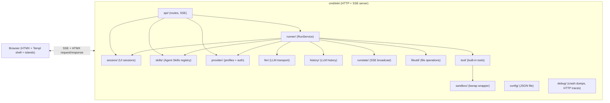

# Eitri — Architecture Guide

> For AI agents navigating the codebase. Explains module boundaries, key types, data flow, and extension points.
> This guide is canonical for implementation topology, package boundaries, data flow, and extension seams.

## Overview

Eitri is a self-hosted, single-binary AI coding agent for Linux. It launches an HTTP server with an HTMX-based chat UI for Chrome on Linux. A browser profile can keep up to 10 in-memory chat sessions via top-bar tabs. Shell commands execute via `os/exec.Command` inside an optional bubblewrap sandbox (read-only root, writable workspace and /tmp) for defense-in-depth. Falls back to direct execution when bwrap is unavailable or sandbox is disabled. No tmux dependency.


```mermaid
flowchart LR
    Browser["Browser (HTMX + Templ shell + islands)"]

    subgraph Server["cmd/eitri (HTTP + SSE server)"]
        API["api/ (routes, SSE)"]
        RunSvc["runner/ (RunService)"]
        UISess["session/ (UI sessions)"]
        LLMHist["history/ (LLM history)"]
        LLMTrp["llm/ (LLM transport)"]
        RunSt["runstate/ (SSE broadcast)"]
        FileUtil["fileutil/ (file operations)"]
        Skills["skills/ (Agent Skills registry)"]
        Tools["tool/ (built-in tools)"]
        Sandbox["sandbox/ (bwrap wrapper)"]
        Config["config/ (JSON file)"]
        Provider["provider/ (profiles + auth)"]
        Debug["debug/ (crash dumps, HTTP traces)"]
    end

    Browser <-->|SSE + HTMX request/response| Server
    API --> RunSvc
    API --> UISess
    API --> Skills
    API --> Provider
    RunSvc --> LLMTrp
    RunSvc --> LLMHist
    RunSvc --> RunSt
    RunSvc --> FileUtil
    RunSvc --> Skills
    RunSvc --> UISess
    RunSvc --> Provider
    RunSvc --> Tools
    Tools --> Sandbox
```

## Module map

### `cmd/eitri/main.go` — Entry point

Orchestrates startup:
1. **Workspace capture** — resolves process CWD as the launch workspace; currently has no CLI workspace argument
2. **Config manager** (`config.Manager`) — reads `~/.eitri/config.json`
3. **Debug recorder** (`debug.Recorder`) — captures HTTP traces for crash dump diagnostics
4. **UI session manager** (`session.Manager`) — in-memory browser-facing session state with `browser_id` ownership and max-session cap (default 10)
5. **LLM history service** (`internal/history/`) — stores LLM conversation history with sliding window
6. **Skills service** (`skills.Service`) — scans Agent Skills roots, resolves precedence, exposes effective/shadowed/invalid records
7. **Run service** (`runner.RunService`) — run lifecycle, agent loop, SSE broadcast via `runstate.State`
8. **HTTP server** (`api.NewServer`) — registers routes via `net/http` (Go 1.22+ ServeMux); uses `session.Manager`, `runner.RunService`, `config.Manager`, and `skills.Service`

Key lifecycle: sets up graceful shutdown via `signal.NotifyContext` → notifies active SSE clients, cancels active runs, then shuts down HTTP. On crash, `RunService` writes a crash dump via `debug.WriteCrashDump` capturing config summary, sessions, HTTP traces, logs, and system diagnostics.

### `internal/llm/` — LLM transport abstraction

| File | Responsibility |
|------|---------------|
| `types.go` | Core types: `Request`, `Message`, `Response`, `StreamEvent`, `ToolDef`, `AdapterConfig` |
| `service.go` | `LLMService` interface — `Chat()` and `ChatStream()` |
| `factory.go` | `NewLLMService()` — route provider ID to adapter |
| `openai.go` | `OpenAI` — OpenAI-compatible adapter |
| `anthropic.go` | `Anthropic` — Anthropic Messages API adapter (used for qwen*/minimax* models via opencode_go) |
| `openrouter.go` | `OpenRouter` — OpenRouter adapter with optional ref/title headers |
| `github_copilot.go` | `GitHubCopilot` — GitHub Copilot adapter with token refresh |
| `wire_types.go` | Wire-format types for OpenAI and Anthropic JSON APIs |
| `sse_scanner.go` | SSE stream scanner for parsing `data:` lines from streaming responses |
| `common.go` | Shared helpers |

**Layer isolation**: `llm` is the sole package that speaks to LLM wire protocols. Callers (`runner`) construct adapters via `llm.NewLLMService()`. New backends add an adapter file + factory route.

Note: a third-party package `github.com/voocel/litellm` provides the `litellm.Schema`, `litellm.Block`, and `litellm.Tool` types used by the `tool/` package. The internal `llm` package and the external `litellm` package are distinct.

### `internal/history/` — LLM conversation history

| File | Responsibility |
|------|---------------|
| `session.go` | `SessionManager` — per-chat LLM conversation history with sliding window cap |
| `session_test.go` | Unit tests for session lifecycle, history, sliding window |

Stores per-session LLM message history with configurable exchange cap. System prompt stored separately and prepended on reads. Used by `runner` loop to load history before each agent turn. Lost on server restart.

### `internal/fileutil/` — File path validation and operations

| File | Responsibility |
|------|---------------|
| `path.go` | `ValidateWorkspacePath`, `ValidatePathWithAllowed` — workspace path validation |
| `path_test.go` | Unit tests for path validation |
| `filetools.go` | `ReadFile`, `ReadFileWithLineInfo`, `LineHash`, `EditFile`, `InsertLine`, `WriteFile`, `ListDirectory`, `FileViewerResult` |
| `filetools_test.go` | Unit tests for file operations |
| `walk.go` | `WalkFiles` — directory walking for file exploration |
| `walk_test.go` | Tests for directory walking |

Used by the `read`, `write`, `edit`, and `grep` tools for all file I/O and path validation. Workspace-aware: all path operations validate against allowed directories.

### `internal/provider/` — Provider profiles + auth seams

| File | Responsibility |
|------|---------------|
| `discovery.go` | `DiscoverModels()` — model-discovery seam. Resolves auth, refreshes provider-owned auth, fetches selectable models, returns refreshed auth state for caller persistence. |
| `profiles.go` | Provider-internal profile table + caller-safe metadata descriptors (`Describe`, `MustDescribe`). |
| `auth.go` | Auth helpers: config-auth validation/normalization, GitHub Copilot device-flow start/poll status mapping, token-to-auth-state conversion, refresh. |

**Role**: thin package — profile metadata, auth, discovery only. LLM transport lives in `internal/llm/`. Callers use `llm.NewLLMService()`, not raw provider internals.

### `internal/sandbox/` — bwrap sandbox wrapper

| File | Responsibility |
|------|---------------|
| `sandbox.go` | `WrapCommand()` — wraps a shell command inside a bubblewrap sandbox; falls back to direct execution if bwrap is unavailable, OS is not Linux, or profile is `"none"` |
| `sandbox_test.go` | Unit and integration tests for `WrapCommand` (skip if bwrap not on PATH) |

Provides `WrapCommand(workspace, command, Config)` which returns the executable and arguments for running a command inside a bubblewrap sandbox. Falls back to direct execution if bwrap is not installed or the profile is `"none"`. Configurable via the global config (`sandbox.profile`, `sandbox.network`, `sandbox.extra_writable_paths`). See ADR-0017 for the full argument rationale.

### `internal/runstate/` — SSE broadcast + context tracking

| File | Responsibility |
|------|---------------|
| `runstate.go` | `State` — subscriber fan-out, event history, text buffer, `SSEEvent`, `TokenUsage` types |
| `compute_context.go` | `ComputeContext()` — estimate token breakdown (system/prompt/history/skill/completion) for a message list |
| `runstate_test.go` | Tests for SSE broadcast and context computation |

Network-agnostic: manages channels, not HTTP connections. Each active runner run creates one `State` via `runstate.New()`. The runner broadcasts `SSEEvent` values; `api.Server` connects subscribers to SSE HTTP streams.

**Context panel**: runner broadcasts `context_update` SSE events after each agent turn. Browser island `eitri-context` renders per-category progress bars using data from `ComputeContext()`. Falls back to 256k context window when provider metadata lacks context length.

### `internal/session/` — UI session management

| File | Responsibility |
|------|---------------|
| `session.go` | `Manager` — in-memory `UISession` records with browser_id ownership, max-session cap, title generation |
| `session_test.go` | Unit tests for session lifecycle, browser scoping, message limits |

Replaces inline `UISession` map in early `api.Server`. Server-owned canonical session state: ID, browser_id, title, status (`idle`/`running`/`error`), messages, active skills, timestamps. `api.Server` stores `*session.Manager` and passes session data to templates. Not persisted — server restart loses all sessions.

### `internal/debug/` — Crash dumps, HTTP traces, diagnostics

| File | Responsibility |
|------|---------------|
| `dump.go` | `WriteCrashDump()` — writes structured crash dump to `~/.eitri/dumps/` |
| `recorder.go` | `Recorder` — ring buffer of HTTP request/response traces for diagnostics |
| `log_handler.go` | `RingBufferHandler` — circular log buffer for crash dump capture |
| `doc.go` | Package documentation |

### `internal/api/` — HTTP server + Templ templates + markdown rendering

| File | Responsibility |
|------|---------------|
| `server.go` | `Server` struct — route registration, config CRUD, SSE handler, render endpoints |
| `handlers_chat.go` | Chat POST handler, stream connection, completion endpoints |
| `handlers_config.go` | Config GET/PUT, model discovery, provider auth flow |
| `handlers_sessions.go` | Session CRUD, rename, close |
| `handlers_skills.go` | Skills list, diagnostics |
| `handlers_confirm.go` | Confirmation approval/denial endpoints |
| `handlers_workspace.go` | Workspace file browser |
| `handlers_browse_directory.go` | Directory listing with breadcrumbs |
| `copilot_device_flow.go` | GitHub Copilot device-flow UI handler |
| `debug.go` | GUI overlay for crash dump listing, HTTP traces |
| `markdown.go` | Core rendering pipeline: goldmark setup, render helper functions |
| `markdown_enhance.go` | Custom AST transformers and renderer enhancements |
| `markdown_math.go` | LaTeX math block rendering (KaTeX integration) |
| `markdown_code.go` | Code block rendering (syntax highlighting via Prism.js) |
| `templates/` | Templ source files (`.templ` → Go via `templ generate`) |
| `assets/` | Pinned frontend assets served from `embed.FS` (HTMX, Prism, KaTeX, Mermaid, and stylesheet assets) |

Route contract: `api.Server` registers routes via Go 1.22+ ServeMux. SSE packets are JSON-enveloped events with `event`, `data`, and optional `id` fields. Settings page load/save and `/api/models` cross model-discovery seam: `provider.DiscoverModels()`, then persist returned auth refresh. GitHub Copilot device-flow UI polls through provider-owned `PollGitHubCopilotDeviceFlow()` status + `AuthUpdate`. `RunService.StartRun()` builds LLM service via `llm.NewLLMService()` and persists auth refresh via `PersistAuth` callback. `/api/sessions/{id}/stream` subscribes to active run state via `RunService.Subscribe()` after validating `browser_id` ownership. Active runs own `runstate.State` subscriber set, making multiple EventSource clients and reconnects fan-out safe. Run start snapshots user-configured runtime limits (e.g., `max_turns`) — later Settings changes affect only later runs. Completion endpoints under `/api/sessions/{id}/complete/*` validate `browser_id` ownership and return JSON for the composer island. The top-level HTTP handler owns cross-cutting middleware: 1MB POST/PUT body limits and structured per-request logging (`method`, `path`, `status`, `duration_ms`, `session_id`).

**Templ templates** colocated at `internal/api/templates/`:

| Template | Purpose |
|----------|---------|
| `base.templ` | HTML document shell + embedded pinned assets + browser island scripts. Sidebar is a four-panel flex column: `#session-panel` (sessions list, fixed height), `#tool-activity` (tool activity cards, max 6 entries), `#thinking-panel` (LLM reasoning content, flex-grows), `#context-panel` (context window progress bars) |
| `chat.templ` | `ChatView` — workspace indicator, setup banner for invalid provider config, message list, input, visible Stop button, completion menu container, SSE target for selected session |
| `session_tabs.templ` | `SessionTabs` — session list with title, status dot, close button, and new-session button in header |
| `settings.templ` | `SettingsView` — config form, provider + model selectors, custom system prompt |
| `skills.templ` | `SkillsView` — detected Agent Skills table, refresh action, diagnostics |
| `message_input.templ` | `MessageInput` — textarea with skill `/` and file `@` completion |
| `chat_bubble.templ` | User/assistant message bubbles |
| `error_toast.templ` | Error banner, auto-dismiss |
| `mermaid_diagram.templ` | Mermaid diagram container |
| `quick_replies.templ` | Suggestion chip buttons |
| `directory_browser.templ` | Workspace file browser view |
| `settings_view_model.go` | View model helpers for settings page rendering |
| `helpers.go` | Shared template rendering helpers |

### `internal/skills/` — Agent Skills discovery + activation

Package owns Agent Skills scanning, parsing, precedence resolution, diagnostics, resource manifests, and activation. Skills are discovered from fixed project/user roots containing `SKILL.md`; precedence follows last-wins scoping.

| File | Responsibility |
|------|---------------|
| `skills.go` | Core types: `Skill`, `Scope`, `Status`, `Diagnostic`, `ActivatedSkill` |
| `discover.go` | Scan fixed skill roots for subdirectories containing `SKILL.md` |
| `parse.go` | Extract YAML frontmatter and Markdown body with lenient validation |
| `registry.go` | Resolve precedence, effective map, shadowed records, lookup by name |
| `resources.go` | Build capped resource manifests under `scripts/`, `references/`, and `assets/` |
| `slash.go` | Slash-command parsing (`/skillname`) |
| `skills_test.go` | Unit tests for roots, precedence, validation, diagnostics, activation caps |

**Service API**:
```go
type Service struct { ... }

func (s *Service) Refresh(ctx context.Context) (*Registry, error)
func (s *Service) Current() *Registry
func (s *Service) Activate(ctx context.Context, sessionID, name string) (*ActivatedSkill, error)
```

`api.Server` stores active skill names per UI session. The `skill` tool (in `internal/tool/`) delegates to `skills.Service`. At chat-run start, `runner.RunService` re-resolves those active names against current effective registry state, drops disappeared/invalid/shadowed Skills with a warning, and injects ephemeral skill tool-call context into that Run's LLM request so Skill instructions re-apply without permanently duplicating them into conversation history. API and runner packages consume this service; they never scan skill files directly.

### `internal/runner/` — Run service + agent loop

| File | Responsibility |
|------|---------------|
| `service.go` | `RunService` — run lifecycle, confirmation handling, SSE broadcast bridge, auth persist callbacks |
| `run.go` | `StartRun()` — validates config, snapshot runtime limits, builds LLM service, resolves skill context, builds tool registry (including `skill`, `delegate`, `collect`, `render_quick_replies`), starts agent loop |
| `system_prompt.go` | `buildSystemPrompt()`, `buildLLMService()` — assembles system prompt from base prompt + repo instructions + skills catalog + active skills |
| `skill_context.go` | `resolveSessionSkillContext()` — re-resolves active skill names against current registry |
| `subagent.go` | `SpawnSubAgent()`, `CollectSubAgents()` — sub-agent lifecycle management, `buildBaseToolRegistry()` |
| `subagent_store.go` | Thread-safe sub-agent task storage and cancellation |
| `run_tracker.go` | Tracks active `RunState` records per session |
| `batch.go` | `BatchRun()` — headless batch execution with token streaming to `io.Writer` |
| `loop/` | Agent turn loop (`loop.go`, `loop_helpers.go`, `stream.go`, `tool_call.go`, `debug.go`) |
| `adapters/` | `ConfirmationFunc`, `NewFuncConfirmer` — confirmation seam |
| `broadcast/` | `Broadcaster` — fan-out event distribution used by runner |
| `runconfig/` | `RunConfig` — runtime configuration snapshot from config + workspace |

**Key flow**: `RunService.StartRun()` delegates to `startRunWithConfig()` which:
1. Validates config, snapshots runtime limits (`max_turns`, `context_window_tokens`)
2. Resolves skill context from session's active skills
3. Calls `buildLLMService()` → resolves auth, creates `llm.LLMService`, builds base tool registry (`bash`, `glob`, `grep`, `read`, `write`, `edit`, `render_mermaid_diagram`, `web_fetch`)
4. Registers parent-only tools: `render_quick_replies`, `skill`, `delegate`, `collect`
5. Creates `runstate.State` for SSE broadcast
6. Calls `RunAgent()` — synchronous agent turn loop in `loop.RunAgent()`

### `internal/tool/` — Built-in tools

| File | Responsibility |
|------|---------------|
| `tool.go` | `ToolHandler` interface, `SchemaOf[T]()` helper for JSON Schema generation |
| `dispatch.go` | `NewRegistry()` — registry of tool handlers registered by name |
| `bash.go` | `BashTool` — direct `exec.Command` execution with stdout/stderr capture, exit code, timeout via `context.WithTimeout`, 128 KiB output cap |
| `glob.go` | `GlobTool` — workspace-scoped glob pattern matching |
| `grep.go` | `GrepTool` — workspace-scoped grep with context lines |
| `read.go` | `ReadTool` — read file with line info and hashes |
| `write.go` | `WriteTool` — write file with workspace validation |
| `edit.go` | `EditTool` — edit file with line-hash anchors |
| `render_mermaid_diagram.go` | `RenderMermaidDiagram` — emit mermaid diagram data for server-side rendering |
| `render_quick_replies.go` | `RenderQuickReplies` — emit suggestion chips for UI |
| `web_fetch.go` | `WebFetchTool` — fetch a web page and convert to Markdown |
| `skill.go` | `SkillTool` — delegate to `skills.Service` for Agent Skills activation |
| `delegate.go` | `DelegateTool` — spawn a sub-agent in the background, returns task_id immediately |
| `collect.go` | `CollectTool` — block until sub-agent tasks complete, returns structured JSON results |
| `helpers.go` | Shared types: `SubAgentManager` interface, `SubAgentResult`, `SessionIDKey` |
| `result.go` | `ToolResult` struct with `Blocks`, `IsError`, `NeedsConfirm` flags; constructor helpers `Success`, `ToolError`, `NeedsConfirmPath`, `TextResult`, `TextBlocks` |

**BashTool** replaces the old `TmuxExecutor`:
- Creates `exec.Command` per call — no persistent shell session
- Commands run inside a bubblewrap sandbox (read-only root, writable workspace and /tmp, separate PID namespace) by default
- Falls back to direct `bash -c` execution when bwrap is unavailable or sandbox profile is `"none"`
- Receives `workspace`, `timeout`, and `sandbox.Config` as constructor params
- Captures stdout and stderr separately via pipes
- Exit code from `cmd.ProcessState.ExitCode()`
- Per-command timeout via `context.WithTimeout` (default 60s from `command_timeout` config)
- Output capped at 128 KiB
- No cross-turn shell state — agent must use `&&` chains or explicit env vars

**Tool registration** happens in two places:
- `buildBaseToolRegistry()` in `internal/runner/subagent.go` registers the core tools: `bash`, `glob`, `grep`, `read`, `write`, `edit`, `render_mermaid_diagram`, `web_fetch`
- `startRunWithConfig()` in `internal/runner/run.go` adds parent-only tools: `render_quick_replies`, `skill`, `delegate`, `collect`

Sub-agents only receive the base registry (no delegate/collect/render_quick_replies/skill).

### `internal/config/` — Configuration

| File | Responsibility |
|------|---------------|
| `manager.go` | `Manager` — load/save config JSON, validation, atomic writes, environment variable overrides, provider/model discovery on save |
| `doc.go` | Package documentation |

Config schema with defaults, masking, validation, and environment variable names are defined in `internal/config/manager.go`. Key details: `config.Manager` owns atomic JSON file writes, secure config permissions (`~/.eitri` `0700`, config/temp files `0600`), default loading without file creation, provider validation/model discovery on save, `context_window_tokens` fallback defaults (256k tokens for UI estimates when provider/model metadata lacks context length), and hot-reload on `PUT /api/config` / runner creation. Config reads provider defaults through caller-safe Provider descriptors rather than raw profile internals. Config also persists provider-owned auth state in `provider_auth` for providers that need richer auth than plain `api_key`; `GET /api/config` must never expose that raw state back to browser clients.

## Frontend architecture

Architecture name: **HTMX + Templ shell with browser islands**. Server owns canonical state and rendering; browser islands own only local ephemeral UI state.

**Stack**: Templ (`.templ` → Go), HTMX, small custom-element/browser-island scripts, embedded CSS, Prism.js, KaTeX, Mermaid.js. No npm, bundler, Tailwind, or SPA framework. Only code-generation step is `templ generate`.

**Ownership boundary**:
- Go server owns canonical state, sessions, routing, validation, security boundaries, agent runs, assistant transcripts, and HTML rendering.
- Templ renders pages, fragments, and rich UI components.
- HTMX handles forms, navigation, partial updates, OOB swaps, indicators, and transitions.
- DOM is base UI state.
- Browser islands own only ephemeral widget state: stream buffer, completion menu, copy toggles, rendered-library lifecycle, diff view mode.
- No island owns canonical app state or global store.

**Island lifecycle**:
- Initialize on full page load and `htmx:afterSwap`.
- Idempotent setup: no duplicate handlers, double renders, or timer leaks.
- Read configuration from server-rendered `data-*` attributes.
- Tolerate missing Prism/KaTeX/Mermaid.
- Use text nodes or server-rendered sanitized HTML for untrusted content; never `innerHTML` from user/LLM data.

**Key islands** (scripts in `internal/api/assets/`):
- `eitri-stream`: opens `/api/sessions/{id}/stream` only after chat POST trigger; parses JSON envelopes; batches display-only tokens; handles run phases, no-dead-air, reconnect state, cancellation UI, render endpoint dispatch, and final Markdown render by `message_id`.
- `eitri-composer`: owns textarea keyboard behavior and `/` skill + `@` file completion menu state; calls JSON completion endpoints with debounce/sequence checks; preserves HTMX chat submit as authoritative transport.
- `eitri-context`: reads `context_update` SSE events, renders per-category progress bars (system/prompt/history/skill/completion) against context window cap, persists state across session switches via `sessionStorage`, toggles expanded/collapsed view.
- `eitri-code-block`, `eitri-mermaid`, `eitri-diff-card`: local widget behavior for copy/wrap/show-all, Mermaid rendering, and diff view toggles.

**Asset strategy**: `internal/api/assets/` contains pinned vendor assets served from `embed.FS` to avoid CDN availability, offline, and privacy failure modes. Do not use CDN or npm/bundler.

**Generative UI seam**: `render_mermaid_diagram` and `render_quick_replies` tools emit structured data; server renders Templ components via `/api/sessions/{id}/render`; islands add optional browser-native behavior without turning app into an SPA.

## Data flow (chat request)


```mermaid
sequenceDiagram
    participant Browser as Browser (HTMX)
    participant API as api.Server
    participant RunSvc as runner.RunService
    participant LLM as llm.LLMService
    participant Skills as skills.Service
    participant Tool as tool/

    Browser->>API: GET /api/sessions/{id}/complete/skills or /complete/files
    API-->>Browser: JSON completion candidates
    Browser->>API: POST /api/sessions/{id}/chat
    API->>API: Validate message, provider setup, parse slash skills, ensure no active run
    API->>Skills: Refresh + activate slash skills
    Skills-->>API: effective catalog + active skills
    API->>API: Re-resolve session active skills via skill_context.go, warn/drop stale ones
    API->>RunSvc: StartRun(sessionID, message)
    RunSvc->>RunSvc: Build LLM via llm.NewLLMService(), build tool registry, resolve skills
    RunSvc->>RunSvc: RunAgent() — synchronous agent turn loop
    API-->>Browser: User bubble HTML + HX-Trigger: eitri:connectRunStream
    Browser->>API: GET /api/sessions/{id}/stream (browser_id cookie)
    API->>API: Subscribe to runstate.State subscriber set for this run
    
    loop Agent turn
        RunSvc->>LLM: ChatStream(request with history + skill context)
        LLM-->>RunSvc: stream of SSEEvent (token deltas)
        RunSvc->>runstate.State: Broadcast token events
        RunSvc-->>Browser: SSE: token (delta)
        Browser->>Browser: Display-only buffer, flush on newline or 50-100ms
        LLM-->>RunSvc: tool call
        RunSvc-->>Browser: SSE: tool_call
        Browser->>Browser: Activity panel entry only
        alt skill
            RunSvc->>Skills: Activate(sessionID, name)
            Skills-->>RunSvc: structured skill_content
        else bash
            RunSvc->>Tool: BashTool executes (exec.Command)
            Tool-->>RunSvc: result (stdout, stderr, exit code)
        else write / edit
            RunSvc->>RunSvc: validate workspace path, write or modify file via fileutil
        else web_fetch
            RunSvc->>Tool: WebFetchTool fetches URL
            Tool-->>RunSvc: Markdown content
        end
        RunSvc->>runstate.State: Broadcast context_update (ComputeContext)
        RunSvc-->>Browser: SSE: tool_result
        Browser->>API: POST /api/sessions/{id}/render {kind: "tool_card"}
    end

    RunSvc-->>Browser: SSE: done (message_id)
    Browser->>API: POST /api/sessions/{id}/render {kind: "markdown", message_id}
    API->>API: Compute usage footer from llm usage and model context metadata or 256k fallback
    API-->>Browser: goldmark-rendered server-owned assistant message (via unified /render)
```

## Extension points

### Adding a new built-in tool

1. Define tool in `internal/tool/` implementing the `ToolHandler` interface (`Name()`, `Description()`, `JSONSchema()`, `Call()`) with a struct that embeds `SchemaOf[T]()` for parameter schemas
2. Register with `tool.NewRegistry().Register(...)` in `buildBaseToolRegistry()` (base tools) or `startRunWithConfig()` (parent-only tools)
3. Tool receives `context.Context` with `tool.SessionIDKey` for session-scoped state

### Extending Agent Skills support

1. Keep discovery/parsing/precedence logic in `internal/skills`; API and agent packages should consume the service API rather than scanning files directly.
2. Add new skill roots only through a documented precedence change and ADR update.
3. Keep `allowed-tools` advisory until Eitri has a real approval/permission model.
4. Preserve resource access invariant: `read` can read workspace and skill directories; `write` and `edit` remain workspace-only.

### Adding a new API route

1. In `internal/api/server.go`, add `mux.HandleFunc(...)` in `NewServer()`
2. Access `configMgr`, `sessionMgr`, `sessionSvc` via `s` fields
3. Check `r.Header.Get("HX-Request")` to distinguish full page vs HTMX partial

### Adding a new generative UI component

1. Create a new tool in `internal/tool/` (e.g. `render_foo.go`) implementing `ToolHandler` with a JSON schema for parameters
2. Register it in the appropriate tool registry
3. Create Templ component template in `internal/api/templates/`
4. Wire server-side dispatch in `/api/sessions/{id}/render` handler with the new kind
5. Add browser island initialization only if component needs local browser-native behavior

### Adding a browser island

1. Server renders custom element/container via Templ.
2. Island script lives in Base asset bundle or a small module served by `internal/api/assets/`.
3. Island reads configuration from `data-*` attributes.
4. Island never owns canonical application state.
5. Island initialization is idempotent across full page loads and HTMX swaps.
6. If island renders untrusted content, it uses text nodes or server-rendered sanitized HTML, never `innerHTML` from LLM/user data.
7. Island keyboard behavior preserves existing composer contracts unless explicitly changed.
8. Browser E2E test covers island behavior.

### Supporting a non-OpenAI backend

1. Study existing adapters in `internal/llm/` — `openai.go`, `anthropic.go`, `openrouter.go`, `github_copilot.go`
2. Create a new adapter file implementing `LLMService` interface (`Chat()` + `ChatStream()`)
3. Add wire types in `wire_types.go` if the API uses a different JSON shape
4. Register in `factory.go` `NewLLMService()` by provider ID

## Target repository layout

```text
eitri/
├── cmd/eitri/                 # Entry point
├── internal/
│   ├── api/                   # HTTP/SSE server, assets, Templ templates
│   ├── config/                # Config loading, validation, atomic writes
│   ├── debug/                 # Crash dumps, HTTP traces, diagnostics
│   ├── fileutil/              # File path validation and I/O operations
│   ├── history/               # LLM conversation history
│   ├── llm/                   # LLM transport abstraction (OpenAI, Anthropic, OpenRouter, GitHub Copilot)
│   ├── provider/              # Provider profiles + auth seams
│   ├── runner/                # Run lifecycle + agent loop
│   │   ├── adapters/          # Confirmation seam
│   │   ├── broadcast/         # Fan-out event distribution
│   │   ├── loop/              # Agent turn loop
│   │   └── runconfig/         # Runtime configuration snapshot
│   ├── runstate/              # SSE broadcast infrastructure + context tracking
│   ├── session/               # UI session management (browser-facing)
│   ├── skills/                # Agent Skills discovery, registry, activation
│   └── tool/                  # Built-in tools (bash, read, write, edit, glob, grep, web_fetch, render, skill, delegate, collect)
├── scripts/
├── docs/
│   ├── ARCHITECTURE.md
│   ├── TESTING.md
│   ├── adr/
│   ├── agents/
│   └── providers/
├── CONTEXT.md
├── AGENTS.md
├── go.mod / go.sum
```

Tests are colocated as `*_test.go`. Browser E2E tests live under `internal/api` behind the `browser` build tag. Templ-generated `*_templ.go` files are committed next to `.templ` sources.

## Testing patterns

Canonical test commands, fixtures, browser setup, and per-layer coverage live in [TESTING.md](TESTING.md). BashTool is tested as part of `internal/tool/` tests. API tests use `httptest`; browser E2E uses chromedp against server-rendered HTMX DOM.

## Key ADRs

ADR index lives in [CONTEXT.md](../CONTEXT.md#architecture-decisions).

## Runtime configuration

Config file (`~/.eitri/config.json`), listen address (`--listen` flag, default `127.0.0.1:8080`), and environment variable overrides are defined in `internal/config/manager.go`. Batch mode supports headless execution via `-b` flag (see `docs/agents/batch.md`).
