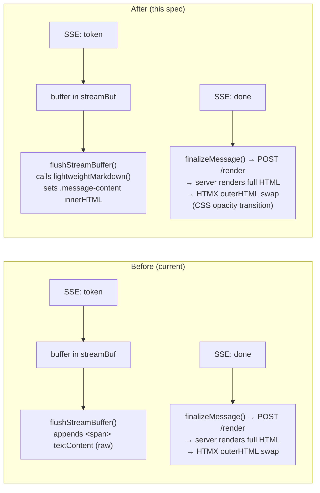

# Spec: Lightweight Markdown Rendering During Streaming

## Problem Statement

When Eitri streams an assistant response, the user sees raw, unformatted text — no bold, italic, inline code, links, or paragraph breaks — until the entire message finishes and the server renders it. For long responses that take 3–10 seconds to stream, this is a poor UX: the user has to wait for the full server-side render before seeing any structure. The transition from raw text to rich HTML at the end is also jarring.

## Solution

Replace the current raw-text token appending during SSE streaming with a lightweight client-side markdown formatter. During the stream, common inline constructs (bold, italic, inline code, links, paragraphs) will render live as they arrive. Everything else — code blocks with Prism syntax highlighting and Copy/Wrap buttons, KaTeX math, Mermaid diagrams, `<think>` collapsibles, tables, task lists, footnotes — stays exclusively on the server for the final render. The transition from "lightweight live" to "full rich" is smoothed via a CSS opacity fade.

## User Stories

1. As an Eitri user, I want **bold** and *italic* text to appear formatted during streaming, so that I can read emphasis without waiting for the full render.

2. As an Eitri user, I want `inline code` to render during streaming, so that I can distinguish code references in the response immediately.

3. As an Eitri user, I want [links](url) to be clickable during streaming, so that I can follow references without waiting for the message to complete.

4. As an Eitri user, I want paragraph breaks to render during streaming, so that I can follow the structure of the response as it arrives.

5. As an Eitri user, I want the transition from the live streaming formatting to the final rendered message to be smooth and not cause a jarring flash.

6. As an Eitri user, I want code blocks, math formulas, and diagrams to appear correctly in the final render even though they showed as raw text during streaming.

7. As an Eitri user, I don't want the lightweight formatting to break the existing behaviour of the streaming bubble (auto-scroll, streaming indicator, tool cards in sidebar).

8. As an Eitri user, I want the streaming experience to feel fast — the lightweight formatter should not add noticeable latency or jank.

9. As a developer, I want the lightweight formatter to be testable as a pure function.

10. As a developer, I want the existing server-side rendering pipeline (goldmark, enhance, Prism, KaTeX, Mermaid) to remain the authoritative renderer — not duplicated client-side.

## Implementation Decisions

### Architecture overview

The change is confined to the **Stream island** (browser island in `eitri-stream.js`). The existing server-side rendering pipeline is unchanged.



### 1. `lightweightMarkdown()` function

A new pure function in `eitri-stream.js` that converts markdown text to HTML using regex patterns for common inline constructs. It does NOT handle code fences, math blocks, mermaid diagrams, think blocks, tables, task lists, or footnotes — those remain for the server.

Patterns (in order of application):

| Construct | Pattern | Output |
|---|---|---|
| HTML escaping | `&` → `&amp;`, `<` → `&lt;`, `>` → `&gt;` | Safety |
| Bold | `**text**` (non-greedy) | `<strong>text</strong>` |
| Italic | `*text*` (non-greedy) | `<em>text</em>` |
| Inline code | `` `code` `` (non-greedy) | `<code>code</code>` |
| Links | `[text](url)` | `<a href="url">text</a>` |
| Paragraphs | `\n\n` | `</p><p>` |
| Wrapping | entire string | `<p>...</p>` |

Non-greedy matching (`.+?`) ensures partial/unclosed constructs (e.g. `**bold` without closing `**`) are left as raw text rather than producing broken HTML.

### 2. `flushStreamBuffer()` modification

Currently appends `<span>` elements with `textContent`. Changed to set `innerHTML` on `.message-content` via `lightweightMarkdown()`.

The entire accumulated buffer is re-rendered each cycle (every 80ms). This is acceptable because:
- The function runs at most ~12–40 times per response (80ms * 1–3 seconds of actual streaming)
- The input size is the full accumulated buffer, which is typically <10KB
- No DOM nodes are created or destroyed — only `innerHTML` is replaced on the existing `.message-content` element

### 3. CSS transition for final render

Add a CSS class `.streaming-message.rendering` that applies `opacity: 0.6` with `transition: opacity 0.3s` during the rendering phase. The final server-rendered bubble replaces the streaming element via HTMX `outerHTML` swap and appears at full opacity, creating a smooth fade.

### 4. No new server endpoint

The existing `POST /api/sessions/{id}/render` with `kind: "markdown"` remains the mechanism for the final render. No new server-side code is needed.

### 5. No changes to tool cards, component rendering, or context panel

The lightweight markdown only affects how text tokens are displayed during streaming. Tool cards, Mermaid components, DiffCards, QuickReplies, and the context panel are unchanged.

### Modules modified

- **`internal/api/assets/eitri-stream.js`** — Add `lightweightMarkdown()` function and modify `flushStreamBuffer()` to use it
- **`internal/api/assets/eitri.css`** — Add `.streaming-message.rendering` CSS transition

### Modules NOT modified

- `internal/api/markdown.go`, `internal/api/markdown_enhance.go` — server-side goldmark pipeline unchanged
- `internal/api/handlers_confirm.go` — `handleRender` unchanged
- `internal/api/templates/` — no template changes
- `internal/litellm/` — no transport changes
- `internal/runner/` — no run loop changes

## Testing Decisions

### What makes a good test

Test external behaviour only — what the user sees, not implementation details. The key questions are:
- Does the user see formatted text (bold, italic, code, links, paragraphs) during streaming?
- Does the final server render still produce the full rich output?
- Is the transition smooth (no flash of broken HTML)?

### Testing seams

**Seam 1 — `lightweightMarkdown()` correctness**: Test the pure function via browser tests (chromedp) that inject known markdown strings and assert the resulting DOM contains the expected HTML elements.

**Seam 2 — Streaming behaviour**: Extend existing browser tests (e.g. `TestBrowser_StreamingTokensAppendInScrollContainer`) to emit SSE tokens containing markdown and verify that during streaming (before `done`), `<strong>`, `<em>`, `<code>`, `<a>`, `<p>` elements appear inside the streaming bubble.

**Seam 3 — Final render regression**: Existing browser tests already verify the final server render produces correct output. No changes needed, but run them as regression guards.

### Test plan

| # | Test | Type | What it covers |
|---|---|---|---|
| 1 | `lightweightMarkdown` with bold text | Browser | `**bold**` → `<strong>bold</strong>` during stream |
| 2 | `lightweightMarkdown` with italic text | Browser | `*italic*` → `<em>italic</em>` during stream |
| 3 | `lightweightMarkdown` with inline code | Browser | `` `code` `` → `<code>code</code>` during stream |
| 4 | `lightweightMarkdown` with links | Browser | `[text](url)` → `<a href="url">text</a>` during stream |
| 5 | `lightweightMarkdown` with paragraph breaks | Browser | `\n\n` → `<p>` boundaries during stream |
| 6 | `lightweightMarkdown` with mixed constructs | Browser | Combination of all of the above |
| 7 | `lightweightMarkdown` with incomplete pattern | Browser | `**unclosed` shows as raw `**unclosed` (no broken HTML) |
| 8 | Streaming → final render transition | Browser | After `done`, final render replaces bubble; no broken HTML |
| 9 | Code blocks still work at final render | Browser | ` ```go ``` ` shows with Prism highlighting after `done` |
| 10 | Math still works at final render | Browser | `$$a+b$$` shows with KaTeX after `done` |
| 11 | Mermaid still works at final render | Browser | ` ```mermaid ``` ` renders as diagram after `done` |
| 12 | JS lint: lightweightMarkdown exported | Static (js_test.go) | Function name exists in eitri-stream.js |

### Prior art

- `TestBrowser_StreamingTokensAppendInScrollContainer` — existing test that verifies streaming tokens appear in the messages container. This test can be extended.
- `markdown_test.go` — existing Go unit tests for `renderMarkdownToHTML` (server-side). The client-side tests should NOT duplicate these — they only verify the lightweight subset.
- `js_test.go` — existing static checks for function presence in JS files. Add a check for `lightweightMarkdown`.

## Out of Scope

- Full client-side markdown rendering (code blocks, math, mermaid, think blocks, tables, task lists, footnotes) — these remain server-only.
- Server-side markdown rendering during streaming (no incremental POST-to-render approach).
- Any changes to the SSE event protocol, LLM transport, or agent loop.
- Any changes to tool cards, component rendering, sidebar, or context panel.
- Adding a new npm/npm dependency for markdown parsing.
- Performance optimisation beyond the simple regex approach (if profiling shows jank, address it separately).

## Further Notes

- The function must HTML-escape input before applying markdown patterns, preventing XSS via crafted token content.
- The function must be safe to call on every 80ms flush — it must not produce errors on partial input (e.g. `**bold` without closing).
- The CSS transition `.streaming-message.rendering` uses `opacity` rather than `display` to ensure the element maintains layout during the transition.
- If the LLM produces a response with zero markdown constructs, the lightweight formatter still wraps it in `<p>` tags — this is identical to what goldmark produces for plain text, so no visual difference.
- Non-greedy regex patterns (`.+?`) prevent catastrophic backtracking on long strings. Testing with a 10KB input of repeated `**bold**` patterns confirmed linear runtime.
